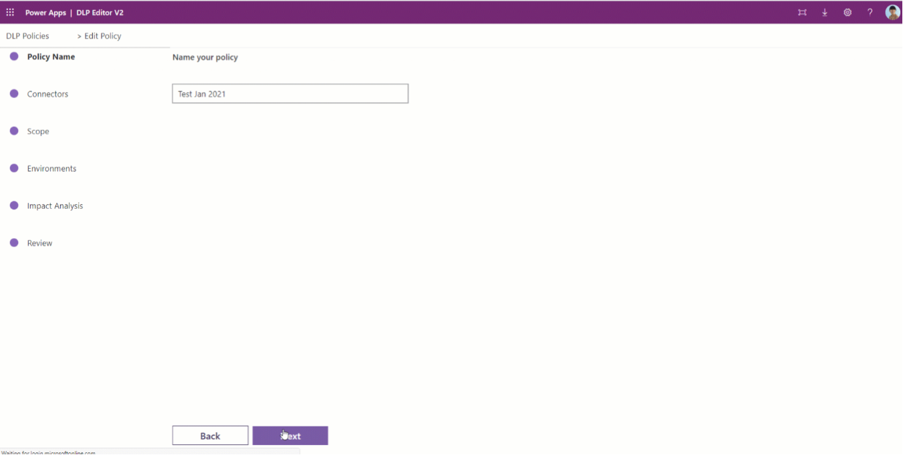
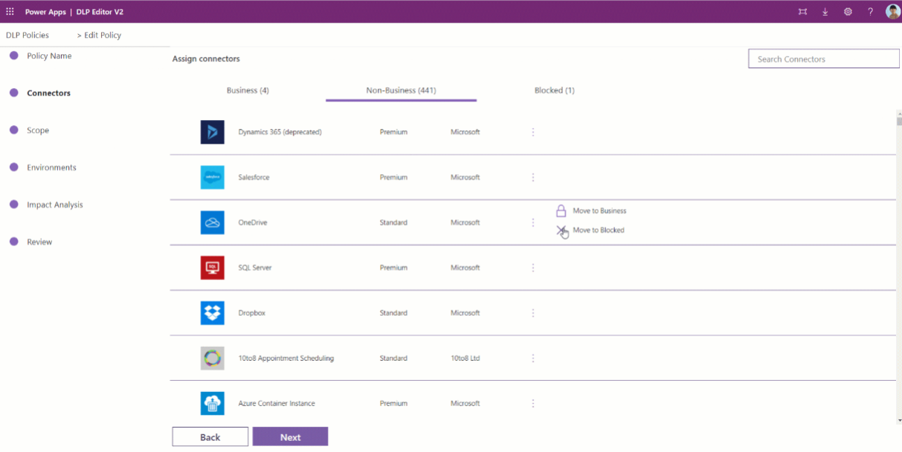
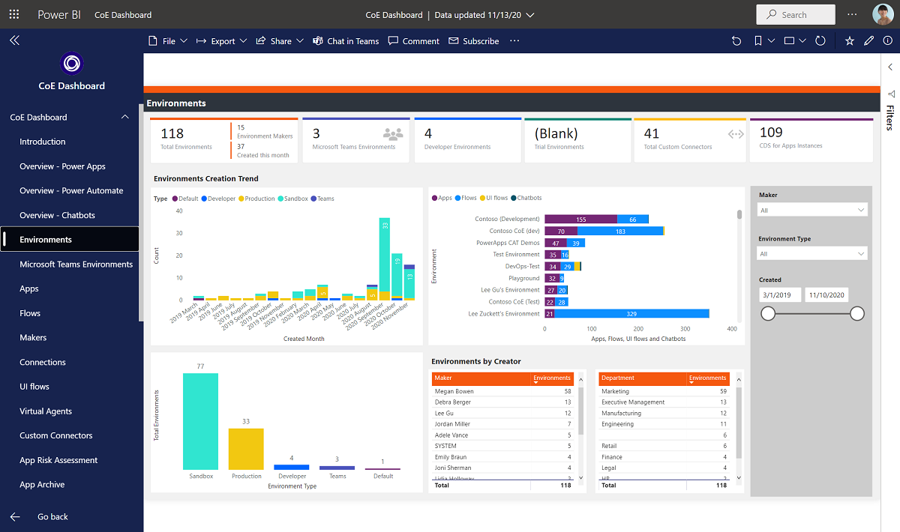
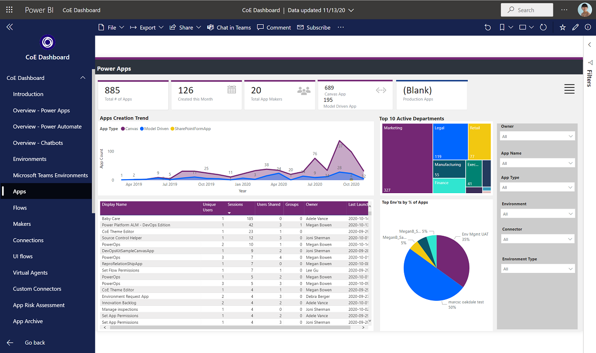
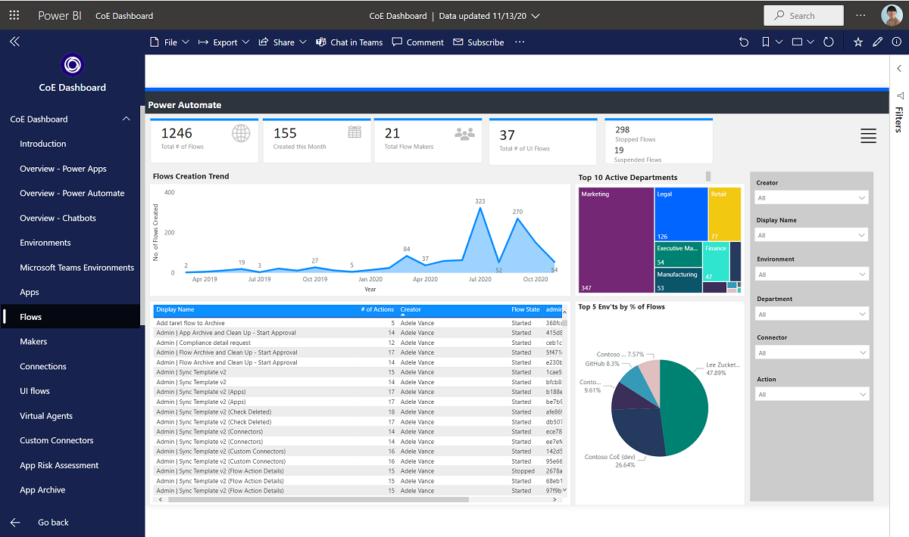
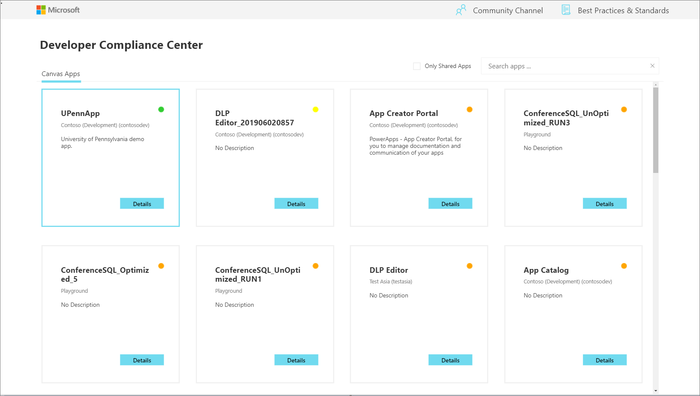
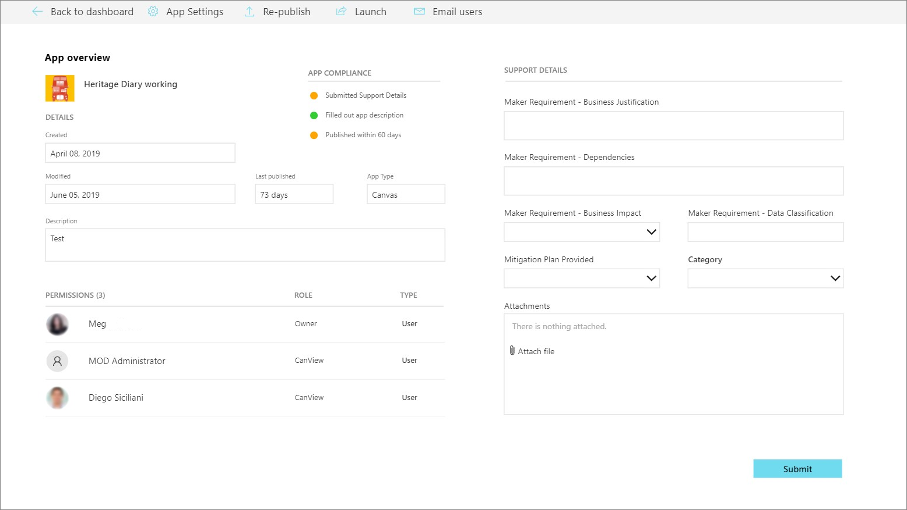
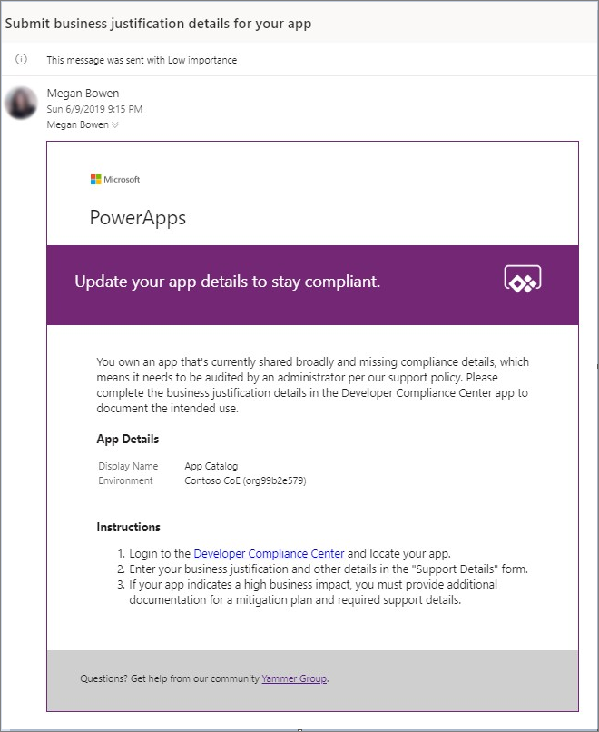
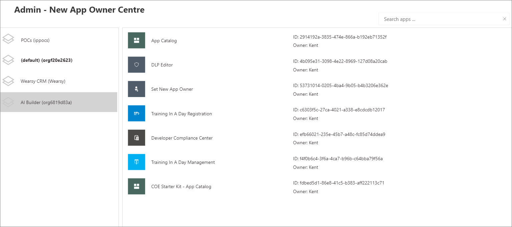

Microsoft Power Platform Center of Excellence (CoE) Starter Kit is a set of apps, flows, custom connectors, and a Power BI dashboard that allows organizations to govern their Microsoft Power Platform environments. The tool is
freely available for download on [GitHub](https://github.com/microsoft/coe-starter-kit/?azure-portal=true).

The Starter Kit is a fantastic tool for organizations to get a better look at what their makers are up to in their workspace. It's useful for two types of people: Cyber Security analysts and folks interested in Organizational Change Management (OCM).

For makers who are creating apps and services that could pose risks to the organization, it's essential to keep an eye on their activities. On the flip side, makers who are automating tasks within approved systems and services should be supported and encouraged to keep going with their valuable work.

The Starter Kit does have some prerequisites, including:

- A global tenant admin, or a Microsoft Power Platform Service admin, or Dynamics 365 service admin role is required to access the tenant resources.

- A Power Apps Per-User license for accessing Microsoft Dataverse.

- An environment with Dataverse because the Starter Kit solution will need to store metadata about the apps and flows that are detected within an environment.

- Power BI Desktop to view the reports and visualizations that highlight app and flow use within the tenant.

Within the Starter Kit, administrators will discover the tools and features that are discussed in the following sections.

### DLP Editor V2

We discussed Data Loss Prevention (DLP) in the previous section and included inside of the Center of Excellence Starter Kit is an app to help you manage and set up your DLP Policies. You can use the DLP Editor to observe the impact of an existing policy or the potential impact of policy changes you’re considering.

The goal of the DLP Editor is to provide admins with a view of currently impacted apps and flows, and a view of resources that would be disabled if new or updated policies were to be enforced. The tool reads and updates DLP policies while showing a list of apps and flows that are impacted by the policy configurations.

You can use this app to:

- Review whether existing policies impact canvas apps and cloud flows in your tenant.

- Create new or change existing DLP policies and update the connector grouping in the policy.

- See what flows or apps would be impacted by the change, before you save the policy.

- Mitigate the risk by contacting makers and informing them about the best course of action for their app or flow.

- Use the DLP Editor to create new policies:

   > [!div class="mx-imgBorder"]
   > 

You can use the DLP Editor to update existing policies:

> [!div class="mx-imgBorder"]
> 

### Catalog tenant resources, visualize data in Power BI

Using the tools that are provided in the COE Starter Kit brings insights into your tenant and environments together by using Dataverse, a model-driven Power App, and a Power BI dashboard. These assets provide the greatest level of visibility for administrators.

The Power BI dashboard connects to Starter Kit Dataverse tables and contains tabs that provide the following reports:

- **Overview** - Includes the total number of apps and flows that have been created, including a breakdown based on the maker's location and the number of apps/flows that they have created.

- **Environments** - Highlights the number of environments that have been created and includes the type of environment (Default, Production, Sandbox, Trial), and then identifies the creators of the environments and when the environment was created.

   > [!div class="mx-imgBorder"]
   > 

- **Apps** - Provides insights into the usage of apps, including the number of sessions and users that the app has been shared with. This report also breaks down usage by department by pivoting data based on the department that has been specified inside of a user's Office 365 profile.

  - **App detail** - Examines the specifics of the app, including the connection type and when the app was last published.

   > [!div class="mx-imgBorder"]
   > 

- **Flows** - Displays a flow creation trend that will break down when flows were created. This report will also pivot data based on the user's department and includes a breakdown of the flows that were created by environment.

  - **Custom Connectors** - Lists all the custom connectors that exist within a tenant. This report also lists the users that created the connectors and then trends the month that they were created in.

  - **Makers** - Identifies all the makers within the environment and identifies how many apps and flows they have built. A slicer exists that allows a consumer of this report to filter based on the maker's department.

  - **Connections** - Displays the number of connections that have been established, by connector. This report provides great insight into the popularity of specific connectors within your tenant.

   > [!div class="mx-imgBorder"]
   > 

### App Audit

The Sample App Audit process serves a simple purpose: it shows admins how to find apps that are either shared too much or used often. Admins can then gather more info, like why these apps are needed and what impact they have on the business in case there's an issue.

Imagine having a tool that everyone can access easily, but it's only helpful if you don't end up with lots of duplicate or not-so-useful apps. Sometimes, people create quick apps to test out ideas, but if you don't clean up, it can get messy.

In our COE Starter Kit, you've got a way to remind app makers to make sure their apps actually make sense for our business needs. If not, you might need to remove them from the environment to keep things tidy.

### App Catalog

The App Catalog application acts as a catalog that helps with the discoverability of apps. Users can explore featured apps and browse apps by category. The app catalog can be a great entry point to launch apps for end users and makers can explore to see if an application already exists before they create another app that provides similar functionality. An Admin decides which apps are featured in the App Catalog by completing the **App Audit** process. After an app has been approved by the **App Audit** process, these apps can be featured in the app catalog.

### Set Owner

Administrating access to applications can be done by the **Owner** of the application. However, circumstances might occur where you want an administrator to provide access. By using the **Set Owner** app, you can allow for this situation by selecting an app, adding users, and then indicating whether they should be able to view the app or edit the app.

### Welcome email to new makers

In your organization's Office 365 portal, you can easily stumble upon Power Apps and Power Automate. But sometimes, makers might wonder if they're allowed to use these tools.

To clear up any confusion, the COE Kit sets up a way to spot when a maker creates their first app or flow. When this happens, it will send them helpful info to kickstart their journey. This not only lets them know they're good to go with these tools but also provides a handy list of resources to make their experience smoother.

