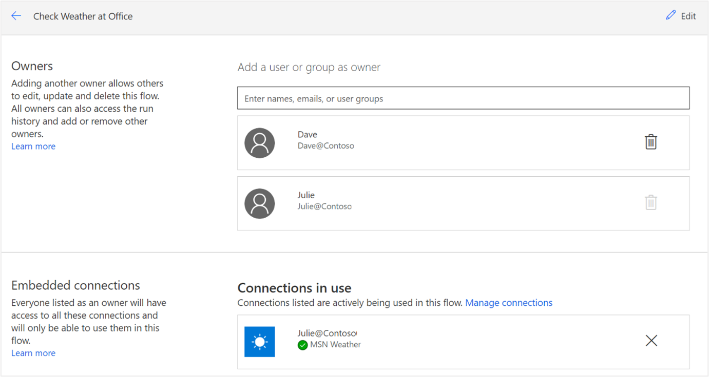

When you create a new Microsoft Power Automate cloud flow, you're the only one who can view, edit, and run it. By sharing a cloud flow, you can allow other users within your organization to run or help edit your automation.

> [!div class="mx-imgBorder"]
> 

Power Automate offers the following types of sharing:

- Share a cloud flow so that other users can run the flow.

- Share a cloud flow so that other users can edit the flow.

- Package a cloud flow by using Microsoft Dataverse solutions to copy a flow into different Microsoft Power Platform environments, such as Test and Production.

- Share a copy of a cloud flow.

The type of cloud flow can limit the type of available sharing. For example, you can only share instant cloud flows, which allow the user to run the flow without giving them permission to edit the flow also. You can share instant, automated, and scheduled cloud flows by using co-ownership, a Dataverse solution, or by sending a copy.

You can choose an individual user or group when sharing a cloud flow. Sharing with a user is a good approach for informal sharing with a few people. When possible, sharing with a group is a better option when you want to share multiple flows with the same group of people. Group sharing simplifies your task of managing who has access to flows.

In Microsoft Entra ID, you can organize groups as security groups or office groups. For example, you can create an office group by creating a team in Microsoft Teams.

You can share with users outside your organization if they've been [added as a guest user](/azure/active-directory/external-identities/b2b-quickstart-add-guest-users-portal/?azure-portal=true) in your Azure AD. Some limitations are placed on what an external user can do with flows that are shared with them.

## Where to find shared flows

When someone shares a cloud flow with you, you'll receive an email. The email will indicate if you've been added as a co-owner that can edit or if you're a run-only user. When you share a flow with a group of users, they won't receive an email.

If you're a co-owner of a cloud flow, the flow won't show in your **My flows > Cloud flows** list but will show in the **My flows > Shared with me** list.

> [!div class="mx-imgBorder"]
> 

If you don't recognize a flow and want to know who shared it with you, select the flow name. The **Details** page will list the original flow owner.

> [!div class="mx-imgBorder"]
> 

For instant cloud flows that you access as a run-only user, you'll only see it in the app that supports the flow's instant trigger. For example, a button flow would show in the Power Automate mobile app. A Microsoft Teams-selected message would show in Microsoft Teams and Dataverse when you select a record in a model-driven app from Microsoft Power Apps. When you're a run-only user, the flow won't appear in the **My flows > Shared with me** list.

You can add a user or a group as a co-owner. This approach will allow the user or any member of the group to edit the flow. After you've added a co-owner, your flow will no longer be in the **My flows > Cloud flows** list but will show in **My flows > Shared with me**. It will remain on the shared list even after you've removed everyone whom the flow was shared with.

Cloud flows that are shared as run-only will still appear on your **My flows > Cloud flows** list.

## Check before you share

Before you share your cloud flow with other users, make sure that it's a good candidate for sharing by completing the following checks.

- **Evaluate if your flow would be helpful to those whom you're sharing with.** For example, a flow that's set to use your postal address wouldn't be useful to someone who lives or works elsewhere. In some cases, you can make minor changes to your flow to make it more useful to others before you share it.

- **Determine if the flow has a name that's meaningful to others.** After you've shared a flow with others, it will show up in their lists of flows. For example, a flow named **Check WAO** might mean something to you, but if you shared it with others, they might be confused. Instead, a better name would be **Check Weather at Office**. Also, make the first 20 or so characters of the name meaningful because that's what users see when space is limited.

- **Decide whether the flow will send notifications or emails.** It's common, if you're building a flow to improve your productivity, to include a notification or an email to yourself. Essentially, whenever someone else runs the flow, you'll receive an email notification. Instead of specifying your own email address, you can use an action such as **Get My Profile (V2)** in the **Office 365 Users** connector to retrieve the email address of the user who is running the flow and then send an email to them instead.

- **Assess if the user will need special licenses or subscriptions.** Users whom you share a cloud flow with will need an appropriate Power Automate license or [equivalent use rights](/power-automate/create-team-flows?azure-portal=true#prerequisites). If you use other services by using an action from other connectors, they might have their own license requirements. For example, choosing to allow users whom you share with use your connection instead of requiring their own might be an important decision. You'll learn about these two options later in this module.

In the rest of this module, you'll explore how sharing a cloud flow works and learn about the options that you can take advantage of when using the feature.
