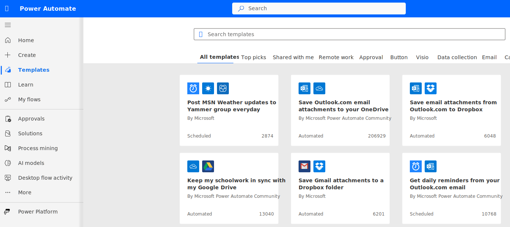

Within Power Automate, templates exist that allow app makers to use blueprints that have been provided by Microsoft, Microsoft partners, and the community. These templates are free to use and can act as accelerators for people who are looking to solve a pre-determined problem.

The public gallery can be accessed from the **Templates** link in the left navigation menu. From the gallery, makers can search for specific connectors or keywords that they're interested in. Additionally, Microsoft has categorized the templates based on popular scenarios like approvals, email, and calendar.

While many of the templates in the gallery target information workers, some templates target Microsoft Power Platform governance use cases. This module explores some of these templates that can be used by administrators to improve their productivity when governing Microsoft Power Platform.

