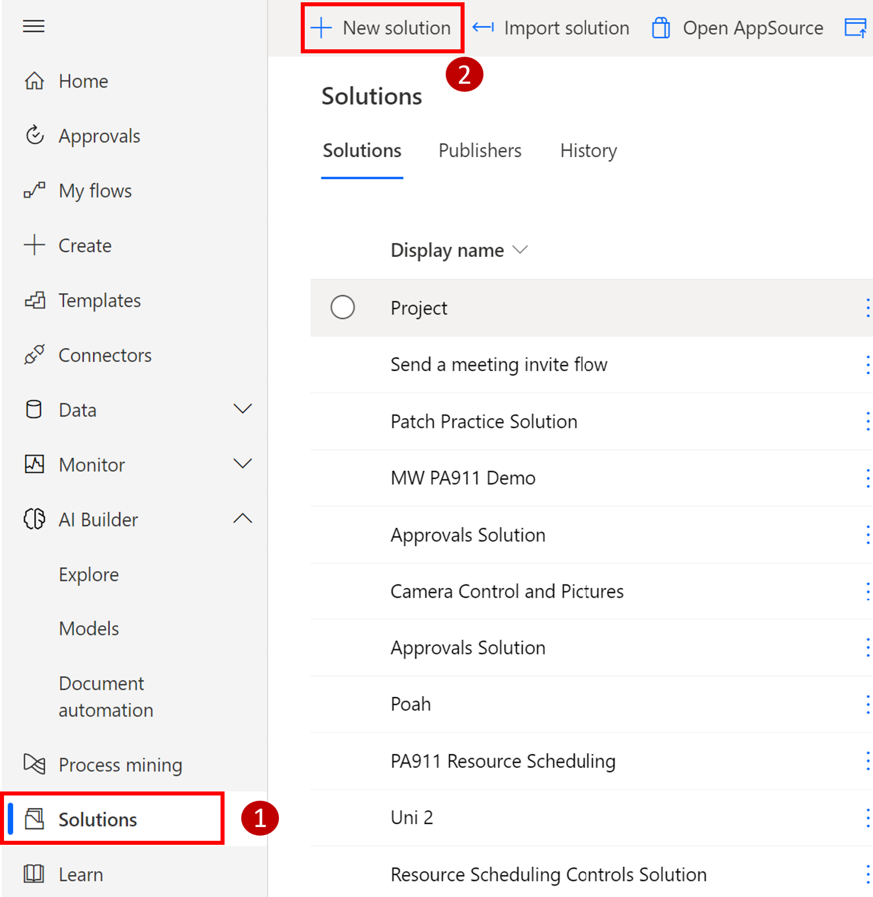
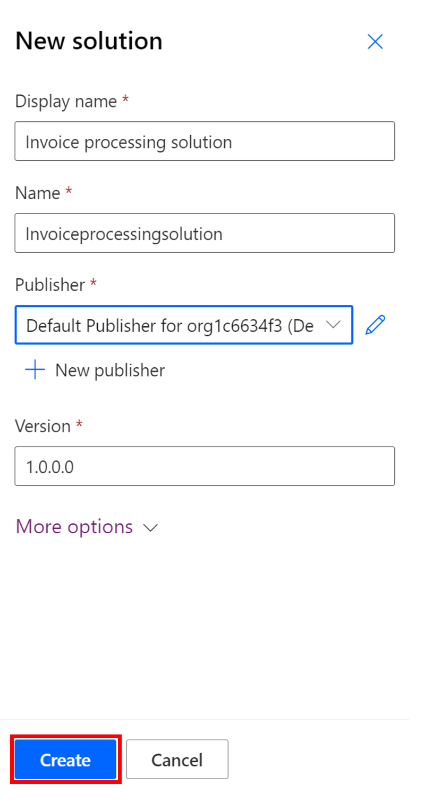
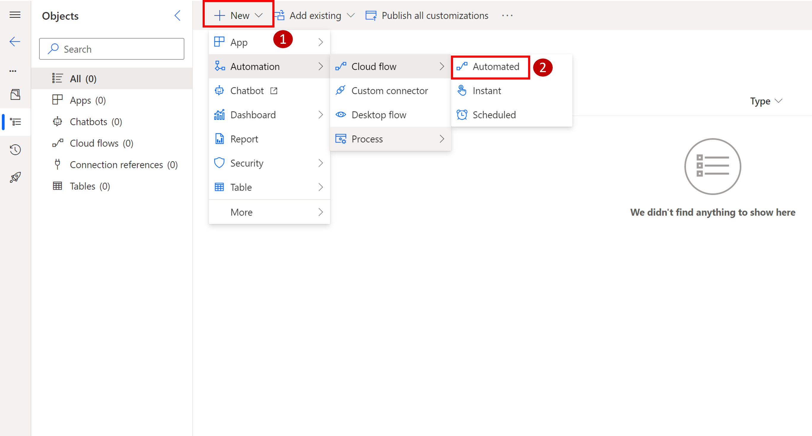
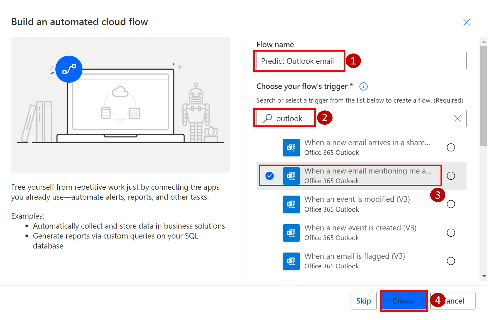
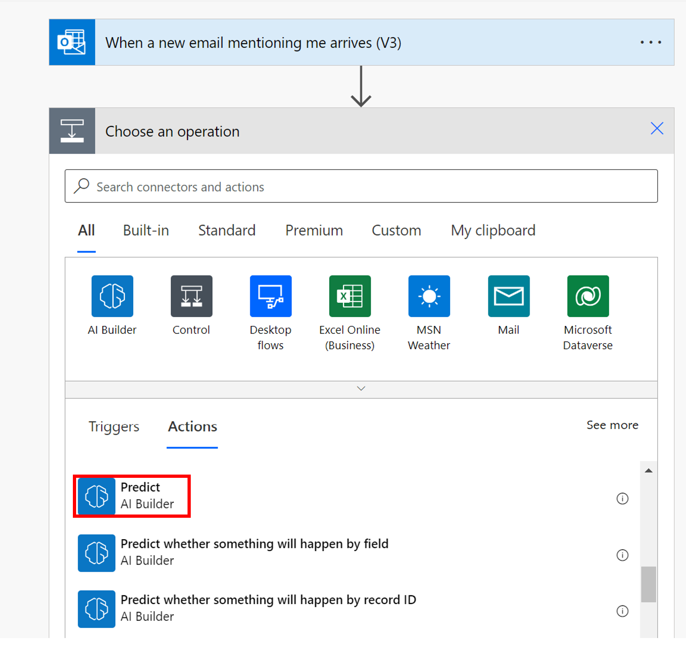
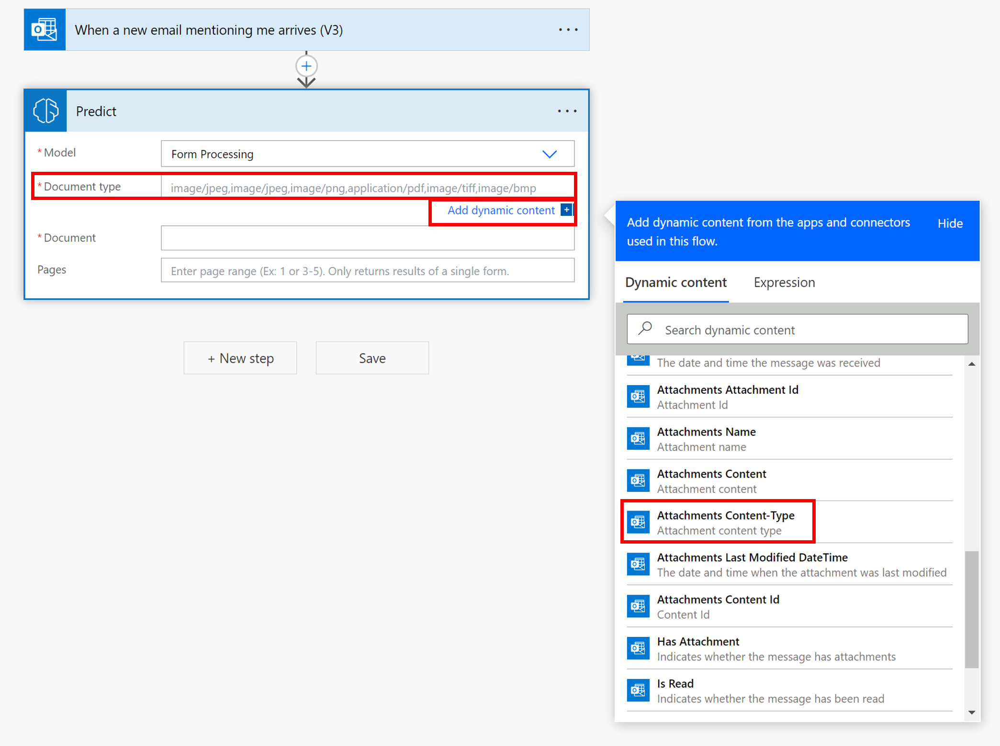
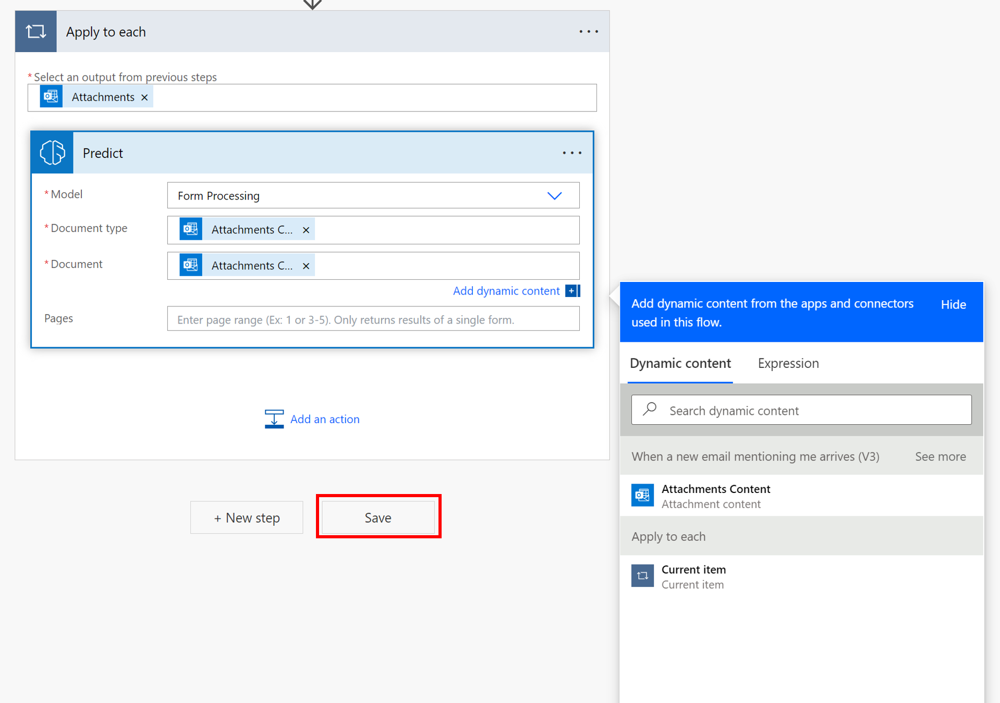
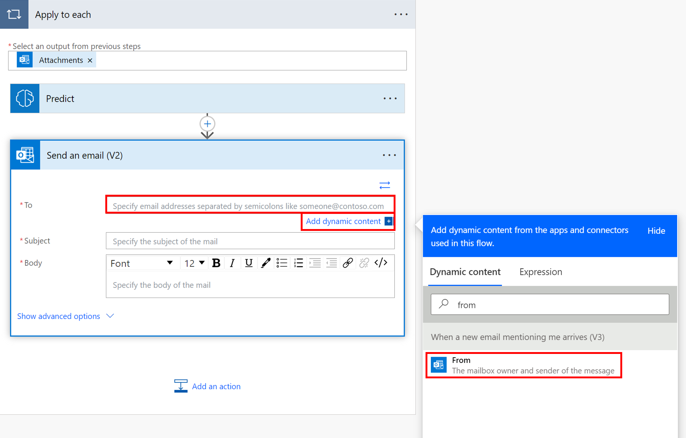
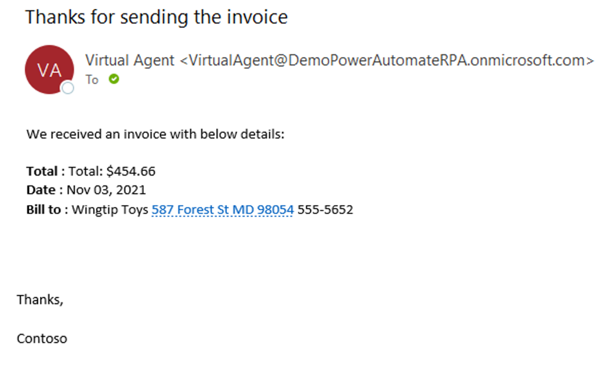

Now that you've created and customized your AI model, you can integrate it into a cloud flow. The flow in this example is a solution-aware cloud flow, meaning that it's packaged in a solution. To create it, select **Solutions** and then **+ New solution**. 

> [!div class="mx-imgBorder"]
> 

Populate the fields as shown below and then click on **Create**.

> [!div class="mx-imgBorder"]
> 

Select the new **Solution** you have just created. You can use the search function available on the top right to find it.

> [!div class="mx-imgBorder"]
> 

First, click on **All (0)** then **+New**. In **Automate**, select **Cloud flow** and then select **Automated**.

> [!div class="mx-imgBorder"]
> 

Type **Predict Outlook email** as the flow name. Then search for **Outlook** and select **When a new email arrives (V3)**. Click **Create**.

> [!div class="mx-imgBorder"]
> 

Click on **Show advanced options** and for **Include Attachments** and **Only with Attachments** select **Yes**.

> [!div class="mx-imgBorder"]
> 

Select **+ New step** and then search for and select **Predict** under AI Builder.

> [!div class="mx-imgBorder"]
> 

Select the model that you want to use, which in this case is **Form Processing**. After your model is selected, more fields will appear. For the form processing model, a document is required. Because this flow is triggered by receiving an email with an attachment, you can specify that attachment with dynamic content. For the document type, search for and select **Attachments Content-Type** in the **Dynamic content** menu.

> [!div class="mx-imgBorder"]
> 

This selection will put your **Predict** action inside an **Apply to each** action so that the model will run for each attachment, if more than one exists. You might need to open the **Predict** action again to specify the **Attachment Content** dynamic content for the document. Select **Save**.

> [!div class="mx-imgBorder"]
> 

While inside the **Apply to each** action, select **Add an action**. Search for and add the **Send an email (V2)** action. Use the **Dynamic content** tab to set the **To** field to the email sender by entering **From** in the search box.

> [!div class="mx-imgBorder"]
> 

Use **Thanks for sending the invoice** for the **Subject**. The body will be a mix of text and dynamic content from the AI model. The following screenshot shows an example of the end result. The model has a display name and a value for each field. Select **Save**.

> [!div class="mx-imgBorder"]
> 

Select **Test** in the upper-right corner of the screen, select the **Manually** option, and then select **Save & Test**.

> [!div class="mx-imgBorder"]
> 

Send yourself an email with an attachment (in either .pdf or .jpg file format) that matches the layout of one of the collections in the model and a subject line of "New invoice." The flow will appear with indications on each step to show you where your flow is in the process. When testing is complete, the following screen will display, indicating that your flow ran successfully.

The email will resemble the following image.

> [!div class="mx-imgBorder"]
> 
