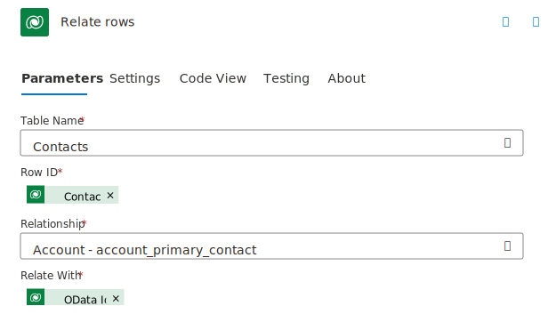
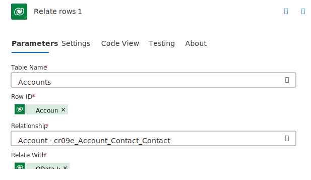

You can use the Dataverse connector to create new rows, modify existing rows, and relate data together by using the defined relationships. When necessary, you can use the delete action to remove rows.

## Create new rows

Use the **Add a new row** action to create new rows in a Dataverse table. You need to choose a table name, and then the action dynamically shows you the top columns for that table. Required columns are indicated with a red asterisk next to the column name. You can't save the flow without providing input to each required column. A required column is any column on the table that's set up as **Business Required**. If you mark other columns as **Business Required** after you create a flow, you need to update your action the next time you update the column so that you can save the flow.

Only some columns automatically show on the **Action parameters** tab. The remaining columns are in advanced parameters.

## Update rows

Use the **Update a row** action to update an existing data row. Also, you can use the action to upsert (update or insert) when the ID doesn't match an existing row; the action can create a new row instead.

The row ID is required on the **Update a row** action, and you only need to update the GUID for the data row. If you're getting the row ID from another Dataverse connector trigger or action, the row ID should be named the same as the table, and the column description would be Unique Identifier for the table. Don't use the OData ID column, which is different.

Unlike the **Add a new row** action that requires columns, the **Update a row** action doesn't require columns. However, you should only change values for columns when the data changes. For example, passing the Account name column when it isn't changed would result in other automations looking for changes on the account table to be run.

To clear an existing column value, change the column on the action to use an expression of null.

## Relate data

You can use Dataverse to create one-to-many (or many-to-one, if you consider the relationship from the other direction) and many-to-many relationships between table rows. Two options are available for you to relate data rows together, depending on the type of relationship and which row in the relationship you're working with.

When you use the **Add a new row** or **Update a row** actions, you can update lookup columns on the data row that you're adding or updating. For example, the Account table has a primary contact lookup column that represents a many-to-one relationship to Contact. When you add or update an account, you can also establish the relationship to the contact in the same action. You can't establish this relationship if you're adding or updating the Contact row because it doesn't have the lookup column. The other option is to use the **Relate rows** action to establish the relationship separately.

You can only establish many-to-many relationships by using the **Relate rows** action. The reason is because none of the rows in the relationship has a lookup column to which you can set the value in the **Add a new row** or **Update a row** actions.

### Specify the ID for each row

When you relate data rows, you need to provide the row's globally unique identifier (GUID) or a row URL. Make sure that you note the difference because giving the wrong GUID or URL results in an error.

You can get the GUID (for example, fd140aaf-4df4-11dd-bd17-0019b9312238) for a row that's in the output of an earlier step in your flow. To do so, select the GUID from dynamic content by looking for the column with the same name as your table and a description that says Unique identifier for *tablename*.

To get the row URL, search in the dynamic content list for OData ID with a description of the OData row ID. You can manually compose a row URL by combining the table OData entity set name with the GUID. The entity set name is usually the table's logical name with the letter "s" added. Thus, the Account table's logical name is account, so the entity set name would be accounts. A quick way to find the name for a table is to add a Dataverse action, set the table to the table name that you want to know the entity set name of, and then switch to code view. In code view, the EntityName value is the entity set name that you need to build an OData row URL. Your OData row URL should resemble the following example:

```
contoso_projects(fd140aaf-4df4-11dd-bd17-0019b9312238)
```

### Use the Add or update a row action

When you use the **Add or update a row** action, you need to specify the row URL for the row to which you're building the relationship. 

The following screenshot shows how to set the primary contact on an account row by using OData ID.

> [!div class="mx-imgBorder"]
> [](../media/lookup-odata.svg#lightbox)

The following screenshot shows how to set the primary contact on an account row by using row ID.

> [!div class="mx-imgBorder"]
> [](../media/lookup-id.svg#lightbox)

### Use the Relate rows action to establish a one-to-many relationship

When using the **Relate rows** action to establish a relationship between two rows, you need to determine which table to select on the action. In a one-to-many relationship, you would use the table on the one side of the relationship. For example, consider a situation where Account rows have a primary contact. The Account row can be related to only one Contact row for this relationship, which puts the Contact row on the one side of the relationship.

Next, provide the **Row ID** for the table that you set up. This value is a row ID, not a URL, so you need to provide only the GUID (for example, fd140aaf-4df4-11dd-bd17-0019b9312238).

Tables can have multiple relationships, so you should pick which relationship you're establishing next. If you need help with the name, you can look at the table properties for the relationship to find the relationship name.

Your last step is to set up the **Relate With** property. This property is a row URL, so you can use the OData ID column from a previous step or provide the full URL manually, such as **contoso_projects(fd140aaf-4df4-11dd-bd17-0019b9312238)**.

> [!div class="mx-imgBorder"]
> [](../media/relate-rows.svg#lightbox)

### Use the Relate rows action to establish a many-to-many relationship
When working with a many-to-many relationship, you can determine which table to specify on the action by looking at the table properties for the relationship. The table that's in the Relate column on the list of relationships is the table name that you should pick when establishing a many-to-many relationship between two rows.

For the **Relate With** option, use the row URL for the other table row.

> [!div class="mx-imgBorder"]
> [](../media/custom-relate-rows.svg#lightbox)
