In this exercise, you'll use the Dataverse connector to create a cloud flow that monitors the status of projects that are related to Contoso's Innovation Challenge. Your flow will trigger if the budget status or the schedule performance changes. Additionally, the flow will complete a series of evaluations and then act on the results.

After you define the trigger to only act when either named column is modified, you'll build the conditions of the actions that are taken: 

- If this project is on track, complete this action (change the status field).

- If the project isn't on track, continue a further evaluation to determine the next action.

In addition to updating the **Status** field, you'll set up the system to add a task as needed. Then, you'll create a dynamic HTML table to include in your email notification.

## Requirements
Your project needs to meet the following requirements:

- The flow should trigger only if the budget status and/or the schedule performance columns have value. The flow shouldn't trigger if both columns are empty.

    - If the budget status is **on budget** or **under budget**, and if schedule performance is **on time** or **ahead**, set the project status to **green**.

    - If the budget status is **over budget**, or if schedule performance is **behind**, set the project status to **red** and then create a task and associate it with the project that triggered the flow.

    - Otherwise, set the project status to **yellow** and then create a task and associate it with the project that triggered the flow.

- Find the project lead of the project that triggered the flow, and then obtain all projects that they own. Send an email that lists all projects that they lead, including the project name and the status of the project (green, yellow, red). For this exercise, you might use your user's email instead.

## Prepare the environment
Your first task is to prepare the environment by following these steps:

1. Go to [Power Apps maker portal](https://make.powerapps.com/?azure-portal=true).

1. Select the correct environment and then select **Apps**.

1. Select the **Innovation Challenge** application and then select **Play**.

1. The **Innovation Challenge** application should launch. Select **Team Projects** and then open the **Fleet Automation** project.

   The columns that you want are located in the **Status** section of the form.

	- **Project Status** is the column that the flow should update.

	- **Budget status** and **Schedule performance** should trigger the flow.

	> [!div class="mx-imgBorder"]
	> [](../media/status-section.svg#lightbox)

1. Locate the **Project lead** column. This application uses the **Owner** user as the project lead. The flow sends the email to this user. You might use the email of your user. For this sample application, the signed-in user, the owner, and the project lead are the same.

	> [!div class="mx-imgBorder"]
	> [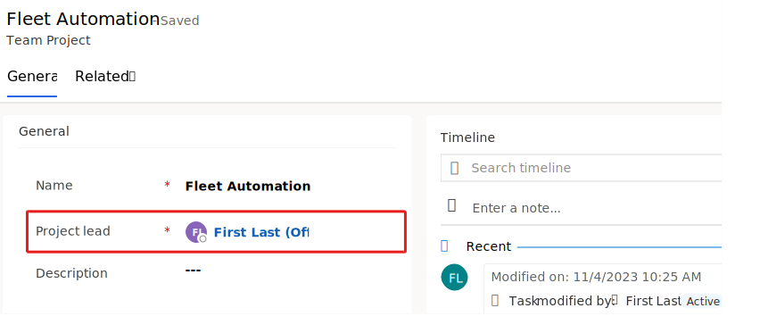](../media/project-lead.svg#lightbox)

1. Close the application browser window or tab.

1. Return to the Power Apps maker portal, select **Solutions**, and then open **Default Solution**.

	> [!div class="mx-imgBorder"]
	> [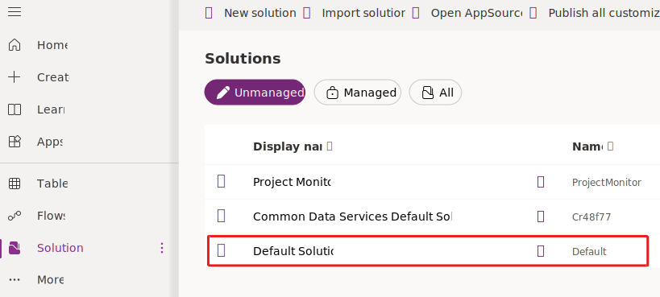](../media/default-solution.svg#lightbox)

1. Search for **team project**, expand the **Team Project** table, and then select **Columns**.

1. Locate and open the **Budget status** column.

	> [!div class="mx-imgBorder"]
	> [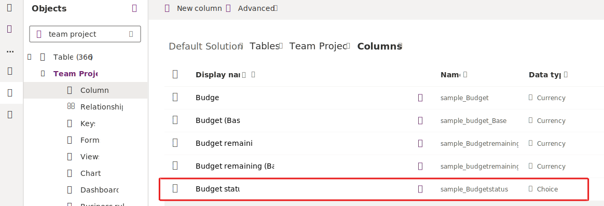](../media/budget-status-column.svg#lightbox)

1.  Locate the choices, which are the choice values that the flow checks. Note these values and their corresponding labels because it's how you would locate option-set values.

1. Expand **Advanced options** and locate the **Logical name** column, where you can find the columns' logical names.

	 > [!div class="mx-imgBorder"]
	 > [](../media/budget-status-options.svg#lightbox)

1. Close the **Column editor** pane.

1. Locate and open the **Schedule performance** column.

1. Locate the choices and logical name for the **Schedule performance** column.

1. The choices for both columns are as follows. Don't include commas.

	- **Budget status** logical name **sample_budgetstatus**

		- **Over budget** - 727000000

		- **On budget** - 727000001

		- **Under budget** - 727000002

	- **Schedule performance** logical name **sample_scheduleperformance**

		- **On time** - 727000000

		- **Ahead** - 727000001

		- **Behind** - 727000002

1. Close the solution.

## Create the flow
Follow these steps to create the flow:

1. Go to [Power Automate portal](https://make.powerautomate.com/?azure-portal=true).

1. Select the correct environment and then select **My flows**.

1. Select **+ New flow** and then select **Automated cloud flow**.

	> [!div class="mx-imgBorder"]
	> [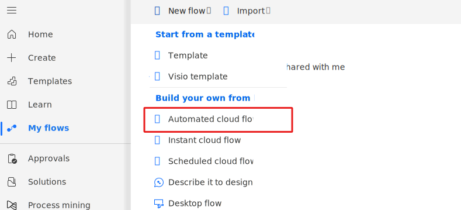](../media/new-cloud-flow.svg#lightbox)

1. Enter **Project status monitor** for the **Flow name**. Search for and select **When a new row is added, modified or deleted Microsoft Dataverse**, and then select **Create**.

	> [!div class="mx-imgBorder"]
	> [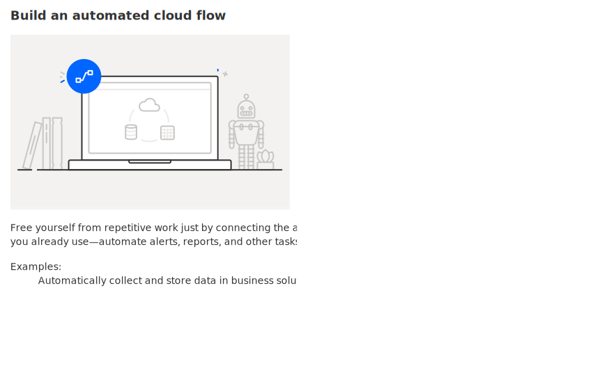](../media/build-cloud-flow-dialog.svg#lightbox)

1. If your connection has an error, follow the prompts to resolve. Select the trigger and then change the name to **When a project budget status or schedule changes**.

1. Select **Modified** for the **Change Type**, select **Team Projects** for the **Table Name**, select **Organization** for **Scope**, and then select **Show all**.

	> [!div class="mx-imgBorder"]
	> [](../media/trigger-config.svg#lightbox)

1. You only need to get the Budget status and Schedule performance columns. In the **Select Columns** field, paste the following budget status and schedule performance logical names, separated by a comma:

	```sample_budgetstatus,sample_scheduleperformance```

1. You don't want the flow to be triggered if the Budget status and Schedule performance columns are empty. Therefore, in the **Filter Rows** field, paste the following test. Notice that you're using the columns' logical names again.

	```sample_budgetstatus ne null or sample_scheduleperformance ne null```

1. The trigger should now resemble the following image. Select **+ Insert a new step** and then select **Add an action**.

	> [!div class="mx-imgBorder"]
	> [](../media/add-action.svg#lightbox)

1. Search for **initialize** and then select **Initialize variable**.

1. Rename the action to **Initialize on track**, enter **OnTrack** for the **Name**, select **Boolean** for the **Type**, and then select **true** for **Value**.

	> [!div class="mx-imgBorder"]
	> [](../media/initialize-variable.svg#lightbox)

1. Select **+ Insert a new step** under the **Initialize on track** step and then select **Add an action**.

1. Search for **control** and then select **Condition**.

1. Select the condition that you added and then rename it to **Check project status**.

1. Enter a slash (**/**) in the **Choose a value** field and then select **Insert Dynamic Content**.

	> [!div class="mx-imgBorder"]
	> [](../media/insert-dynamic.svg#lightbox)

1. Search for and select **Budget status** from the **Dynamic content** pane.

	> [!div class="mx-imgBorder"]
	> [](../media/budget-status.svg#lightbox)

1. Enter **727000001** in the second **Choose a value** field. This entry is the **On budget** option-set value for this column.

1. Select the **+ New item** dropdown menu and then select **+ Add Row**.

	> [!div class="mx-imgBorder"]
	> [](../media/add-row-option.svg#lightbox)

1. Enter a slash (**/**) in the **Choose a value** field and then select **Insert Dynamic Content**.

1. Search for and select **Budget status** from the **Dynamic content** pane.

1. Enter **727000002** in the second **Choose a value** field. This entry is the **Under budget** option-set value for this column.

1. Select both checkboxes, select the **...More commands** menu, and then select **Make Group**.

	> [!div class="mx-imgBorder"]
	> [](../media/make-group.svg#lightbox)

1. Change the group condition to **OR**.

1. Select the **+ New item** option outside the group and then select **+ Add Row**.

	> [!div class="mx-imgBorder"]
	> [](../media/add-item-after-group.svg#lightbox)

1. Enter a slash (**/**) in the **Choose a value** field and then select **Insert Dynamic Content**.

1. Search for and select **Schedule performance** from the **Dynamic content** pane.

1. Enter **727000000** in the second **Choose a value** field. This entry is the **On time** option-set value for this column.

1. Select **+ New item** and then select **+ Add Row**.

1. Enter a slash (**/**) in the left **Choose a value** field and then select **Insert Dynamic Content**.

1. Search for and select **Schedule performance** from the **Dynamic content** pane.

1. Enter **727000001** in the second **Choose a value** field. This entry is the **Ahead** option-set value for this column.

1. Select the checkboxes of the two conditions that you added, select the **...More commands** menu, and then select **Make Group**.

1. Change the group condition to **OR**.

The completed condition should now resemble the following image.

> [!div class="mx-imgBorder"]
> [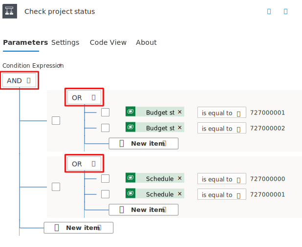](../media/complete-condition.svg#lightbox)

## Update the project status to green
Your next task is to update the project status to **Green** by following these steps:

1. Select the **Insert a new step** button of the **True** branch and then select **Add an action**.

	> [!div class="mx-imgBorder"]
	> [](../media/green-add-action.svg#lightbox)

1. Search for and select **Update a row** from the Microsoft Dataverse connector.

1. Select the **Update a row** action that you added.

1. Rename the step to **Update for green**, select **Team Projects** for the **Table Name**, enter a slash (**/**) in the **Row ID** field, and then select **Insert Dynamic Content**.

	> [!div class="mx-imgBorder"]
	> [](../media/green-insert-dynamic-content.svg#lightbox)

1. Select **Team Project** from the **Dynamic content** pane.

	> [!div class="mx-imgBorder"]
	> [](../media/selected-team-project.svg#lightbox)

1. Select **Show all**.

1. Scroll down and select **Green** from the **Project Status** dropdown menu.

	> [!div class="mx-imgBorder"]
	> [](../media/green-status.svg#lightbox)

1. Select the **Save** button and then wait for the flow to save.

Don't navigate away from this page.

## Check for over budget and behind
Follow these steps to check for over budget and behind:

1. Select the **Insert a new step** button of the **False** branch and then select **Add an action**.

1. Search for **control** and then select **Condition**.

1. Select the condition that you added.

1. Rename the condition to **Check if over budget and behind**.

1. Enter a slash (**/**) in the first **Choose a value** field and then select **Insert Dynamic Content**.

	> [!div class="mx-imgBorder"]
	> [](../media/red-condition-dynamic-content.svg#lightbox)

1. Select **Budget status** from the **Dynamic content** pane and then enter **727000000** in the second **Choose a value** field.

1. Select the **+ New item** dropdown menu and then select **+ Add Row**.

1. Enter a slash (**/**) in the first **Choose a value** field and then select **Insert Dynamic Content**.

1. Select **Schedule performance** from the **Dynamic content** pane and then enter **727000002** in the second **Choose a value** field.

## Update the project status to red
The next task is to update the project status to **Red** by following these steps:

1. The condition should now resemble the following image. Select the **Insert a new step** button from the **True** branch of the **Check if over budget and behind** condition and then select **Add an action**.

	> [!div class="mx-imgBorder"]
	> [](../media/over-condition.svg#lightbox)

1. Search for and select **Update a row** from the Microsoft Dataverse connector.

1. Select the **Update a row** action that you added.

1. Rename the step to **Update for red**, select **Team Projects** for the **Table Name**, enter a slash (**/**) in the **Row ID** field, and then select **Insert Dynamic Content**.

1. Select **Team Project** from the **Dynamic content** pane.

1. Select **Show all**.

1. Scroll down and select **Red** from the **Project Status** dropdown menu.

	> [!div class="mx-imgBorder"]
	> [](../media/red-status.svg#lightbox)

## Update the project status to yellow
To update the project status to **Yellow**, follow these steps:

1. Select the **Insert a new step** button from the **False** branch of the **Check if over budget and behind** condition and then select **Add an action**.

1. Search for and select **Update a row** from the Microsoft Dataverse connector.

1. Select the **Update a row** action that you added.

1. Rename the step to **Update for yellow**, select **Team Projects** for the **Table Name**, enter a slash (**/**) in the **Row ID** field, and then select **Insert Dynamic Content**.

1. Select **Team Project** from the **Dynamic content** pane.

1. Select **Show all**.

1. Scroll down and select **Yellow** from the **Project Status** dropdown menu.

	> [!div class="mx-imgBorder"]
	> [](../media/yellow-status.svg#lightbox)

1. Select **Save** and then wait for the flow to save.

Don't navigate away from this page.

## Update and check the variable
Now, you can update and check the variable by following these steps:

1. Select the **Insert a new step** button from beneath the **Check if over budget and behind** condition and then select **Add an action**.

	> [!div class="mx-imgBorder"]
	> [](../media/action-after-condition.svg#lightbox)

1. Search for and select **Set variable**.

1. Rename the step to **Set on track**, select **OnTrack** for the **Name**, and then select **false** for **Value**.

	> [!div class="mx-imgBorder"]
	> [](../media/set-variable.svg#lightbox)

1. Select the **Insert a new step** button located outside the **Check project status** condition and then select **Add an action**.

	> [!div class="mx-imgBorder"]
	> [](../media/add-action-after-condition.svg#lightbox)

1. Search for **control** and then select **Condition**.

1. Rename the condition to **Check if on track**.

1. Enter a slash (**/**) in the first **Choose a value** field and then select **Insert Dynamic Content**.

1. Select **OnTrack** from the **Dynamic content** pane.

1. Enter a slash (**/**) in the second **Choose a value** field and then select **Insert Expression**.

1. Enter **false** for the expression and then select **Add**.

	> [!div class="mx-imgBorder"]
	> [](../media/false-expression.svg#lightbox)

## Create a task
To create a task, follow these steps:

1. Select the **Insert a new step** button from the **True** branch of the **Check if on track** condition and then select **Add an action**.

1. Search for and select **Add a new row** from the Microsoft Dataverse connector.

1. Rename the step to **Create task**, select **Tasks** for the **Table Name**, and then enter **Project Status Review** for the **Subject**.

	> [!div class="mx-imgBorder"]
	> [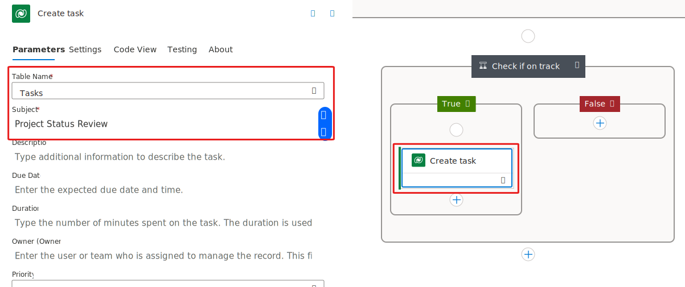](../media/task-subject.svg#lightbox)

1. Scroll down to locate the **Regarding (Team Projects)** field.

1. Enter **sample_teamprojects()** in the **Regarding (Team Projects)** field.

1. Enter a slash (**/**) inside the parentheses and then select **Insert Dynamic Content**.

	> [!div class="mx-imgBorder"]
	> [](../media/dynamic-project.svg#lightbox)

1. Select **Team Project** from the **When a project budget status or schedule changes** trigger.

	> [!div class="mx-imgBorder"]
	> [](../media/trigger-project.svg#lightbox)

1. Select **Save** and then wait for the flow to save.

Don't navigate away from this page.

## Get the team project list and send the report
In this next task, you get the team project list for the user and then send a status report.

1. Select the **Insert a new step** button from beneath the **Check if on track** condition and then select **Add an action**.

1. Search for and select **List rows** from the Microsoft Dataverse connector.

1. Rename the step to **List user projects**, select **Team Projects** for the **Table Name**, and then select **Show all**.

	> [!div class="mx-imgBorder"]
	> [](../media/trigger-project.svg#lightbox)

1. Enter **sample_name, sample_projectstatus** in the **Select Columns** field.

1. Enter **_owninguser_value eq** in the **Filter Rows** field.

1. Enter a space after **eq** and then select **Insert Dynamic Content**.

1. Select **Owner (Value)** from the **Dynamic content** pane from the trigger step.

	> [!div class="mx-imgBorder"]
	> [](../media/filter-rows.svg#lightbox)

1. Select the **Insert a new step** button located beneath the **List user projects** step and then select **Add an action**.

1. Search for **HTML table** and then select **Create HTML table**.

1. Rename the step to **Create projects table**.

1. Enter a slash (**/**) in the **From** field and then select **Insert Dynamic Content**.

1. Select **body/value** from the **Dynamic content** pane and then select **Show all**.

	> [!div class="mx-imgBorder"]
	> [](../media/table-show-all.svg#lightbox)

1. Select **Custom** for **Columns**.

1. Enter **Name** on the **Enter key** field and then select **Insert Dynamic Content**.

1. Select **Name** from the **List user projects** step.

	> [!div class="mx-imgBorder"]
	> [](../media/project-name.svg#lightbox)

1. Enter **Status** in the second row, enter a slash (**/**) in the **Value** field of the second row, and then select **Insert Expression**.

1. Paste the following expression and then select **Add**.

	```item()?['sample_projectstatus@OData.Community.Display.V1.FormattedValue']```

	> [!div class="mx-imgBorder"]
	> [](../media/status-expression.svg#lightbox)

1. Select the **Insert a new step** button located beneath the **Create projects** step and then select **Add an action**.

1. Search for **send email** and then select **Send an email (V2)** for Microsoft Office 365 Outlook.

1. Sign in if prompted.

1. Rename the step to **Send report**.

1. Provide your user's email for the **To** field.

1. Enter **Status Report** for **Subject**.

1. Enter **Status of your projects** and then make it bold format.

1. Move your cursor below the text in the **Body**, enter a slash (**/**), and then select **Insert Dynamic Content**. Add the HTML output table.

	> [!div class="mx-imgBorder"]
	> [](../media/send-email.svg#lightbox)

1. Select **Save** and then wait for the flow to save.

## Test the flow
Your last task in this exercise is to test your flow by following these steps:

1. Go to [Power Apps maker portal](https://make.powerapps.com/?azure-portal=true).

1. Make sure that you're in the correct environment and then select **Apps**.

1. Select the **Innovation Challenge** application and then select **Play**.

1. Select **Team Projects** and then open the **Fleet Automation** project.

1. Select **Over budget** for **Budget status**, select **Behind** for **Schedule performance**, and then select **Save**.

	> [!div class="mx-imgBorder"]
	> [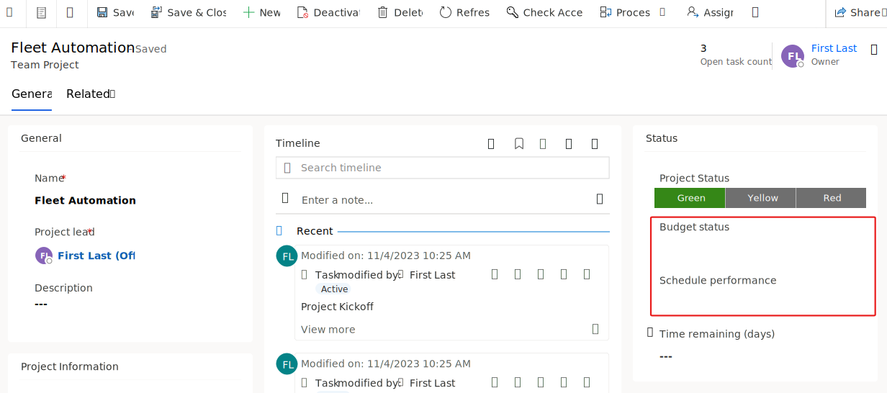](../media/update-project.svg#lightbox)

1. Refresh the form. The **Project Status** should change to **Red** and a **Project Status Review** task should display.

	> [!div class="mx-imgBorder"]
	> [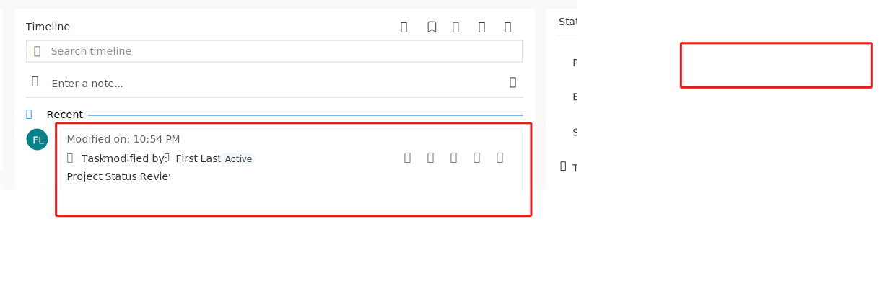](../media/project-and-task.svg#lightbox)

1. Go to **Outlook**. You should receive a **Status Report** email.

	> [!div class="mx-imgBorder"]
	> [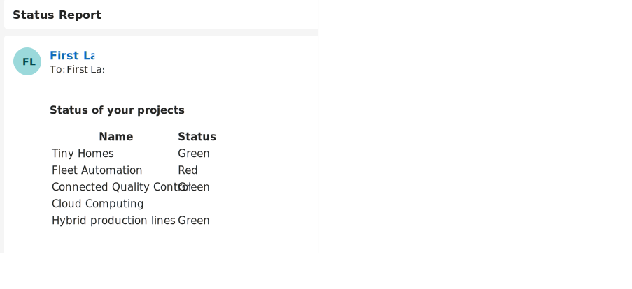](../media/status-email.svg#lightbox)

1. You can test the flow for Red and Yellow status.
