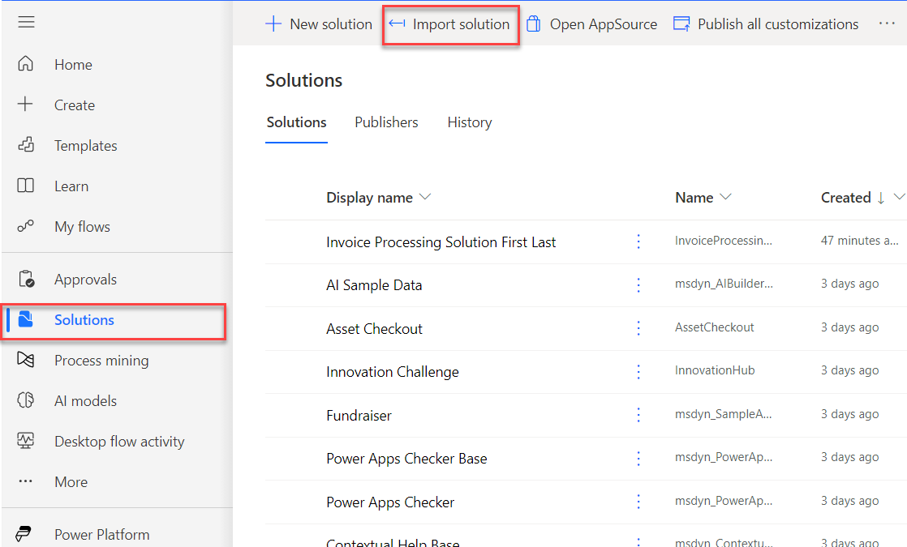
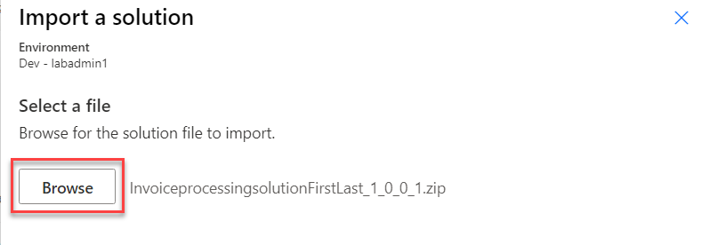

> [!NOTE]
> If you completed the **Create your first desktop flow - Online workshop** module, skip to the next task.

To import the solution, follow these steps:

1. Go to Microsoft [Power Automate](https://powerautomate.microsoft.com/?azure-portal=true) and select the environment that you want to use for this module.

1. Select **Solutions** and then select **Import solution**.

   > [!div class="mx-imgBorder"]
   > 

1. Select **Browse**.

1. Select the **InvoiceprocessingsolutionFirstLast_1_0_0_1.zip** solution file located in the solution folder and then select **Open**.

1. Select **Next**.

   > [!div class="mx-imgBorder"]
   > 

1. Select **Import** and then wait for the solution to import.
