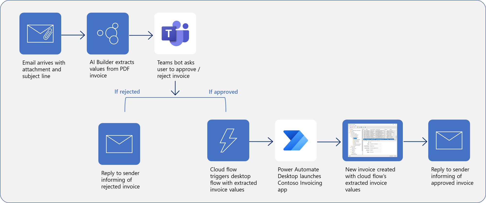

This module uses an existing solution as a basis for creating the flow with Microsoft Teams approval. The solution includes a desktop flow that's built in Microsoft Power Automate for desktop to take actions in an invoicing application. The desktop flow contains various input and output variables and is connected to a cloud flow through a gateway that's triggered by receiving an email in Microsoft Outlook. Then, the flow uses a customized AI form processing model to analyze attachments. These features are packaged together in a Power Automate solution. You can use this module to learn the concepts that are involved in creating approvals in Teams for your own solution, or you can build off the previous modules to re-create the example solution.

> 
**Using a bot in Microsoft Teams allows for human intervention in approving/rejecting the creation of new invoices in the Contoso Invoicing application.**

In this module, you'll:

- Integrate a Teams-based approval model and the associated conditional logic into an existing cloud flow.

- Integrate the desktop flow for entering the invoice information into the approval process.

- Integrate Microsoft Outlook-based approval and rejection notifications into the invoice process.

- Test the end-to-end invoice processing cloud flow.
