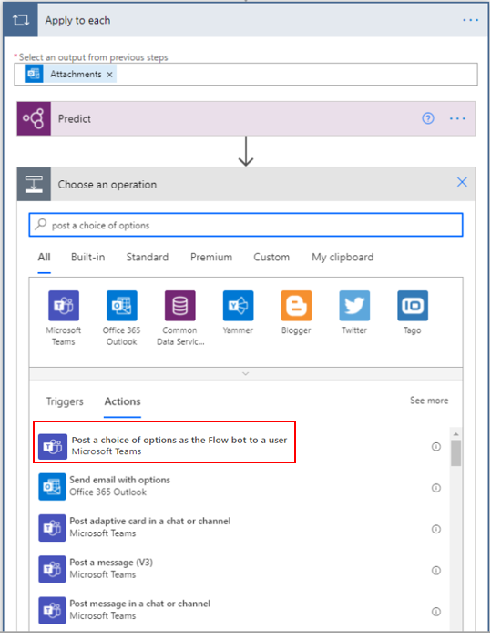
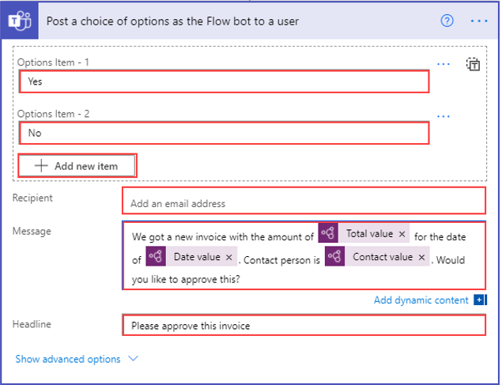
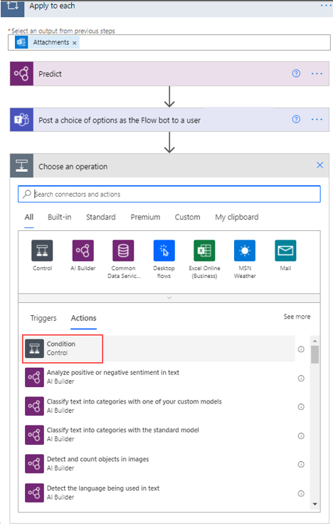
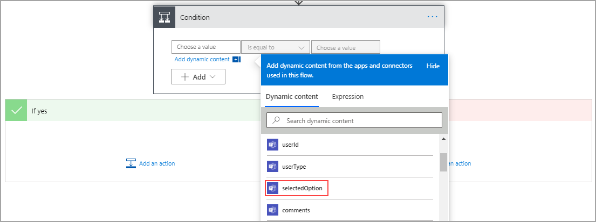
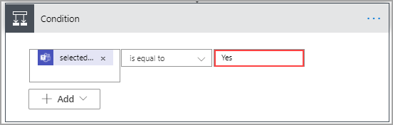

Watch the following demo video of the steps that you'll complete in this unit.

> [!VIDEO https://www.microsoft.com/videoplayer/embed/RE5cLhx]

To add the actions that will post to Teams, ensure that you're still in the **Apply to each** screen and then select **Add an action**. Search for and select the **Post a choice of options as the Flow bot to a user** option.

> [!div class="mx-imgBorder"]
> 

In the **Options Item - 1** field, enter **Yes**. Select **Add new item** and then enter **No** in the **Options Item - 2** field. Add your email address in the **Recipient** field. You can change the recipient later to follow conditional logic, or you can change it to someone other than you, but we recommend that you enter your own email for testing.

The **Message** box should be a combination of text and dynamic content from the AI model. Use information from the following image to help create the message. Remember to add dynamic content by selecting the **Add dynamic content** button when your cursor is in the correct place and then select the desired content in the flyout menu.

The **Headline** field should read: **Please approve this invoice**.

> [!div class="mx-imgBorder"]
> 

Now that you've posted in Teams, you'll need to act on the response. To accomplish this task, select **Add an action** in the **Apply to each** screen. Search for and select **Condition**.

> [!div class="mx-imgBorder"]
> 

For the first value, select **selectedOption** from the **Dynamic content** menu.

> [!div class="mx-imgBorder"]
> 

Ensure that the operator field is set to **is equal to** and then enter **Yes** for the second value.

Conditions are case-sensitive, so be sure that you enter the same value for the option and the condition.

> [!div class="mx-imgBorder"]
> 

Now, you've connected to Teams for approval and have set up the condition. The remaining step is to add the actions for approval and rejection.
