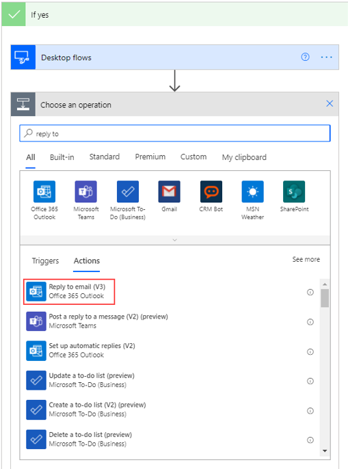
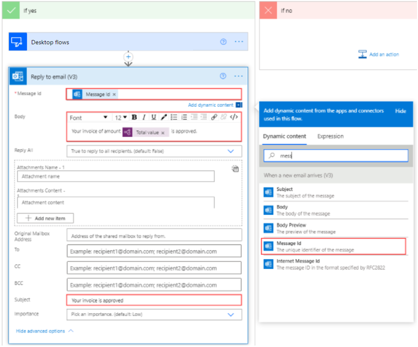
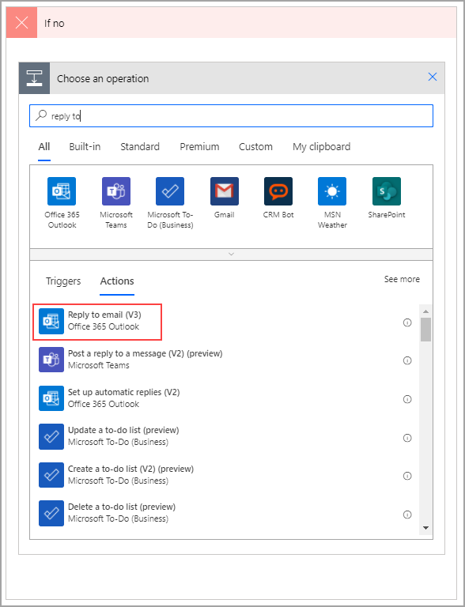
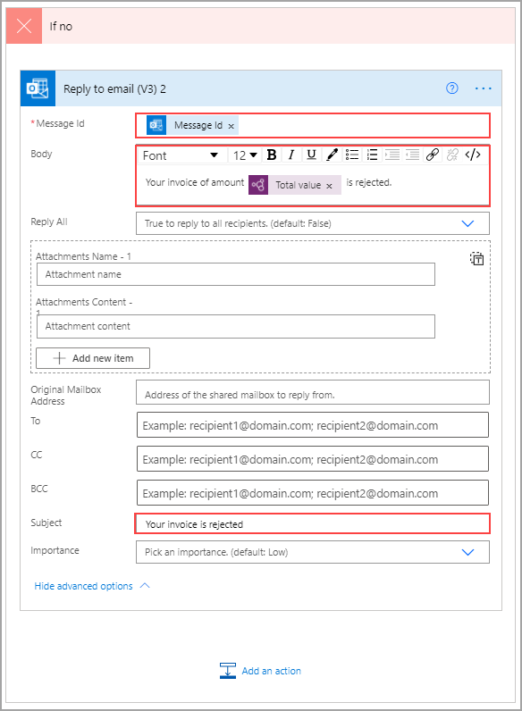

Watch the following demo video of the steps that you'll complete in this unit.

> [!VIDEO https://www.microsoft.com/videoplayer/embed/RE5cFR4]

Now that you've gone through an approval and have updated your legacy app (if approved), you'll need to alert the invoice sender of the approval outcome. To begin, select **Add an action** under the **If yes** branch and then search for and select **Reply to email (V3)**.

> [!div class="mx-imgBorder"]
> 

For the first field, find the **Message ID** of the original email in the **Dynamic content** menu. The body will be a combination of text and dynamic content, as shown in the following image. Expand the fields by selecting **Show advanced options** and then enter **Your invoice is approved** in the **Subject** field.

> [!div class="mx-imgBorder"]
> 

Now, you have the approval email and only need to add the rejection email. To do so, ensure that you're under the **If no** branch and then select **Add an action**. Search for and select **Reply to email (V3)**.

> [!div class="mx-imgBorder"]
> 

For the first field, find the **Message ID** of the original email in the **Dynamic content** menu. The body will be a combination of text and dynamic content, as shown in the following image. Expand the fields by selecting **Show advanced options** and then enter **Your invoice is rejected** in the **Subject** field.

> [!div class="mx-imgBorder"]
> 

Select **Save**.
