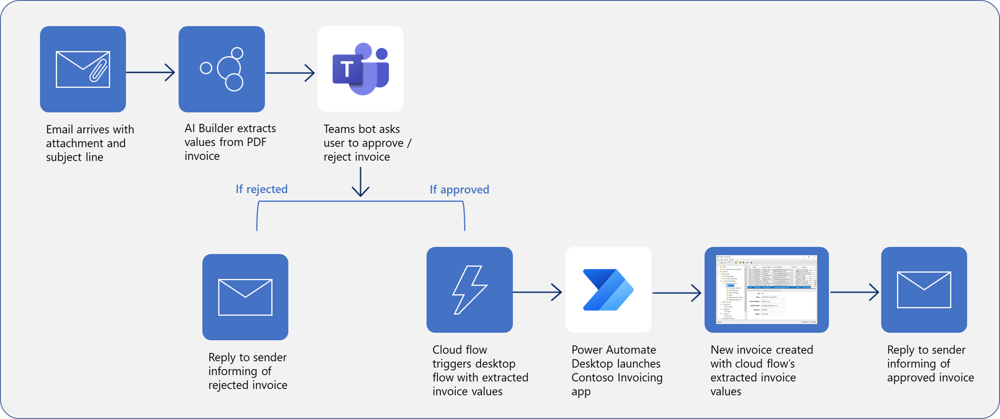

Now, you have learned how to design an end-to-end robotic process automation (RPA), from automated emails and form processing to approvals and performing actions in desktop applications. You can use these concepts to build nearly any process in Power Automate, which will reduce the amount of time that you spend on necessary but repetitive tasks.

> 
**Using a bot in Microsoft Teams allows for human intervention in approving/rejecting the creation of new invoices in the Contoso Invoicing application.**

In this module, you learned how to:

- Integrate a Teams-based approval model and the associated conditional logic into an existing cloud flow.

- Integrate the desktop flow for entering the invoice information into the approval process.

- Integrate Outlook-based approval/rejection notifications into the invoice process.

- Test the end-to-end invoice processing cloud flow.

## Key takeaways

Three key takeaways for this module are:

- Dynamic content enables you to use information from previous steps in a flow.

- Power Automate has hundreds of connectors that you can use to design a truly robust RPA.

- Solutions allow you to integrate various programs, such as Teams and Outlook, with legacy desktop applications.
