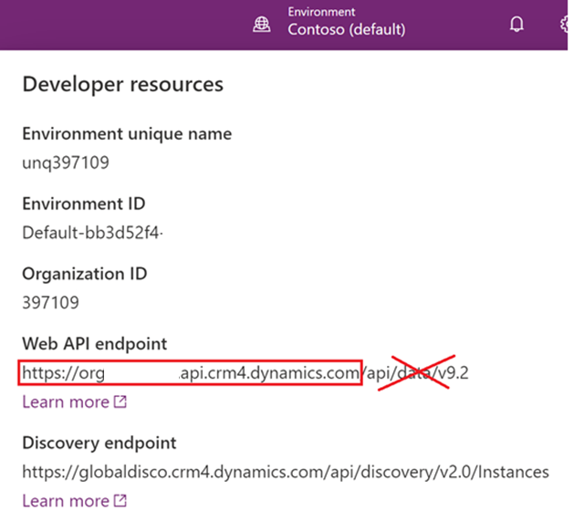
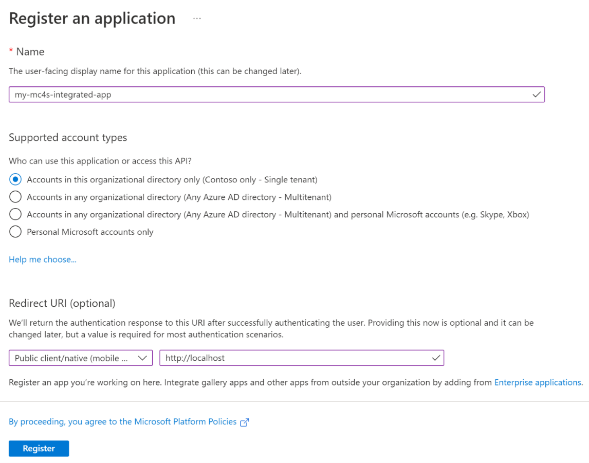

[Microsoft Authentication Library (MSAL)](/azure/active-directory/develop/msal-net-differences-adal-net/?azure-portal=true) is recommended over [Azure Active Directory Authentication Library (ADAL)](/azure/active-directory/develop/msal-net-differences-adal-net/?azure-portal=true) because MSAL comes with more security and resiliency benefits. However, you’ll still need to use ADAL if your application needs to sign in users with earlier versions of Active Directory Federation Services (ADFS). This exercise is intended for legacy or existing apps that use ADAL and aren’t yet migrated to MSAL. 

## Step 1 - Locate the endpoint of your Dataverse environment

To locate the endpoint of your Dataverse environment, follow these steps:

1. Go to [Power Apps](https://make.powerapps.com/?azure-portal=true).
2. Check the **Environment badge** in the upper right to ensure that you’re in the correct environment. 
3. Select the **Settings** icon in the upper right and then select **Developer resources**. 
4. Copy and save the **Web API endpoint** (you’ll need this information later in this exercise). Make sure that you only copy the URL from the scheme (https) to the host `globaldisco.crm4.dynamics.com` without the **/api/data/v9.x** path or query string.

    > [!div class="mx-imgBorder"]
    > [](../media/web-endpoint.png#lightbox)
 
## Step 2 – Register the Microsoft Entra ID app 

Next, you’ll create the app registration and underlying service principal that your app will use to run the Microsoft Entra ID delegate authentication. 

> [!Note]
> You’ll need to complete this step to get the user to authenticate with their credentials and use the resulting authentication token to access Dataverse.
1. Go to the [Azure portal](https://ms.portal.azure.com/?azure-portal=true).

2. Go to Microsoft Entra ID.
3. Go to **App registrations**.
4. Select **New registration**.
    1. Enter any name, such as **my-mc4s-integrated-app**.
    1. Select **Single tenant** for the **Supported account types**. 
    1. Select **Public client/native (mobile & desktop)** and then enter `http://localhost` in the **Redirect URI (optional)** section.
    1. Select **Register**.
        > [!div class="mx-imgBorder"]
        > [](../media/register-application.png#lightbox)

    Now, you've created your Microsoft Entra ID application and service principal. The app registration will be created and the **Overview** tab will open. 

5. Note the **Application (client) ID** because you’ll need it later in this exercise. 

    > [!div class="mx-imgBorder"]
    > [](../media/intergrated-app.png#lightbox)

6. To access resources in your subscription, assign a role to the application. 
    1. Go to **API permissions**.
    1. Select **Add a permission**.
    1. Select **APIs my organization uses**.
    1. Enter **Dataverse** in the search box.
    1. Select the **Dataverse** item from the result list. 
 
        > [!div class="mx-imgBorder"]
        > [](../media/integrated-app-permissions.png#lightbox)

7. Ensure that the **user_impersonation** permission is selected and then select **Add permissions**.

    > [!div class="mx-imgBorder"]
    > [](../media/request-api-permissions.png#lightbox)

    The **user_impersonation** permission will be shown in the **Permissions** list.

    > [!div class="mx-imgBorder"]
    > [](../media/user-impersonation.png#lightbox)

Your service principal is now set up. You can start using it to run your scripts or apps. These steps will allow your app to impersonate the signed-in user to access the Microsoft Cloud for Sustainability data in Dataverse.

## Step 3 – Create a .NET Framework console app to query the Emission table

To create a Microsoft .NET Framework console app to query the **Emission** table, follow these steps:

1. Open **Visual Studio 2019** (or newer) to create a new C# .NET Framework console app. 

    > [!Note]
    > Select at least .NET Framework 4.7.

2. Open the **Program.cs** file and replace the entire content with the following code:

    ```C#

    using Microsoft.IdentityModel.Clients.ActiveDirectory;
    using Newtonsoft.Json;
    using Newtonsoft.Json.Linq;
    using System;
    using System.Collections.Generic;
    using System.IO;
    using System.Net.Http;
    using System.Net.Http.Headers;

    namespace MyMC4SApps
    {
        class Program
        {
            static void Main()
            {
                // TODO Specify the Dataverse environment name to connect with.
                string resource = "Enter Dataverse environment endpoint here";
                // TODO Specify the Microsoft Entra ID app registration id.
                var clientId = "Enter App ID here";
                var redirectUri = new Uri("http://localhost");

                #region Authentication

                // The authentication context used to acquire the web service access token
                var authContext = new AuthenticationContext(
                    "https://login.microsoftonline.com/common", false);

                // Get the web service access token. Its lifetime is about one hour after
                // which it must be refreshed. For this simple sample, no refresh is needed.
                // See https://learn.microsoft.com/powerapps/developer/data-platform/authenticate-oauth
                var token = authContext.AcquireTokenAsync(
                    resource, clientId, redirectUri,
                    new PlatformParameters(
                        PromptBehavior.SelectAccount   // Prompt the user for a logon account.
                    ),
                    UserIdentifier.AnyUser
                ).Result;
                #endregion Authentication

                #region Client configuration

                var client = new HttpClient
                {
                    // See https://learn.microsoft.com/powerapps/developer/data-platform/webapi/compose-http-requests-handle-errors#web-api-url-and-versions
                    BaseAddress = new Uri(resource + "/api/data/v9.2/"),
                    Timeout = new TimeSpan(0, 2, 0)    // Standard two minute timeout on web service calls.
                };

                // Default headers for each Web API call.
                // See https://learn.microsoft.com/powerapps/developer/data-platform/webapi/compose-http-requests-handle-errors#http-headers
                HttpRequestHeaders headers = client.DefaultRequestHeaders;
                headers.Authorization = new AuthenticationHeaderValue("Bearer", token.AccessToken);
                headers.Add("OData-MaxVersion", "4.0");
                headers.Add("OData-Version", "4.0");
                headers.Accept.Add(
                    new MediaTypeWithQualityHeaderValue("application/json"));
                #endregion Client configuration

                var response = client.GetAsync("msdyn_emissions?$top=10").Result;

                if (response.IsSuccessStatusCode)
                {
                    using (var stream = response2.Content.ReadAsStreamAsync().Result)
                    using (var streamReader = new StreamReader(stream))
                    using (var jsonReader = new JsonTextReader(streamReader))
                    { 
                        var jsonSerializer = new JsonSerializer();
                        var result = jsonSerializer.Deserialize<DataverseQueryResult<Emission>>(jsonReader);
                        foreach (var emission in result.value)
                            Console.WriteLine($"{emission.msdyn_activityname} activity on {emission.msdyn_transactiondate} emitted {emission.msdyn_co2e} CO2 Equivalent");
                    }
                }
                else
                {
                    Console.WriteLine("Web API call failed");
                    Console.WriteLine("Reason: " + response.ReasonPhrase);
                }

                Console.ReadKey();
            }
        }
        public class DataverseQueryResult<T>
        {
            public IEnumerable<T> value { get; set; }
        }
        public class Emission
        {
            public string msdyn_activityname { get; set; }
            public DateTime msdyn_transactiondate { get; set; }
            public decimal msdyn_co2e { get; set; }
        }
    }
    ```

3. Replace the **Enter Dataverse environment endpoint** placeholder with the URL that you previously retrieved in this exercise.
4. Replace the **Enter App ID here** placeholder with the app registration ID that you previously copied in this exercise.
5.	Add the following [NuGet packages](/nuget/consume-packages/install-use-packages-visual-studio/?azure-portal=true):

    - Microsoft.IdentityModel.Clients.ActiveDirectory 
        > [!Note]
        > This package is deprecated. 
    
    - Newtonsoft.Json
6. Run the console app. 
7. Authenticate by using your credentials in the pop-up window. The console app should list the first 10 records of the **Emission** table.
    > [!div class="mx-imgBorder"]
    > [](../media/emission-code.png#lightbox)
