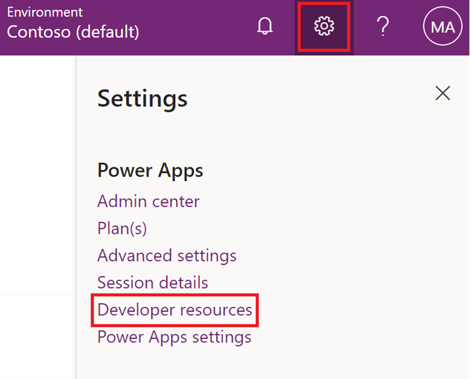
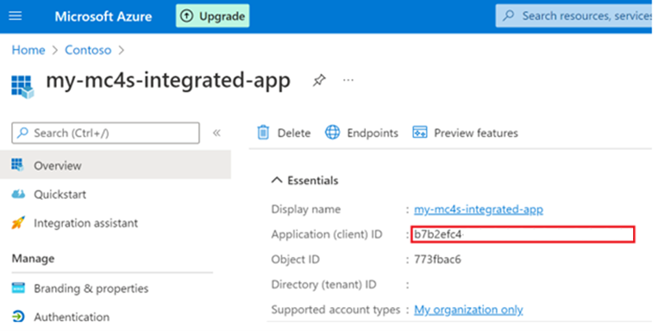
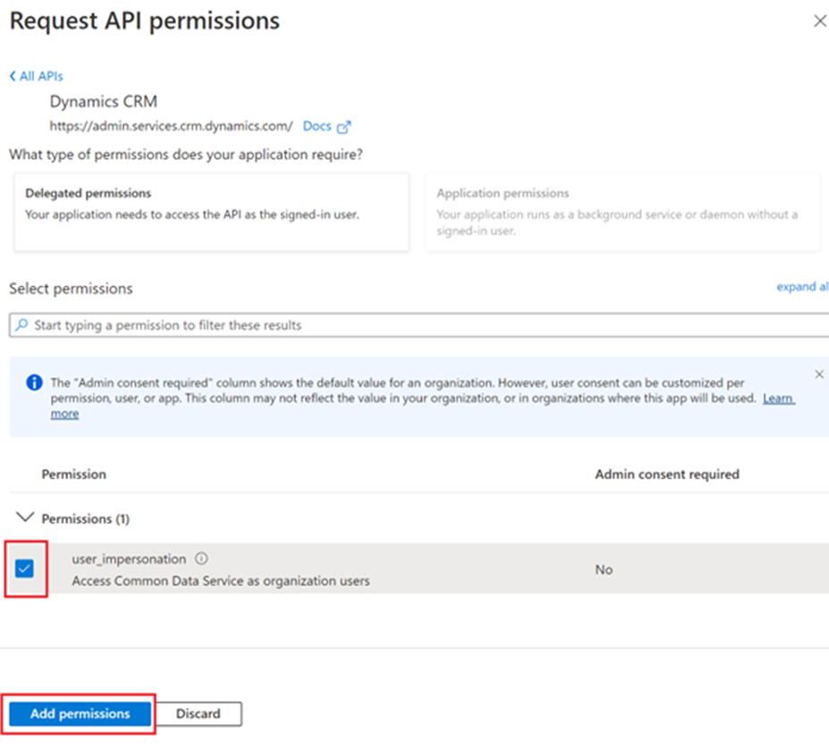
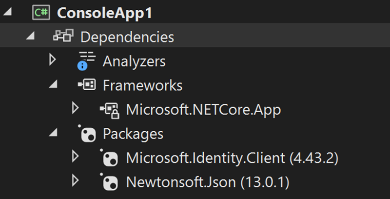

Follow the steps in this exercise to access sustainability data through Dataverse API by using .NET 6 with MSAL. 

## Step 1 – Locate the endpoint of your Dataverse environment

Your first task is to locate the endpoint of your Dataverse environment by following these steps:
1. Go to [Power Apps](https://make.powerapps.com/?azure-portal=true).
2. Review the **Environment** badge in the upper right to ensure that you’re in the correct environment.
3.	Select the **Settings** (gear) icon in the upper right and then select **Developer resources**.

    > [!div class="mx-imgBorder"]
    > [](../media/developer-resources.png#lightbox)

4. Copy and save the **Web API endpoint** (you’ll need this information later in this exercise). Make sure that you only copy the URL from the scheme (https) to the host `www.globaldisco.crm4.dynamics.com` without the path or query string (/api/data/v9.x).

    > [!div class="mx-imgBorder"]
    > [](../media/web-endpoint.png#lightbox)

## Step 2 – Register an application with Microsoft Entra ID and create a service principal

When you have applications, hosted services, or automated tools that need to access or modify resources, you can create an identity for the app. This identity is known as a service principal. Access to resources is restricted by the roles that are assigned to the service principal, giving you control over which resources that people can access and at which level. For security reasons, we always recommend that you use service principals with automated tools rather than allowing users to sign in with a user identity.

In this step, you’ll create the app registration and the underlying service principal that your app will use to run the Microsoft Entra ID delegate authentication. 

> [!Important]
> You’ll need to complete this step to get the users to authenticate with their credentials and use the resulting authentication token to access Dataverse.

1. Go to the [Azure portal](https://ms.portal.azure.com/?azure-portal=true).
2. Go to Microsoft Entra ID. 
3. Go to **App registrations**.
4. Select **New registration** to register the application. 
    1. Enter any name, such as **my-mc4s-integrated-app**.
    1. Select **Single tenant** in the **Supported account types** section.
    1. Select **Public client/native (mobile & desktop)** and then enter **http://localhost** in the **Redirect URI (optional)** section.
    1. Select **Register**.

        > [!div class="mx-imgBorder"]
        > [](../media/register-application.png#lightbox)

Now, you've created your Microsoft Entra ID application and service principal. The app registration will be created, and the **Overview** tab will open. 

5. Note the **Application (client) ID** because you’ll need it later in this exercise. 

    > [!Note]
    > You can register multiple applications with the same name in Microsoft Entra ID, but the applications must have different application (client) IDs. 

    > [!div class="mx-imgBorder"]
    > [](../media/intergrated-app.png#lightbox)

6. To access resources in your subscription, assign a role to the application. 
    1. Go to **API permissions**.
    1. Select **Add a permission**.
    1. Select **APIs my organization uses**.
    1. Enter **Dataverse** in the search box.
    1. Select the **Dataverse** item from the result list. 

    > [!Note]
    > By default, Microsoft Entra ID applications aren't displayed in the available options. To find your application, search for it and then select the name. 

    > [!div class="mx-imgBorder"]
    > [](../media/integrated-app-permissions.png#lightbox)

7. Ensure that the **user_impersonation** permission is selected and then select **Add permissions**.
    
    > [!div class="mx-imgBorder"]
    > [](../media/request-api-permissions.png#lightbox)

    The **user_impersonation** permission will show in the permissions list.

> [!div class="mx-imgBorder"]
> [](../media/user-impersonation.png#lightbox)

Your service principal is now set up. You can start using it to run your scripts or apps. These steps will allow your app to impersonate the signed-in user to access the Microsoft Cloud for Sustainability data in Dataverse.

## Step 3 - Create a .NET 6 console app to query the Emission table

To create a .NET 6 console app, follow these steps:

1. Open Microsoft Visual Studio or Visual Studio Code.
2. Open the **Program.cs** file and replace the existing content with the following code:

    ```C#
    using MyMC4SApp;
    using Microsoft.Identity.Client;  // Microsoft Authentication Library (MSAL)
    using System.Net.Http.Headers;
    using System.Text.Json;

    namespace MyMC4SApp
    {
    class Program
    {
    static async Task Main()
    {
    // TODO Specify the Dataverse environment name to connect with.
    string resource = "Enter Dataverse environment endpoint here";
    // TODO Specify the Microsoft Entra ID app registration id.
    var clientId = "Enter App ID here";
    var redirectUri = "http://localhost"; // Loopback for the interactive login.

    #region Authentication

    var authBuilder = PublicClientApplicationBuilder.Create(clientId)
                                .WithAuthority(AadAuthorityAudience.AzureAdMultipleOrgs)
                                .WithRedirectUri(redirectUri)
                                .Build();
                var scope = resource + "/.default";
                string[] scopes = { scope };

                AuthenticationResult token =
                    authBuilder.AcquireTokenInteractive(scopes).ExecuteAsync().Result;
                #endregion Authentication

                #region Client configuration

                var client = new HttpClient
                {
                    // See https://learn.microsoft.com/powerapps/developer/data-platform/webapi/compose-http-requests-handle-errors#web-api-url-and-versions
                    BaseAddress = new Uri(resource + "/api/data/v9.2/"),
                    Timeout = new TimeSpan(0, 2, 0)    // Standard two minute timeout on web service calls.
                };

                // Default headers for each Web API call.
                // See https://learn.microsoft.com/powerapps/developer/data-platform/webapi/compose-http-requests-handle-errors#http-headers
                HttpRequestHeaders headers = client.DefaultRequestHeaders;
                headers.Authorization = new AuthenticationHeaderValue("Bearer", token.AccessToken);
                headers.Add("OData-MaxVersion", "4.0");
                headers.Add("OData-Version", "4.0");
                headers.Accept.Add(new MediaTypeWithQualityHeaderValue("application/json"));
                #endregion Client configuration

                #region Web API call

                var response = await client.GetAsync("msdyn_emissions?$top=10");

                if (response.IsSuccessStatusCode)
                {
                    using (var stream = response.Content.ReadAsStreamAsync())
                    {
                        var result = await JsonSerializer.DeserializeAsync<DataverseQueryResult<Emission>>(await stream)!;
                        await foreach (var emission in result!.value!)
                            Console.WriteLine($"{emission.msdyn_activityname} activity on {emission.msdyn_transactiondate} emitted {emission.msdyn_co2e} CO2 Equivalent");
                    }
                }
                else
                    Console.WriteLine($"Web API call failed with reason {response.ReasonPhrase}");
                #endregion Web API call

                Console.ReadKey();
            }
        }
        public class DataverseQueryResult<T>
        {
            public IAsyncEnumerable<T> value { get; set; }
        }
        public class Emission
        {
            public string? msdyn_activityname { get; set; }
            public DateTime msdyn_transactiondate { get; set; }
            public decimal msdyn_co2e { get; set; }
        }
    }

    ```
3. Replace the placeholder text in the **Enter Dataverse environment endpoint** field with the URL that you previously retrieved in this exercise.

4. Replace the placeholder text in the **Enter App ID here** field with the app registration ID that you previously copied in this exercise.

5. Add the following NuGet packages:
    - Microsoft.Identity.Client
    - Newtonsoft.Json
        > [!div class="mx-imgBorder"]
        > [](../media/nuget-packages.png#lightbox)

6. Run the console app and authenticate in the browser window. The console app will list the first 10 records of the **Emission** table.

    > [!div class="mx-imgBorder"]
    > [](../media/emission-code.png#lightbox)
