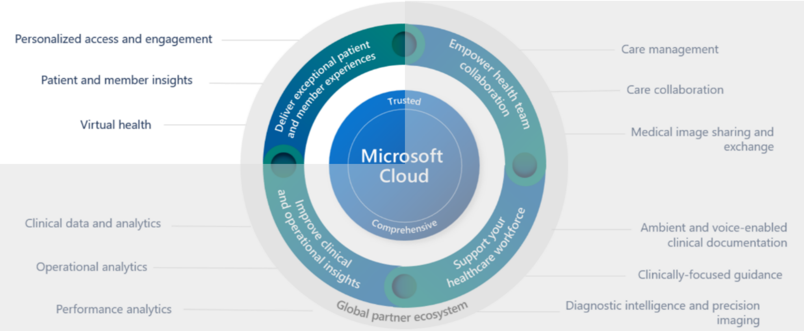
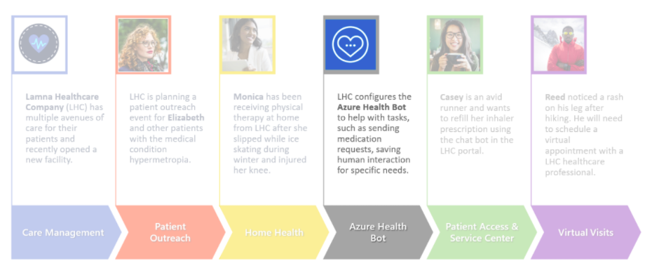

The Microsoft Azure Health Bot service is a cloud platform that empowers developers in healthcare organizations to build and deploy their AI-powered, compliant, conversational healthcare experiences at scale. It allows businesses to offer your users intelligent and personalized access to health-related information and interactions through a natural conversation experience.

With the service, healthcare organizations can build a *health bot instance* and integrate it with their systems that patients, nurses, doctors, and other representatives can interact with. Building an instance allows you to improve processes, services, outcomes, and cost.

Azure Health Bot service contains a built-in medical database, including triage protocols. You can also extend a health bot instance to include your own scenarios and integrate with other IT systems and data sources. For more information, see [Azure Health Bot Overview](/azure/health-bot/?azure-portal=true).

## Industry prioritized scenarios

Azure Health Bot focuses on the **Enhance patient engagement** priority scenario by creating a virtual bot health option to allow for new avenues of care with embedded insights.

> [!div class="mx-imgBorder"]
> 

## Healthcare story

This lab focuses on Lamna Healthcare Company.

> [!div class="mx-imgBorder"]
> 

As part of their digital transformation efforts, Lamna Healthcare Company is seeking to streamline their patient engagement capabilities by implementing Azure Health Bot to help improve processes and services, such as entering medication requests. By allowing patients to interact with this service, Lamna Healthcare Company moves one step closer to their goal of improving patient outcomes while reducing overall costs.

In this module, you play the role of a Lamna Healthcare IT developer. You create and set up your own Azure Health Bot with a custom scenario that allows for medication refills and escalating to a service center agent.

You complete the following tasks:

1. Create an Azure Health Bot and obtain application and bot identifiers.

1. Create an application user for your bot and assign yourself and the bot to the omnichannel agent role.

1. Set up a chat channel, workstream, queue, context variable, and routing rule to define how users interact with the bot and human agents.

1. Embed your chat widget in a Microsoft Power Apps portal.

1. Create scenarios in Azure Health Bot that enable it to engage with patients.
