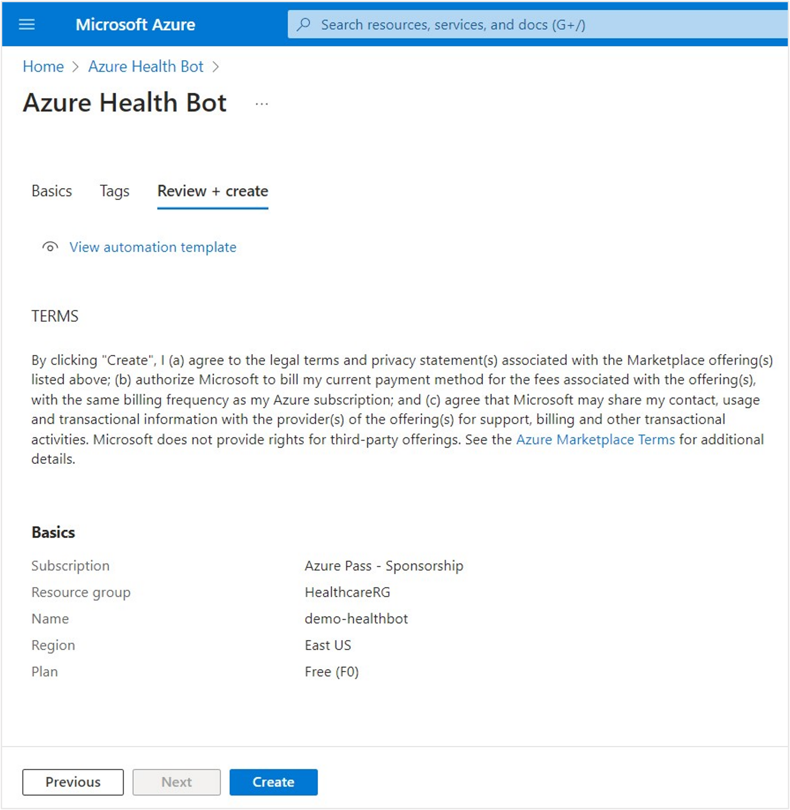

Azure Health Bot empowers developers in healthcare organizations to build and deploy AI-powered, compliant, conversational healthcare experiences at scale. It combines a built-in medical database with natural language capabilities to understand clinical terminology, and you can customize it to support your organization's clinical use cases. The service ensures alignment with industry compliance requirements and is privacy protected to Health Insurance Portability and Accountability Act (HIPAA) standards. For more information, see [Azure Health Bot documentation](/azure/health-bot/).

In this exercise, you complete the following tasks:

1. Set up Azure Health Bot from the Azure portal.

2. Set up and enable integration between Omnichannel for Microsoft Dynamics 365 Customer Service and Azure Health Bot.

3. Set up and enable a bot channel to obtain a bot ID.

4. Obtain the application client ID for your health bot to use later.

## Task: Install Azure Health Bot in Azure subscription

Follow these steps to install the Azure Health Bot in an Azure subscription.

1. While signed in to your Microsoft 365 tenant, open a new tab in your internet browser in Incognito or InPrivate mode and then go to the [Microsoft Azure portal](https://portal.azure.com/?azure-portal=true).

1. Search for **Azure Health Bot** in the search bar and then select it from the search results.

   > [!div class="mx-imgBorder"]
   > 

1. Select the **Create** button to create a new Azure Health Bot instance.

   > [!div class="mx-imgBorder"]
   > 

1. You're redirected to the **Azure Health Bot** page, where you can enter the following information:

   - **Subscription** - Choose your Azure subscription

   - **Resource group** - Use the resource group that you created in environment preparation

   - **Name** - [username]-healthbot (you can choose any name)

   - **Region** - Select the closest region

   - **Plan** - Free (F0)

1. Select **Review + create**.

   > [!div class="mx-imgBorder"]
   > 

1. On the **Review + create** page, verify that your details are correct as Azure validates your Health Bot. When the create button has been enabled after validation passes, select **Create**.

   > [!NOTE]
   > It will take few seconds for the system to run the process before the **Create** button is enabled.

   > [!div class="mx-imgBorder"]
   > 

   You're redirected to the **Deployment** page for your new Azure Health Bot.

1. When the deployment is complete, the **Go to resource** button is enabled. Wait until the deployment has completed for the Azure Health Bot and then select **Go to resource**.

   > [!div class="mx-imgBorder"]
   > 

1. You're redirected to the **Resource** page for your new Azure Health Bot. Select the **Management portal** link on the right of the **Essentials** section to open your Azure Health Bot instance setup page. Select your username for sign-in, if prompted.

   > [!NOTE]
   > Copy this **Management portal** link and store it to access the Health Bot later.

   > [!div class="mx-imgBorder"]
   > 

1. Your new Azure Health Bot instance homepage should appear.

   > [!div class="mx-imgBorder"]
   > 

You've successfully created a new Health Bot instance in your Azure tenant.

## Task: Update Azure Health Bot settings to enable Dynamics 365 integration

To update Azure Health Bot settings to enable Dynamics 365 integration, follow these steps:

1. Select **Configuration > Conversation** on the navigation bar, which opens the **Interactions** tab.

   > [!div class="mx-imgBorder"]
   > 

1. Select the **Human Handoff** tab in the **Conversation Configuration** settings.

   > [!div class="mx-imgBorder"]
   > 

1. Scroll to the bottom of the **Human Handoff** page. Under **Dynamics 365 OmniChannel**, switch the **Bridge Messages** toggle to **Enabled**. This option is required to allow communication and bridge messages between the Azure Health Bot and Omnichannel for Dynamics 365 Customer Service. Select **Save** after enabling the feature.

   > [!div class="mx-imgBorder"]
   > 

1. Go to **Integration > Channels** on the navigation pane. Enable the Health Bot for the **Microsoft Teams** and **Omnichannel** channels.

   > [!div class="mx-imgBorder"]
   > 

1. In the **Channels** list, select the toggle to enable **Microsoft Teams**.

   > [!div class="mx-imgBorder"]
   > 

1. A pop-up window appears with your **Bot ID** information. Copy and store the Bot ID value for later when you create the Dynamics 365 application user. Select **Create**.

   > [!div class="mx-imgBorder"]
   > 

1. In the **Channels** list, select the toggle to enable **Omnichannel**.

   > [!div class="mx-imgBorder"]
   > 

1. The Bot ID should be the same as the Teams channel. Select **Create**.

   > [!div class="mx-imgBorder"]
   > 

   Microsoft Teams and Omnichannel channels are enabled and active.

   > [!div class="mx-imgBorder"]
   > 

You've completed the Azure Health Bot settings for integration with Microsoft Teams and Omnichannel for Dynamics 365 Customer Service.

## Task: Obtain an Azure application ID

In this task, you use the Microsoft Entra ID application ID that you created in your Azure tenant during [environment preparation](/training/modules/training-environment-preparation-healthcare/4a-azure-trial). You might have called it "**MCH Application ID**". Registering this ID established a trusted relationship between your Dynamics 365 app and the Microsoft identity platform.

You now obtain the client ID and store it to later create a Dynamics 365 application user to bridge the authentication between Azure Health Bot and Microsoft Power Apps.

1. Return to the Azure portal and search for **App registrations** in the search box. Select the **App registrations** service.

   > [!div class="mx-imgBorder"]
   > 

1. The **App registrations** homepage opens to the **Owned applications** tab.

   > [!div class="mx-imgBorder"]
   > 

1. Select the **All applications** tab and then enter **MCH Application ID** in the search box to search for your application ID.

   > [!div class="mx-imgBorder"]
   > 

1. Select the **MCH Application Id** app registration resource. Copy and store the **Application (client) ID** for later when you create the Dynamics 365 application user.

   > [!NOTE]
   > ID values have been removed in the screenshot for privacy purposes.

   > [!div class="mx-imgBorder"]
   > 

You've successfully obtained the MCH Application ID from the **Application registrations** page in the Azure portal.
