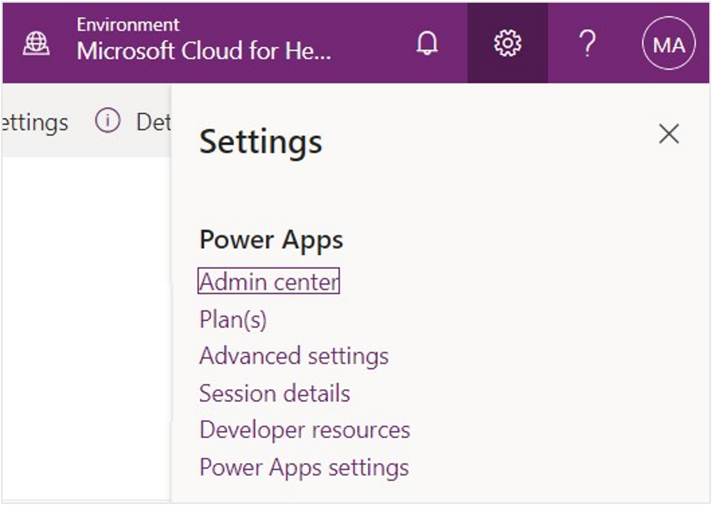
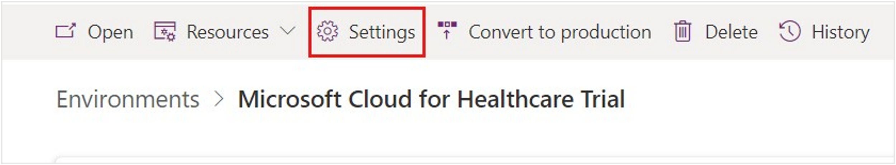
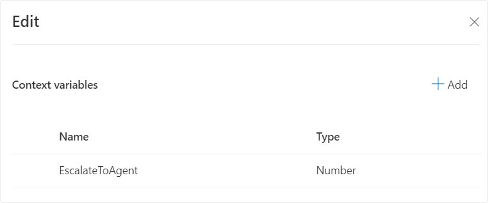

In this exercise, you set up live chat for Omnichannel for Dynamics 365 Customer Service. Omnichannel for Customer Service offers a suite of capabilities that extend the power of Dynamics 365 Customer Service Enterprise so that organizations can instantly connect and engage with customers across digital messaging channels.

In this exercise, you complete the following tasks:

1. Assign the Omnichannel agent security role to your user and the bot user.

1. Create an application user with the MCH Application ID and your bot ID.

1. Set up queues for bot and agent users.

1. Set up a workstream to define a chat channel with a context variable and routing rule to route the message to a bot or an agent.

## Task: Assign the Omnichannel agent security role

To assign the Omnichannel agent security role, follow these steps:

1. While in an InPrivate or Incognito browser, go to [Microsoft Power Apps](https://make.powerapps.com/?azure-portal=true).

1. Select your environment from the **Environment** dropdown menu in the upper right.

   > [!div class="mx-imgBorder"]
   > 

1. Select the **gear icon** in the upper-right corner and then select **Advanced settings**.

   > [!div class="mx-imgBorder"]
   > 

1. A new window should open showing the **Business Management** section of Dynamics 365. If loading takes a while, reload the page.

   > [!div class="mx-imgBorder"]
   > 

1. On the upper command bar next to Dynamics 365, select  **Settings** to open the dropdown menu. Select **Security** in the third column under **System**.
   > [!div class="mx-imgBorder"]
   > 

1. Under **Security**, select **Users**.

   > [!div class="mx-imgBorder"]
   > 

1. Switch the grid view dropdown menu from **Omnichannel Users** to **Enabled Users** so that you can view the user in the list.

   > [!div class="mx-imgBorder"]
   > 

1. In the **Enabled Users** list, scroll or use the search bar to find your user.

   > [!div class="mx-imgBorder"]
   > 

1. Select your user for the training and then select **Manage Roles** on the upper command bar.

   > [!div class="mx-imgBorder"]
   > 

1. Select the **Omnichannel agent** role to assign to your user and then select **OK**.

   > [!div class="mx-imgBorder"]
   > 

You've now assigned the correct Omnichannel agent role to the user, which allows you to be a live agent in Omnichannel.

## Task: Create a Health Bot user in Dynamics 365 Customer Service

You need to set up two users in Omnichannel for Customer Service:

- **Health Bot User** - The Azure Health Bot user that you created in the previous exercise. This configuration allows you to assign the bot as a user and take initial messages through live chat.

- **Omnichannel Agent User** - The current user account that you've used to sign in to Dynamics 365. This configuration allows you to be a live agent in Customer Service who receives messages from portal users through Azure bot escalations.

In this task, you create a bot user, which helps you connect **Azure Health Bot** with **Omnichannel live chat**.

1. Open a new tab and go to [Microsoft Power Platform admin center](https://admin.powerplatform.microsoft.com/?azure-portal=true).

1. Search for and select your Microsoft Cloud for Healthcare environment from the list.

   > [!div class="mx-imgBorder"]
   > 

1. On your **Environments > Details** page, select the **Settings** button on the upper command bar.

   > [!div class="mx-imgBorder"]
   > 

1. Expand **Users + permissions** and then select **Application users**.

   > [!div class="mx-imgBorder"]
   > 

1. Select the **+ New app user** button to create a new application user.

   > [!div class="mx-imgBorder"]
   > 

1. Select **+ Add an app** on the **Create a new app user** page.

   > [!div class="mx-imgBorder"]
   > 

1. Paste the **Application ID** (the Application (client) ID that you obtained in the Azure portal for the supplied MCH Application ID) into the search box and then select the app from the list. You can also search for **mch**. Select **Add**.

   > [!div class="mx-imgBorder"]
   > 

1. Select a **Business unit** from the dropdown list (the options in the list are unique for each Dynamics 365 environment). Select **Create** in the lower right of the page.

   > [!div class="mx-imgBorder"]
   > 

1. Return to the **Dynamics 365 User** page that you previously accessed through **Advanced settings**. Switch the view to **Enabled Users** if you're not already on it. Clear the search terms, if any.

1. While in the **Enabled Users** list, search for **MCH Application ID** or scroll to find the bot app user. Double-click the user or select the row and then select **Edit**.

   > [!div class="mx-imgBorder"]
   > 

1. Above the user name, change the form type from **User** to **Application User**.

   > [!div class="mx-imgBorder"]
   > 

   A new form appears, and the **User type** is **Application user**.

   > [!div class="mx-imgBorder"]
   > 

1. In the **User Information** section, change the **User type** from **Application user** to **Bot application user**. A new field called **Bot application ID** displays.

   > [!div class="mx-imgBorder"]
   > 

1. Add your details to the **Bot application ID**. This ID is the Azure Health Bot ID that you previously noted when you enabled the Teams and Omnichannel channels. This field displays after **Bot application user** has been selected as the **User type**.

   > [!div class="mx-imgBorder"]
   > 

1. Select **Manage Roles** on the command bar.

   > [!div class="mx-imgBorder"]
   > 

1. Assign the **Omnichannel agent** role to the bot user as you did for your own user in the previous task. This action allows the bot to act as an omnichannel agent like your user.

   > [!div class="mx-imgBorder"]
   > 

1. Select the **Omnichannel Administrator** role for your user ID and MCH Application ID users.

   > [!div class="mx-imgBorder"]
   > 

You've successfully created a bot user and have assigned the Omnichannel agent role to it.

## Task: Create and set up human agent queues

You can use queues to collect and distribute workload among agents. As a result, agents are added as members to the queues and the workload is distributed among the agents based on assignment methods. For more information, see [Manage queues for unified routing](/dynamics365/customer-service/queues-omnichannel/?azure-portal=true).

In this task, you create the omnichannel queue that's necessary for communicating with a human agent.

1. Switch back to the tab with [Power Apps](https://make.powerapps.com/?azure-portal=true), select **Apps** in the navigation pane, and open the **Customer Service admin center** app.

   > [!div class="mx-imgBorder"]
   > 

1. You should be on the **Home** page. Select **Guided channel setup** on the navigation pane and select **Start new**. You can automatically create a custom chat channel, queue, and workstream to help connect users to bots and human agents.

   > [!div class="mx-imgBorder"]
   > 

1. On the **Name your setup** page, in the **Setup name** field, and enter the name **Healthcare Training**. Select **Next**.

   > [!div class="mx-imgBorder"]
   > 

1. Select **Chat** as the channel type. Select **Next**.

   > [!div class="mx-imgBorder"]
   > 

1. Select **Continue setup** on the **Summary** page.

   > [!div class="mx-imgBorder"]
   > 

1. Select **Next** on the following two screens, which discuss creating user accounts and assigning security roles.

   > [!div class="mx-imgBorder"]
   > 

   > [!div class="mx-imgBorder"]
   > 

1. In the **Define a queue** page, create a queue called **Escalate to Human**, which manages and redirects the incoming messages from a user to a Customer Service (human) agent when the bot sends the user through to a live agent. Create the new queue with the following details:

   - **Name** - Escalate to Human
   - **Type** - Defaults to **Messaging**

   > [!div class="mx-imgBorder"]
   > 

1. Select **Next**.

1. Select your user to add to the queue. Select **Next**.

   > [!div class="mx-imgBorder"]
   > 

You've now created the necessary queue to escalate to a human agent and have added your user to the messaging queue. Now, you can create the workstream to initially route to a virtual bot, along with routing rules to direct the user to the **Escalate to Human** queue in the proper conditions.

## Task: Update the live workstream with context variables and routing rules

A workstream is a container to enrich, route, and assign work items, and it's associated with a channel, such as live chat, voice, or case. After a bot has been added to a workstream, the incoming work item will be routed to the selected bot at runtime based on classification rules. For more information, see [Create workstreams for unified routing](/dynamics365/customer-service/create-workstreams?azure-portal=true).

In this task, you set up basic chat routing with a new workstream. This setup allows users to chat with a bot user initially and then route to a live human agent in the proper situation.

You complete the following tasks:

- Create a new channel and workstream.

- Turn on proactive chat for the channel.

- Add a bot for initial routing: Initial customer conversation is directed to the Azure Health Bot.

- Create a context variable and routing rule to escalate to a human agent. When context variable **EscalateToAgent** is present and set to **1**, route to the **Escalate to Human** queue that you previously set up with your user so that an agent can continue the conversation.

1. While continuing the guided setup from the previous task, enter a **Chat name** and **Chat language** for your channel and a workstream **Name**. Keep the **Work distribution mode** as **Push** and then select **Next**.

   - **Chat name** -  Chat Widget

   - **Workstream Name** - Chat Workstream

   > [!div class="mx-imgBorder"]
   > 

1. Define a ruleset that allows work from this channel to be routed to the **Escalate to Human** queue. Name the **Routing rules** as **Human Agent** and the **Rule item** as **Human Agent Rule**. Select **Next**.

   > [!div class="mx-imgBorder"]
   > 

   > [!NOTE]
   > On the **Define a Chatbot** page, select **Skip for now** and select **Next**.

   > [!div class="mx-imgBorder"]
   > 

1. It takes a moment for the system to create the chat channel and workstream. When the process is complete, make sure that you **Copy** the **chat widget snippet code** and store it for later. Select **Go to home**.

   > [!div class="mx-imgBorder"]
   > 

1. You still need to set up a few components for the routing to happen correctly:

   1. Enable proactive chat for the chat channel so that the bot can prompt the user.

   1. Add the bot user in the default messaging queue so that conversations initially route to the bot.

   1. Add the default messaging queue as the fallback queue for the new workstream.

   1. Define the routing rule in the workstream for escalating to a human agent.

1. Go to **Overview** on the navigation pane. Select **Chat** in the **Channels** section to view all chat channels.

   > [!div class="mx-imgBorder"]
   > 

1. Select the newly created chat channel, **Chat Widget**, and then select **Edit** on the command bar.

   > [!div class="mx-imgBorder"]
   > 

1. In the **Chat channel settings** form, select the **Chat widget** tab and then turn on **Proactive chat**. This setting allows the bot to prompt the user on the website where it's embedded. Select **Copy** to copy the chat widget code and store it for later use, if you haven't done so already. Select **Save and close**.

   > [!div class="mx-imgBorder"]
   > 

1. Return to **Overview** on the left navigation pane. Scroll down to **Workstreams** and then select **Chat**.

   > [!div class="mx-imgBorder"]
   > 

1. Select **Chat Workstream** and then select **Edit**.

   > [!div class="mx-imgBorder"]
   > 

1. In the **Chat Workstream** record, select **Edit** for the **Fallback queue**.

   > [!div class="mx-imgBorder"]
   > 

1. Select the **Default messaging queue (All users)** from the **Choose existing** dropdown menu.  Select **Save and close**.

   > [!div class="mx-imgBorder"]
   > 

1. The updated fallback queue displays. Select **+ Add bot** to add the Azure Health Bot for initial routing.

   > [!div class="mx-imgBorder"]
   > 

1. Select your bot user from the **Name** dropdown menu. Select **Save and close**.

   > [!div class="mx-imgBorder"]
   > 

1. The bot user has been added. Now, you need to edit the ruleset so that the queue properly escalates to a human agent. First, you need a number variable to use with your escalation logic. On the lower-left corner of the **Workstream** page, select **Show advanced settings**.

   > [!div class="mx-imgBorder"]
   > 

   > [!div class="mx-imgBorder"]
   > 

1. Review the advanced settings for the workstream and then select **+ Add context variable**.

   > [!div class="mx-imgBorder"]
   > 

1. In the **Add context variable** screen, select **+ Add**. Create the new context variable, which you use to determine whether you need to escalate to an agent or not. Enter **EscalateToAgent** as the **Name** and then select **Number** from the **Type** dropdown menu. Select **Create**.

   > [!div class="mx-imgBorder"]
   > 

1. The **EscalateToAgent** context variable of the **Number** type should show as added. Close the **Context variables** screen.

   > [!div class="mx-imgBorder"]
   > 

1. On the workstream record, select **Advanced Settings** to collapse it. Select **Human Agent** under **Ruleset name**.

   > [!div class="mx-imgBorder"]
   > 

1. Select **Human Agent Rule** and then select **Edit**.

   > [!div class="mx-imgBorder"]
   > 

1. **Delete** the initial condition in the rule to start with a blank canvas. The logic to follow is having the workstream route the chat channel to a human agent if the **EscalateToHuman** context variable is equal to **1** in any bot conversation.

   > [!div class="mx-imgBorder"]
   > 

1. Select **Add > Add related entity** to add a new condition.

   > [!div class="mx-imgBorder"]
   > 

1. Select **Context item value (Conversation)** from the dropdown menu to have the routing rule check if conversation context values contain specific data.

1. After you select **Context item value (Conversation)**, the following dropdown menu populates with **contains data**, and a sub condition appears. Select the new **EscalateToAgent** context variable, and then set it as **Equals** to **1** in the condition. This setting allows bot conversations to route to a human agent if that variable is ever set to **1**. You view this result in the last exercise in this module. Select **Save and close**.

   > [!div class="mx-imgBorder"]
   > 

The Chat Workstream shows **Human Agent Rule** with the condition that escalates to a human agent when the context variable is set to **1**.

   > [!div class="mx-imgBorder"]
   > 

You've now created a chat channel, workstream, queue, context variable, and routing rule that allows customers to begin a conversation with a health bot and escalate to a human agent.
