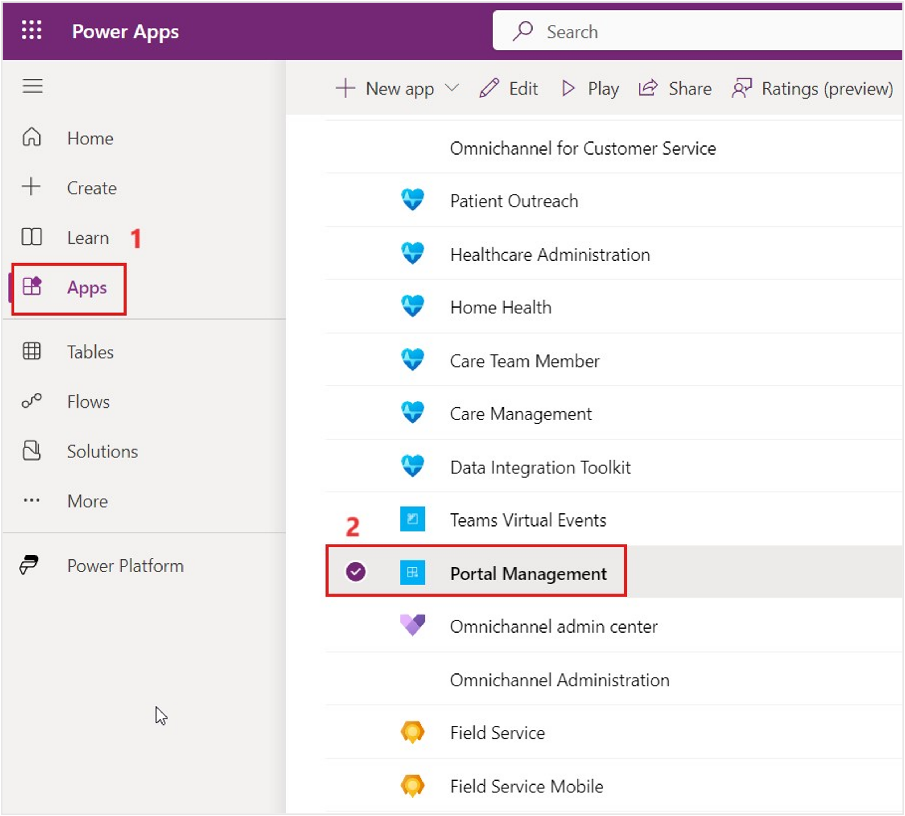
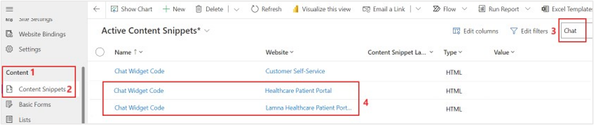
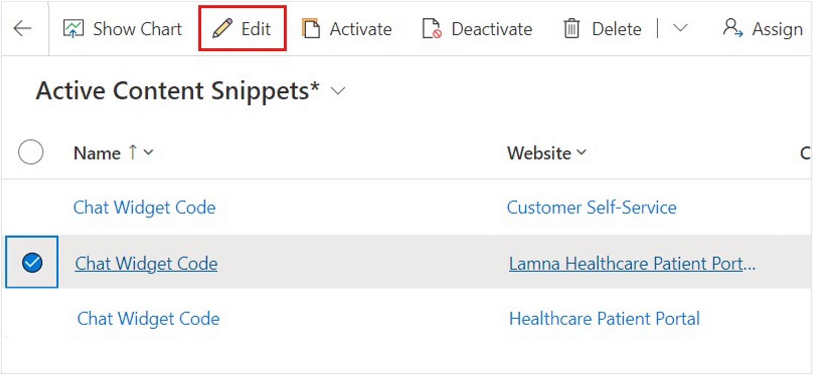
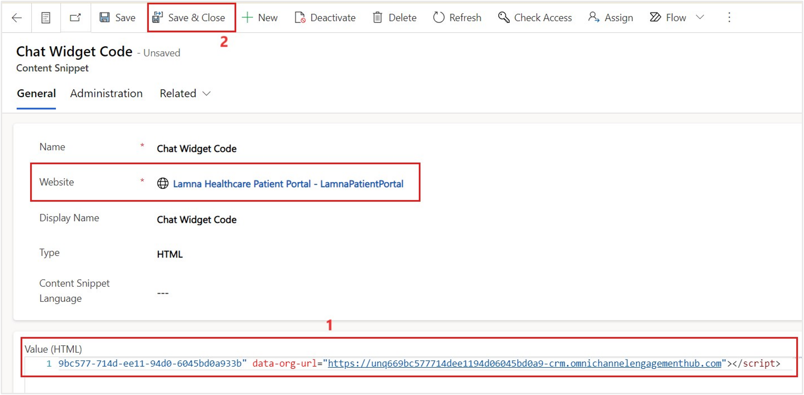
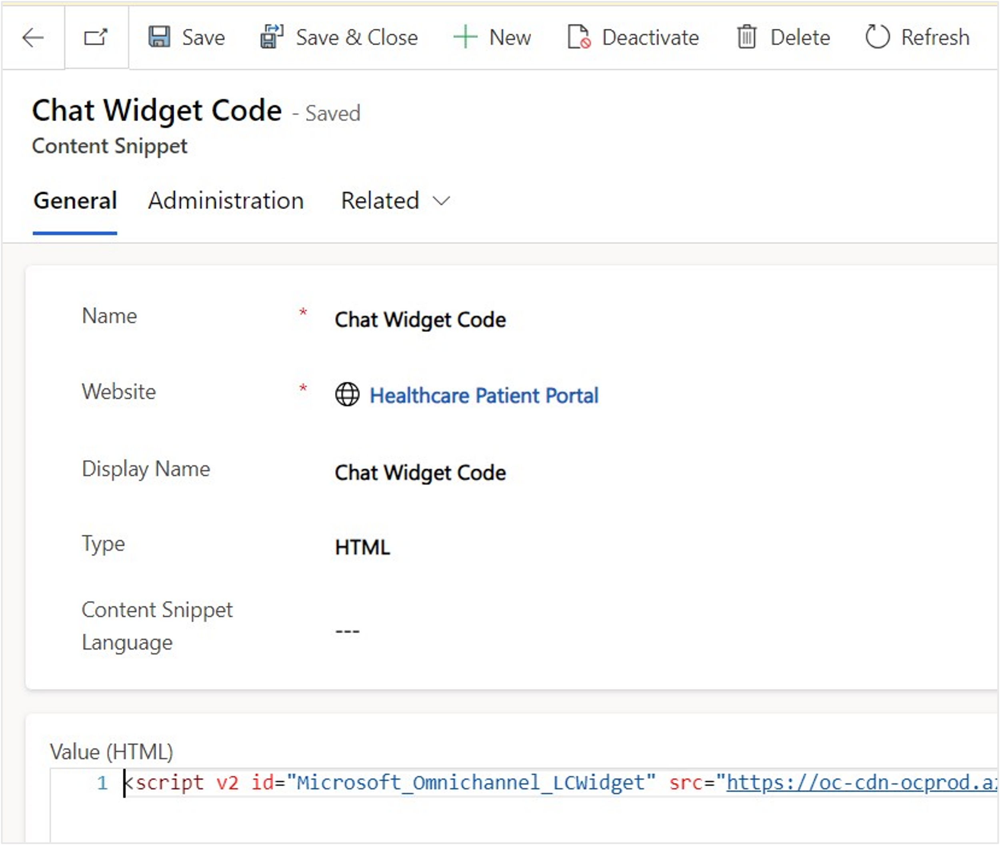
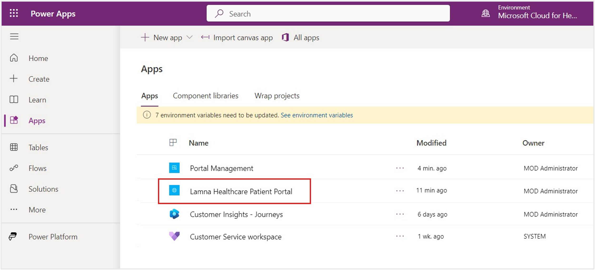
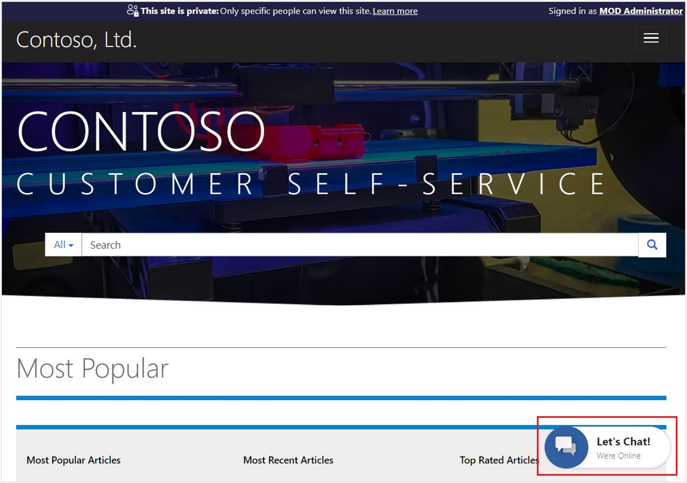
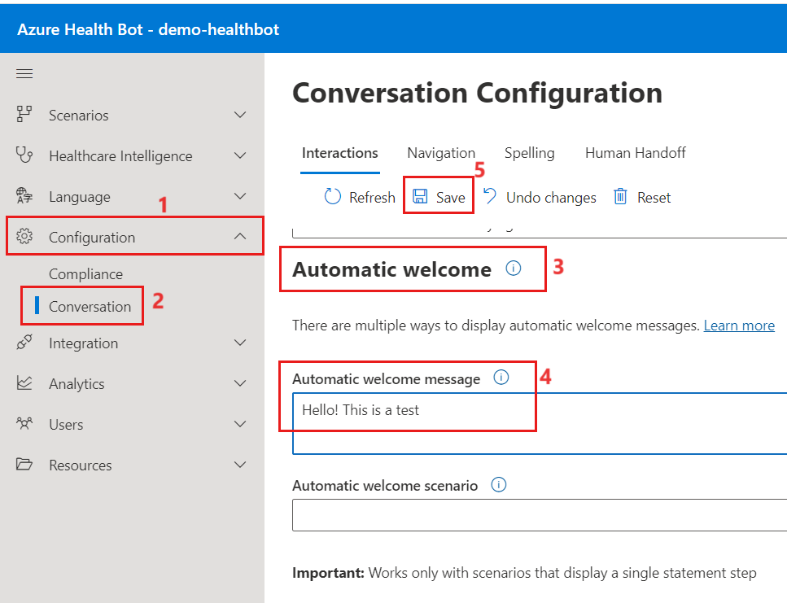
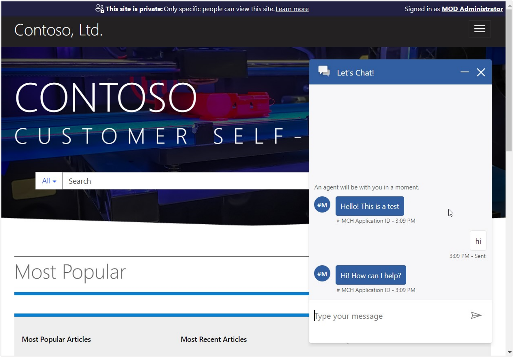

In this exercise, you embed the **Omnichannel Chat Widget** into the Power Apps Customer self-service portal by using the Portal Management configuration. In your environment, you created a Lamna Healthcare Company portal by using the **Customer self-service portal** template before deploying Microsoft Cloud for Healthcare. Now, you set up the chat widget to show on the customer website.

- **Customer self-service portal** - Enables customers to access self-service knowledge and support resources, view the progress of their cases, and provide feedback.

- **Portal Management** - Application to help you get started with the advanced portal configuration. In this exercise, you learn how to set up the chat widget in the **Portal Management** app.

Follow these steps to complete the exercise:

1. In [Power Apps](https://make.powerapps.com/?azure-portal=true), open the **Portal Management** app.

    > [!div class="mx-imgBorder"]
    > 

1. Select **Content Snippets** in the left navigation pane. Enter **chat** in the search box and then press the **Enter** key. Two **Chat Widget Code** records are visible in the list as highlighted in this screenshot.

    > [!div class="mx-imgBorder"]
    > 

1. Select and edit each **Chat Widget Code** record, one at a time, to modify the **Value** contents with the chat widget code snippet that you previously saved. You can find the snippet in the Chat Workstream in the Customer Service admin center again if needed.

    > [!div class="mx-imgBorder"]
    > 

1. In each **Chat Widget Code** record, select **Value (HTML) > HTML** and then paste the chat widget code snippet that you previously copied and saved. The Health Bot that you created is embedded in the Customer self-service portal and the Healthcare Patient Portal templates, whichever your portal website is currently set to show. Select **Save & Close**.

    > [!div class="mx-imgBorder"]
    > 

1. Repeat the same step for both chat widgets so that it shows on both website templates: the Healthcare Patient Portal and the one that's associated with your current Customer self-service template.

    > [!div class="mx-imgBorder"]
    > 

1. Test to ensure that the chat widgets are properly embedded. Go to [Power Apps](https://make.powerapps.com/?azure-portal=true) and select to open **Lamna Healthcare Patient Portal**.

    > [!div class="mx-imgBorder"]
    > 

1. The Azure Health Bot displays the **Let's Chat** button in the lower-right corner of the screen. The chat widgets are successfully embedded into the Customer self-service portal.

    > [!div class="mx-imgBorder"]
    > 

1. Test that the bot is properly connected. Go to your Health Bot management portal that you created from Azure portal. In the navigation pane, select **Configuration > Conversation**. Scroll down to the **Automatic welcome** section and enter a greeting for the portal user: **Hello! This is a test.** Select **Save** on the command bar.

    > [!div class="mx-imgBorder"]
    > 

1. Return to the Lamna Healthcare Patient Portal with the Customer self-service template. Refresh the page and select the **Let's Chat** widget, and the **welcome message** greets you in the chat.

    > [!div class="mx-imgBorder"]
    > 

In this exercise, you've successfully updated the chat widget in the Power Apps portal content snippets. With this configuration, the Health Bot is visible on the Power Apps portal for the Customer self-service template and the Healthcare Patient Portal template.
