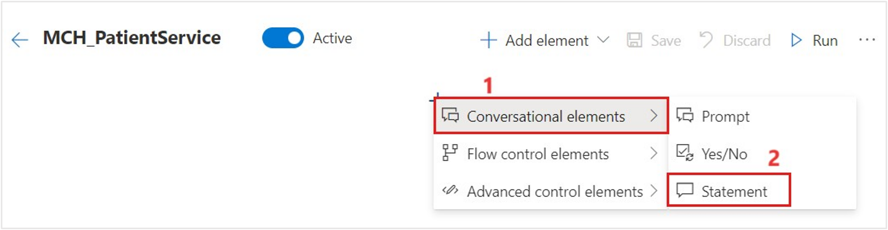
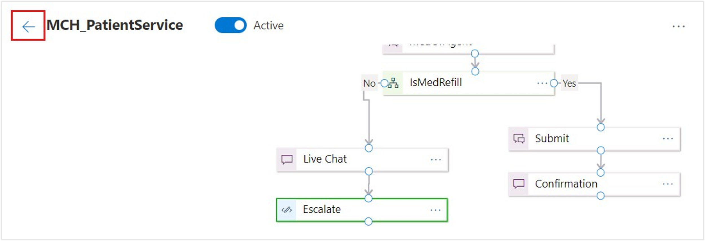
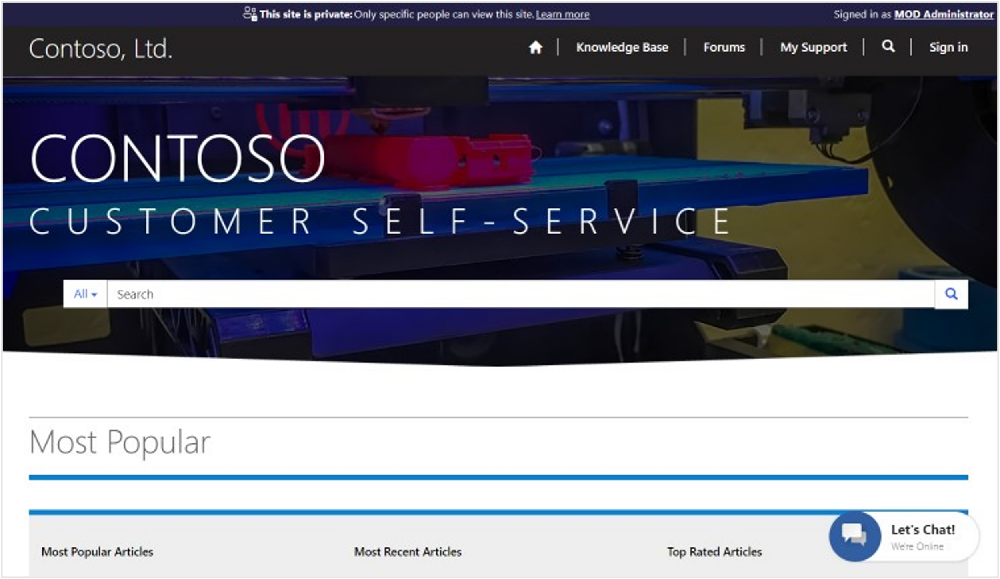
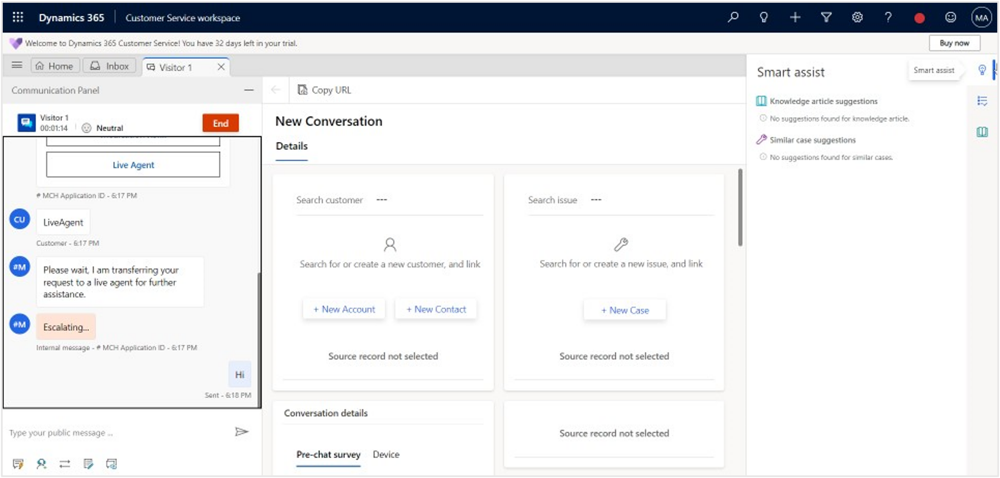

Integration with Omnichannel for Dynamics 365 Customer Service allows the patient to interact with the Azure Health Bot by using the Dynamics 365 chat widget to access medical information and your custom scenarios. It also allows the escalation of a bot conversation to a live agent to continue the interaction. When a conversation is escalated, Dynamics passes along the conversation history and the context to the agent.

In this exercise, you complete the following tasks:

1. Design the following Health Bot scenario called **MCH_PatientService**.

    - **Intro** statement card - Triggers a welcome message to the customer.

    - **MedOrAgent** card - Prompts with the **Medication refill** or **Live Agent** action authored card.

    - **IsMedRefill** decision card - Checks the variable and submits a medication refill or starts live chat.

    - **Submit** card - Prompts an adaptive card message (input text) with name, email, and medication name.

    - **Live Chat** card - Communicates to the customer that they're being directed to a live agent.

    - **Confirmation** card - Repeats information that has been gathered from the submission and then thanks the customer.

    - **Escalate** card - Triggers an **escalate to live agent** message on Omnichannel for Customer Service.

1. Design another Health Bot scenario called **MCH_PatientServiceWelcome**. This scenario holds the starting statement that allows the user to invoke the **MCH_PatientService** scenario.

1. Set the **Automatic Welcome Scenario** to be the **MCH_PatientServiceWelcome** custom scenario that you create. This setting begins the scenario when a user first interacts with the Health Bot.

## Task: Create the MCH_PatientService scenario

In this task, you create the **MCH_PatientService** bot scenario by using the designer canvas.

1. Return to the **Azure Health Bot** instance home page where you set the bot settings. This link is the portal management link that you copied from the Azure portal. Select **Create new scenario** on the landing page. If you aren't on the landing page, you can go to  **Scenario > Manage** on the left navigation pane.

    > [!div class="mx-imgBorder"]
    > [](../media/80-welcome-new-scenario.png#lightbox)

1. Enter **MCH_PatientService** as the **Name** and the **Scenario ID** for the new Health Bot scenario.

    > [!div class="mx-imgBorder"]
    > [](../media/82-new-scenario.png#lightbox)

1. Design the scenario conversation, which should take you directly to the designer. If not, select the **MCH_PatientService** scenario in **Scenarios > Manage** to edit.

    > [!div class="mx-imgBorder"]
    > [](../media/83-manage-scenarios.png#lightbox)

### Step: Add a bot introduction statement

In this step, you add a bot introduction statement.

1. Select the **Plus** (+) symbol.

    > [!div class="mx-imgBorder"]
    > [](../media/plus.png#lightbox)

1. Add a beginning statement to the scenario by selecting the plus (**+**) sign in the center of the canvas and then by going to **Conversational elements > Statement**.

    > [!div class="mx-imgBorder"]
    > [](../media/84-statement.png#lightbox)

1. In the **Display text** box, enter the following message:

    *Hi there, I'm your Healthcare Assistant.*

1. Select the pencil icon next to **Statement** in the upper bar and change the **Title** to **Intro**. Select **Save**.

    > [!div class="mx-imgBorder"]
    > [](../media/85-introduction.png#lightbox)

1. The Intro statement is added to the designer canvas. Double-click if you need to edit any item on the canvas.

    > [!div class="mx-imgBorder"]
    > 

### Step: Add a statement for a medication request or a live agent

This section prompts two buttons: **Medication Refill** and **Live Agent**. When a user selects either button, the appropriate text to the **MedicationOrAgent** variable is set.

1. Add a prompt to the user by right-clicking the canvas or by selecting **Add element > Conversational elements > Prompt**.

    > [!div class="mx-imgBorder"]
    > [](../media/prompt.png#lightbox)

1. Enter the following details:

    - **Display text** - Would you like to request a medication refill or chat with a live agent?

    - **Input variable** - MedicationOrAgent

    - **Input type** - String

    - **Title** - Rename to **MedOrAgent**

    > [!div class="mx-imgBorder"]
    > [](../media/87-medication-request.png#lightbox)

1. Scroll down and select the **Add Cards** button.

    > [!div class="mx-imgBorder"]
    > [](../media/add-cards.png#lightbox)

1. Select **Hero Card** from the **Card type** dropdown menu. Leave the title blank because you're already prompted with the display text. Select the plus (**+**) icon to add new actions so that the user can select a response to send to the bot.

    > [!div class="mx-imgBorder"]
    > [](../media/88-add-card.png#lightbox)

1. Select the plus (**+**) icon twice to add two actions.

    1. For the first action, select the following values:

        - **Action type** - imBack

        - **Action value** - MedicationRefill

        - **Action title** - "Medication Refill"

    1. For the second action, fill in the following values:

        - **Action type** - imBack

        - **Action value** - LiveAgent

        - **Action title** - "Live Agent"

   Select **OK** to return to the prompt details. The Hero Card should be defined.

   > [!div class="mx-imgBorder"]
   > [](../media/89-add-action.png#lightbox)

1. Select **Vertical** from the **Cards layout** dropdown menu. Select **Save**.

    > [!div class="mx-imgBorder"]
    > [](../media/90-select-ok.png#lightbox)

1. Move the **Intro** box above the **MedOrAgent** box and connect them. To do so, select the bottom circle on **Intro** and drag it to the top circle on the new prompt. An arrow automatically appears when you try to connect the **Intro** and **MedOrAgent** boxes. Select **Save** in the menu, which might have changed to an ellipsis (**...**).

    > [!div class="mx-imgBorder"]
    > [](../media/92-connect-boxes.png#lightbox)

1. Remember to save often because the scenario doesn't AutoSave. Now that the scenario has been saved, the run command should be enabled. Select **Run** from the menu to view the output in the Web Chat on the right.

    > [!div class="mx-imgBorder"]
    > [](../media/94-run-button.png#lightbox)

The test welcome message should display from the previous exercise along with the new statement and prompt asking for a medication refill or chat with an agent.

   > [!div class="mx-imgBorder"]
   > [](../media/94-web-chat.png#lightbox)

### Step: Add a MedicationOrAgent decision branch

This step checks whether the user has selected **Medication Refill** or **Live Agent** with the help of the **MedicationOrAgent** variable. It redirects the message according to the selection.

1. Right-click the canvas to bring up the menu, select **Flow control elements > Branch** to allow your logic to proceed in two different directions.

    > [!div class="mx-imgBorder"]
    > [](../media/95-branch.png#lightbox)

1. Enter the following expression in the **Javascript Boolean expression** box:

    `scenario.MedicationOrAgent === "MedicationRefill"`

1. Rename the branch to **IsMedRefill** and then select **Save**.

    > [!div class="mx-imgBorder"]
    > [](../media/96-medication-agent.png#lightbox)

1. Place **IsMedRefill** below **MedOrAgent**. Select and drag the bottom circle of the **MedOrAgent** prompt to the top circle of the **IsMedRefill** branch decision to connect them.

    > [!div class="mx-imgBorder"]
    > [](../media/97-medication-branch.png#lightbox)

### Step: Prompt the user to enter data for the medication refill option

Your next step is to prompt the user to enter data for the medication refill option by following these steps:

1. Add a **Prompt** element to display the form data (by using an Adaptive Card) to capture the patient's name, email, and phone number to create an appointment.

    > [!div class="mx-imgBorder"]
    > [](../media/98-prompt.png#lightbox)

1. Add the following details. When you're finished, select the **Add Cards** button.

    - **Input variable** - formData

    - **Input type** - Object

    - **Title** - Submit

    > [!div class="mx-imgBorder"]
    > [](../media/98-submit.png#lightbox)

1. Change the **Card type** to **Adaptive Card**. Add the following **JSON** to your card to show multiple fields of input for the user in an appealing format. Select **OK**.

    JSON for adaptive card:

    ```json
    {
        "$schema": "http://adaptivecards.io/schemas/adaptive-card.json",
        "type": "AdaptiveCard",
        "version": "1.0",
        "body": [
        {
        "type": "ColumnSet",
        "columns": [
            {
            "type": "Column",
            "width": 2,
            "items": [
                {
                "type": "TextBlock",
                "text": "Tell us about yourself",
                "weight": "bolder",
                "size": "medium"
                },
                {
                "type": "TextBlock",
                "text": "We just need a few more details to get your Medication refill.",
                "isSubtle": true,
                "wrap": true
                },
                {
                "type": "TextBlock",
                "text": "Don't worry, we'll never share or sell your information.",
                "isSubtle": true,
                "wrap": true,
                "size": "small"
                },
                {
                "type": "TextBlock",
                "text": "Your name",
                "wrap": true
                },
                {
                "type": "Input.Text",
                "id": "myName",
                "placeholder": "Full name"
                },
                {
                "type": "TextBlock",
                "text": "Your email",
                "wrap": true
                },
                {
                "type": "Input.Text",
                "id": "myEmail",
                "placeholder": "youremail@example.com",
                "style": "email"
                },
                {
                "type": "TextBlock",
                "text": "Medication Requested"
                },
                {
                "type": "Input.Text",
                "id": "myMedReq",
                "placeholder": "Medication Name",
                "wrap": "true"
                }
              ]
            }
          ]
        }
      ],
        "actions": [
        {
        "type": "Action.Submit",
        "title": "Submit"
        }
      ]
    }
    ```

   > [!NOTE]
   > Go to the [Adaptive Card visualizer](https://adaptivecards.io/?azure-portal=true) to test your own authored card.

   > [!div class="mx-imgBorder"]
   > [](../media/99-adaptive-card.png#lightbox)

1. On the prompt form, select **Vertical** from the **Cards layout** dropdown menu. Select **Save**.

    > [!div class="mx-imgBorder"]
    > [](../media/99-card-layout.png#lightbox)

1. **Connect** the **Yes** condition of the **IsMedRefill** branch to the **Submit** prompt.

    > [!div class="mx-imgBorder"]
    > [](../media/100-connect-yes.png#lightbox)

1. **Save** and **Run** your current scenario. If you don't save the scenario first, it doesn't run with updates that have been made since the last save. If you haven't saved at all, it doesn't recognize any conversation.

    The Adaptive Card output should display in the Web Chat when the system is running the conversation and selecting **Medication Refill** when prompted.

    > [!div class="mx-imgBorder"]
    > [](../media/101-medication-refill.png#lightbox)

### Step: Add a confirmation statement

To add a confirmation statement, follow these steps:

1. Add a **Statement** element.

    > [!div class="mx-imgBorder"]
    > [](../media/statement.png#lightbox)

1. Set the **Display text** to this code:

    `scenario.formData.myName + " - Thanks for providing the information, we have created a Medication Request for you regarding the following medication: " + scenario.formData.myMedReq`

1. Rename the statement to **Confirmation** and then select **Save**.

    > [!div class="mx-imgBorder"]
    > [](../media/102-confirmation.png#lightbox)

1. Connect the **Submit** element to the **Confirmation** element on the designer canvas.

    > [!div class="mx-imgBorder"]
    > [](../media/103-connect-submit.png#lightbox)

1. Select **Save** and **Run** to view your scenario in the web chat. Select **Refill Medication** in the authored card.

1. Fill in information for the request and then select **Submit**. Note the confirmation text that's returned from the bot, which was defined in your confirmation step.

    > [!div class="mx-imgBorder"]
    > [](../media/104-webchat-scenario.png#lightbox)

### Step: Invoke a live agent action

To invoke a live agent action, follow these steps:

1. Add a **Statement** element to the canvas.

1. In the **Display text** box, enter **Please wait, I am transferring your request to a live agent for further assistance.**

1. Rename the statement to **Live Chat** and then select **Save**.

    > [!div class="mx-imgBorder"]
    > [](../media/106-statement-rename.png#lightbox)

1. Connect the **No** decision of the **IsMedRefill** branch to the **Live Chat** statement.

    > [!div class="mx-imgBorder"]
    > [](../media/107-connect-no.png#lightbox)

### Step: Add an action to invoke escalation

To add an action to invoke escalation, follow these steps:

1. Add an **Action** element to the canvas, which you use to trigger an escalation to an Omnichannel live agent.

    > [!div class="mx-imgBorder"]
    > [](../media/108-action-element.png#lightbox)

1. Add the following code to the action, which triggers the live agent chat:

   ```json
   session.sendChannelData('Escalating...', {
      "tags": JSON.stringify({type: "Escalate", context: {"EscalateToAgent": 1}})
   });
   ```

1. Name the action **Escalate** and then select **Save** to return to the designer page.

    > [!div class="mx-imgBorder"]
    > [](../media/109-escalate-agent.png#lightbox)

1. Connect the **Live Chat** statement to the new **Escalate** action.

    > [!div class="mx-imgBorder"]
    > [](../media/110-connect-live-chat.png#lightbox)

   You've now completed the final connection. The following screenshot shows your full scenario.

    > [!div class="mx-imgBorder"]
    > [](../media/111-connection-complete.png#lightbox)

1. **Save** and **Run** your scenario to view the full scenario output.

1. Select **Live Agent** in the authored card to show the escalation action.

    > [!div class="mx-imgBorder"]
    > [](../media/112-live-agent.png#lightbox)

1. **Exit** the **MCH_PatientService** scenario editor with the back arrow next to your scenario name. Make sure that you save before confirming to exit.

    > [!div class="mx-imgBorder"]
    > [](../media/113-scenario-editor.png#lightbox)

You've now created a custom scenario to allow the patient to refill a medication or escalate to a live agent.

## Task: Create the MCH_PatientServiceWelcome scenario

In this task, you create another bot scenario called **MCH_PatientServiceWelcome** to invoke the **MCH_PatientService** scenario. Because the automatic welcome message in the Health Bot settings can be only one step, you use it to initiate the multi-step scenario that you created.

1. On the Azure Health Bot scenarios page, select **New** to create another new scenario.

    > [!div class="mx-imgBorder"]
    > [](../media/114-scenario-management.png#lightbox)

1. Enter **MCH_PatientServiceWelcome** as the **Name** and the **Scenario ID** for the new Health Bot scenario. Select **Create**.

    > [!div class="mx-imgBorder"]
    > [](../media/115-create-new-scenario.png#lightbox)

1. On the scenario editor designer, add a **Statement** element.

    > [!div class="mx-imgBorder"]
    > [](../media/116-statement.png#lightbox)

1. Rename the statement to **Welcome**. Don't add **Display text** because you show it in the card instead. Select **Add Cards**.

    > [!div class="mx-imgBorder"]
    > [](../media/118-add-card.png#lightbox)

1. Select **Hero Card** from the **Card type** dropdown menu. Select the plus (**+**) icon to add an action.

    > [!div class="mx-imgBorder"]
    > [](../media/119-title-card.png#lightbox)

1. Provide the following details for the action:

    - **Action type** - imBack

    - **Action value** - begin MCH_PatientService

    - **Action title** - Lamna Healthcare Support

    > [!div class="mx-imgBorder"]
    > [](../media/120-add-action.png#lightbox)

1. Select **OK** and then select **Save** on the statement form.

    > [!div class="mx-imgBorder"]
    > [](../media/121-save-statement.png#lightbox)

1. **Save** and **Run** to test your **MCH_PatientServiceWelcome** bot scenario in the Web Chat.

    > [!div class="mx-imgBorder"]
    > [](../media/122-test-welcome.png#lightbox)

1. **Exit** the scenario designer.

    > [!div class="mx-imgBorder"]
    > [](../media/122-exit.png#lightbox)

You've now created a welcome scenario that kicks off the **MCH_PatientService** scenario.

## Task: Set up the welcome scenario to be automatic

In this task, you set the **MCH_PatientServiceWelcome** to be the **Automatic Welcome Scenario** in settings. This setting always triggers the scenario when a user starts a conversion with the Health Bot from the portal.

1. In the navigation pane, go to **Configuration > Conversation**.

    > [!div class="mx-imgBorder"]
    > [](../media/123-configuration-conversation.png#lightbox)

1. On the **Interactions** tab, scroll down to the **Automatic welcome** section. From the **Automatic welcome scenario** dropdown menu, select the **MCH_ PatientServiceWelcome** scenario. You can clear the automatic welcome message that you previously set. Select **Save**.

    > [!div class="mx-imgBorder"]
    > [](../media/124-automatic-welcome.png#lightbox)

You've successfully set the **MCH_PatientServiceWelcome** scenario as the default scenario that kicks off when a user interacts with the Health Bot.

## Task: Test Health Bot escalation from Power Apps portal to Omnichannel

In this task, you test the escalation experience from the Power Apps portal to an Omnichannel live agent.

1. Go to [Power Apps](https://make.powerapps.com/?azure-portal=true) and select to open **Lamna Healthcare Patient Portal**.

    > [!div class="mx-imgBorder"]
    > [](../media/patient-portal.png#lightbox)

1. The Azure Health Bot **Let's Chat** button should display in the lower-right corner of the screen, meaning that the chat widget was successfully embedded into the Customer self-service portal.

    > [!div class="mx-imgBorder"]
    > [](../media/127-lets-chat.png#lightbox)

1. When you select the chat widget, the bot triggers the welcome scenario message that you created and sets it as the default welcome message, **MCH_PatientServiceWelcome**.

    > [!div class="mx-imgBorder"]
    > [](../media/128-chat-widget.png#lightbox)

1. Return to Power Apps and open **Customer Service workspace**.

   > [!div class="mx-imgBorder"]
   > [](../media/129-customer-service-workspace.png#lightbox)

   > [!NOTE]
   > Escalation into the Customer Service workspace works only when the **Presence** status shows as enabled. A splash loading screen shows that goes through multiple steps and then displays the status indicator as **Available** after it's loaded. The status is enabled when it shows a check mark in a green circle.

   > [!div class="mx-imgBorder"]
   > [](../media/130-presence-status.png#lightbox)

1. In the Health Bot dialog in the Patient Portal, select the **Healthcare Support** button and then select the **Live Agent** button to witness the escalation into Omnichannel to chat with a live agent (you).

    > [!div class="mx-imgBorder"]
    > [](../media/132-live-agent.png#lightbox)

1. Return to Omnichannel for Customer Service. Your user, as the **Live Agent**, should receive an incoming notification with **Accept** and **Reject** options for the chat.

1. Select **Accept** to connect and chat with the customer, or in this case, the patient.

    > [!div class="mx-imgBorder"]
    > [](../media/134-accept.png#lightbox)

1. When a live chat agent accepts the incoming chat notification, Omnichannel for Customer Service opens a **Live Chat** widget, where the agent can view the entire bot conversation with the user and continue to chat with them.

    > [!div class="mx-imgBorder"]
    > [](../media/135-live-chat-widget.png#lightbox)

Now, you've successfully tested the escalation scenario from the patient by using a Health Bot in the Power Apps portal to a live agent in Omnichannel for Customer Service.
