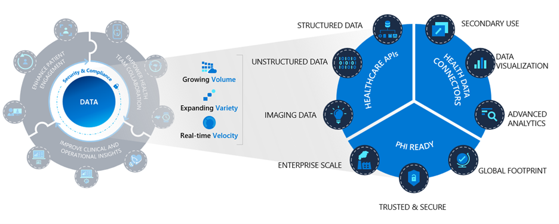

Microsoft Azure Health Data Services is a managed platform as a service (PaaS) based on OpenAPI standards and frameworks that enable more secure and scalable health data solutions. Azure Health Data Services empowers Microsoft Cloud for Healthcare and other health workloads by enabling more secure and compliant paths to ingest, persist, and connect health data in the cloud.

Azure Health Data Services is a set of tools and connectors that enable organizations to bring health data to the Microsoft Cloud and help improve health through insights. Healthcare organizations can benefit from using a set of API services and frameworks that are dedicated to the healthcare industry because health data can be fragmented across multiple systems, device types, and data formats. To improve people's overall wellness, from population health to personalized care, healthcare industries should have a centralized platform for collecting insights from health data. 

For that reason, interoperability is an important global health data objective. Interoperability is the ability of computer systems or software to exchange and use information. Because health data comes in many forms, often from dissimilar sources, interoperability between all types of health data is key to the next generation of wide-scale medical advances. The core function of Azure Health Data Services is to bring together disparate systems, workflows, and health data formats. As a centralized platform for unifying health data of all types, Azure Health Data Services enables organizations to unlock the full potential hidden in their data, yielding new health insights and discoveries.

Microsoft Azure is a more secure cloud, so it can contain protected health information and store it in a safer way. By using Azure Health Data Services as a compliant solution where different types of health data are harmonized together, organizations can de-identify protected health information (PHI) and can connect to the machine learning and data analytics resources in the greater Azure ecosystem.

Microsoft offers a Business Associate Agreement (BAA), which helps support HIPAA compliance. However, using Azure or other Microsoft cloud services doesn't automatically impart compliance with your cloud solutions. For more information, see [HIPAA overview](/azure/compliance/offerings/offering-hipaa-us). 

In this module, you learn about the interoperability challenges of health and life sciences data and the benefits of Azure Health Data Services. Additionally, you explore interoperability in depth and learn about Health Data & FHIR®, Medical Imaging & DICOM®, and MedTech & IoT. 

In this module, you’ll:
- Learn about interoperability challenges of health and life sciences data.
- Discover the core global health data standards that Azure Health Data Services supports today.
- Learn about the tools and connectors that comprise Azure Health Data Services and the benefits that they provide.

> [!VIDEO https://www.microsoft.com/videoplayer/embed/RE52VLz]
