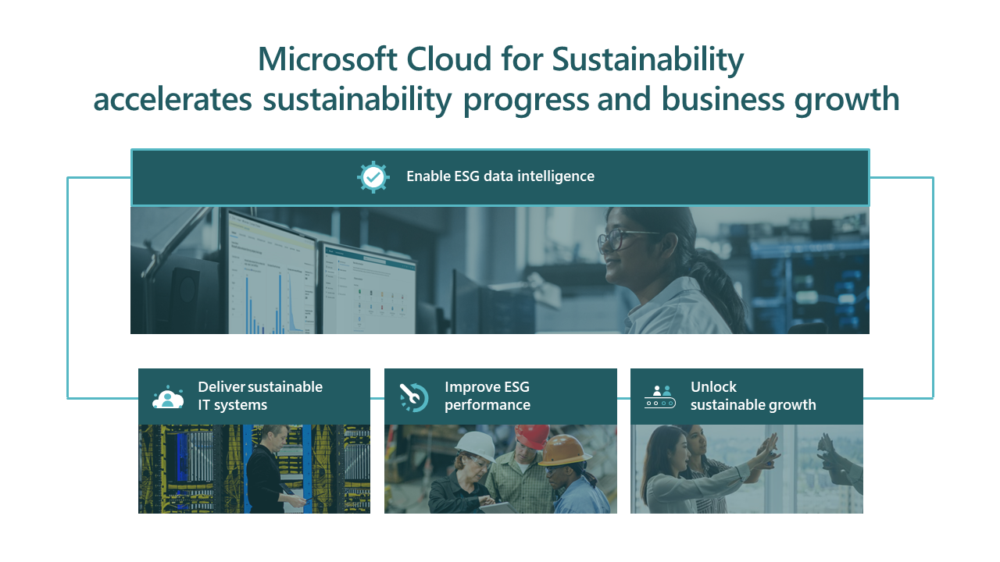
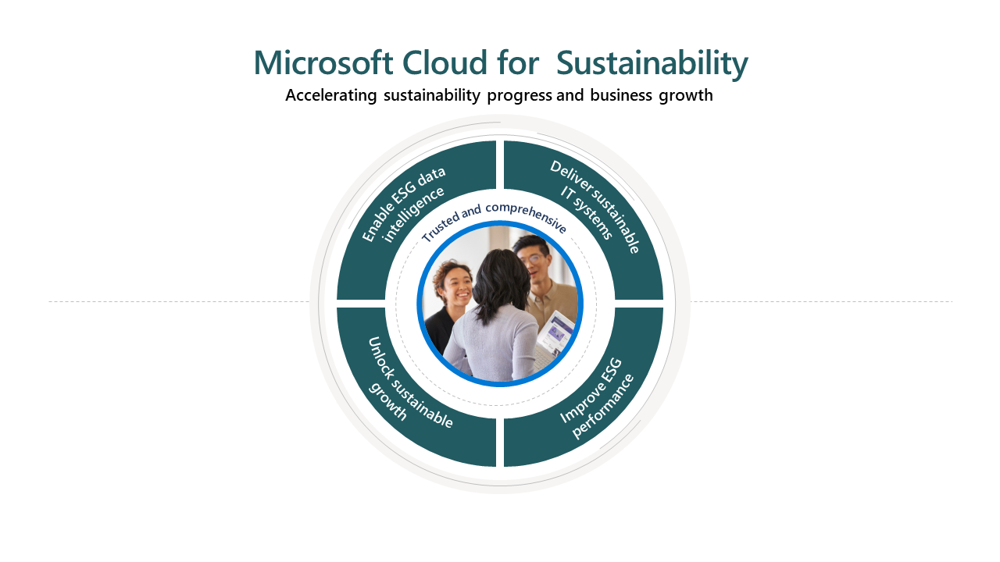
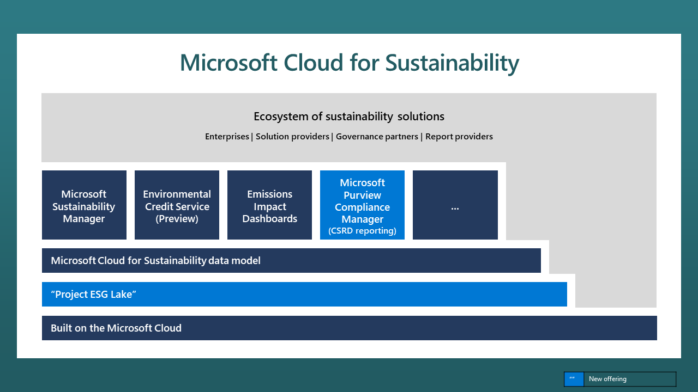

Microsoft Cloud for Sustainability empowers organizations to accelerate sustainability progress and business growth by bringing together a set of environmental, social, and governance (ESG) capabilities across the Microsoft Cloud portfolio plus solutions from a global ecosystem of partners. Microsoft Cloud for Sustainability enables organizations to gain the transparency and insights they need to manage their environmental footprint, embed sustainability through their organization and value chain, and make strategic business investments that drive value.

Microsoft Cloud for Sustainability is the first of Microsoft's horizontal industry clouds and can be used across all other industries, such as healthcare, retail, manufacturing, and others.

Sustainability is central to Microsoft's business, and it has been for more than a decade. Sustainability extends from optimizing Microsoft operations to building a community of customers and partners who learn and work together to advance their sustainability ambitions. Through collaboration, the delivery of dedicated sustainability solutions, and investments in climate equity and innovation, Microsoft is committed to driving transformation to build the world that every person and organization on the planet needs to thrive.

## Priority scenarios

Microsoft Cloud for Sustainability represents an integrated set of environmental, social, and governance (ESG) capabilities from Microsoft and our global ecosystem of partners that help organizations accelerate sustainability progress and business growth. Accurate, reliable data intelligence is critical in driving environmental impact reduction efforts, reporting, and business transformation.

> [!div class="mx-imgBorder"]
> 

Microsoft Cloud for Sustainability helps organizations **enable ESG  data intelligence** to fully understand their environmental footprint and develop more effective strategies to:

- Deliver sustainable IT systems,
- Improve ESG performance, and
- Unlock sustainable growth

> [!div class="mx-imgBorder"]
> 

With increasingly automated, data-driven solutions, Microsoft Cloud for Sustainability helps organizations:

- Calculate their sustainability footprint

- Analyze ESG performance against goals

- Provide data governance, and

- Report impact and progress

Organizations can improve their sustainability posture by **delivering sustainable IT systems** as follows. :

- Reduce the environmental impact of apps, AI, and productivity solutions,

- Optimize workloads in the cloud to achieve carbon and energy efficiencies, and

- Identify opportunities to replace carbon-intensive assets with technologies that are more sustainable by design.

With the right data intelligence, organizations can **improve the ESG performance** of their operations and assets. Together with the solutions from Microsoft Cloud for Sustainability and a global ecosystem of partners, they can:

- Minimize environmental impact of facilities

- Modernize fleet management

- Increase value chain transparency

A solid data foundation and digital infrastructure ensures organizations are prepared to **unlock sustainable growth** opportunities. With the rich intelligence that Microsoft partners are delivering, organizations need to:

- Understand and manage sustainability risk

- Strategically invest in ESG innovation

## Key capabilities

Microsoft Cloud for Sustainability is built on Microsoft Azure and is powered by Microsoft Power Platform, including Power Apps, Power Automate, and Power BI. This platform enables customers or partners to extend core capabilities quickly with custom industry vertical, horizontal, or geo-based solutions.

> [!div class="mx-imgBorder"]
> 

Following are the capabilities of Microsoft Cloud for Sustainability:

- **Project ESG Lake** enables organizations to centralize and standardize data in a comprehensive ESG data estate, ready for advanced analytics and reporting

- **Microsoft Cloud for Sustainability data model** streamlines data ingestion, integration, calculations, and reporting

- **Microsoft Sustainability Manager** enables organizations to record, report, and reduce their environmental impact across their operations and value chain.

- **Environmental Credit Service**, available in preview, provides a common infrastructure to help trace and standardize the origination process for carbon credits and other environmental assets, from creation through retirement.

- **Emissions impact dashboard** provides customers with transparency into the emissions data related to their use of Microsoft Azure and Microsoft 365.

- Sustainability reporting capabilities like **CSRD template in Microsoft Purview Compliance Manager** help customers track required actions and document evidence for their reporting and compliance initiatives.

- **Partner solutions** seamlessly connect into Sustainability Manager. You can view these solutions in Microsoft AppSource.
