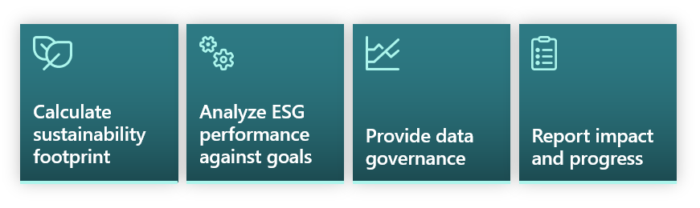
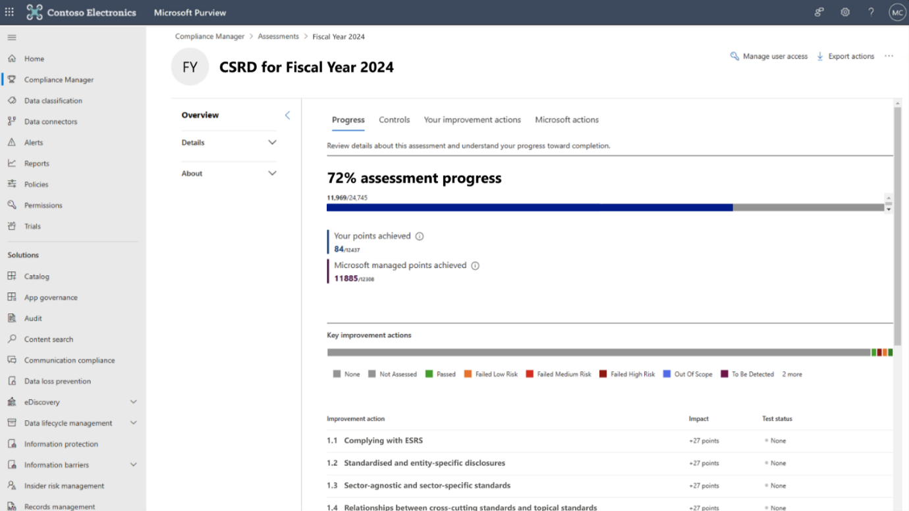

The [Corporate Sustainability Reporting Directive (CSRD)](https://finance.ec.europa.eu/capital-markets-union-and-financial-markets/company-reporting-and-auditing/company-reporting/corporate-sustainability-reporting_en/?azure-portal=true) is the EU's updated guideline for companies to report on their environmental, social, and governance (ESG) activities. Effective from 2023, it replaces the older Non-Financial Reporting Directive (NFRD), ensuring businesses in Europe adhere to the new EU Sustainability Reporting Standards (ESRS). The CSRD aims to streamline and standardize sustainability reporting, replacing a wide range of existing sustainability reporting standards and frameworks.

Starting in 2024, organizations need to take annual compliance steps to meet the CSRD directive.

To help organizations address emerging ESG reporting requirements, Microsoft has introduced new reporting capabilities in Microsoft Cloud for Sustainability. These capabilities are designed to help organizations understand their compliance posture, track required actions, and document evidence for compliance initiatives.

> [!div class="mx-imgBorder"]
> 

Microsoft Sustainability Manager enables customers to gain full visibility into their environmental impact, to address CSRD guidelines and most voluntary reporting needs. Microsoft Sustainability Manager helps organizations:

- Prepare and submit a CSRD report

- Track and disclose the required information

- Use digital data and tagging

- Provide data for third-party assurance CSRD Reporting

Microsoft Purview Compliance Manager helps your organization manage your compliance needs, including assessing data protection risks, implementing controls, staying updated with regulations, and reporting to auditors. The introduction of CSRD expands its capability to also support sustainability reporting.

The CSRD template in [Microsoft Purview Compliance Manager](/microsoft-365/compliance/compliance-manager/?azure-portal=true) helps organizations get CSRD-ready by documenting and reporting evidence aligned to preliminary European Sustainability Reporting Standards (ESRS). This  template helps organizations to collect the data they need for ESG reporting, and also evolve when new standards are adopted.

Here's a screenshot of a CSRD Assessment template.

> [!div class="mx-imgBorder"]
> 

Microsoft has also released targeted reporting and goal alignment enhancements in Microsoft Sustainability Manager to help organizations collect quantitative emissions, water, and waste data aligned to preliminary European Sustainability Reporting Standards, and track progress against Science Based Target initiative (SBTi) designations.
