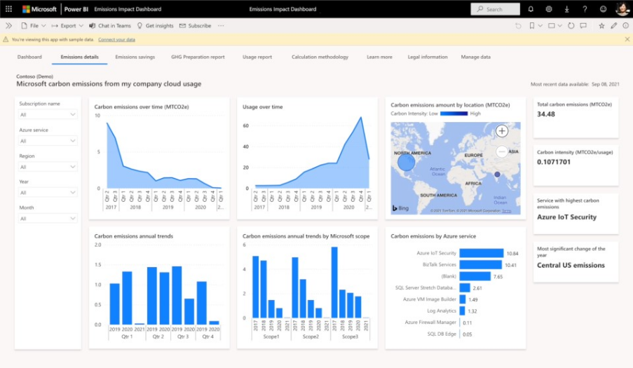

Emissions Impact Dashboard is available as an app for Azure and Microsoft 365. These dashboards help Microsoft customers see how much emissions are produced and how much they can save, while using Microsoft cloud services, compared to estimated emissions from on-premises alternatives.

## Emissions Impact Dashboard for Azure

The Emissions Impact Dashboard for Azure provides clear visibility into the carbon emissions produced through your utilization of Azure and Microsoft Dynamics. Microsoft's carbon calculation covers all three emission scopes, with a methodology that Stanford University validated in 2018.

> [!div class="mx-imgBorder"]
> 

The emissions impact data is based on your billing data. Therefore the Emissions Impact Dashboard for Azure is supported for EA Direct, MCA, and MPA accounts that have direct billing connections with Microsoft. To set up the dashboard in Power BI and link it to your data, you need to have:

- A Power BI Pro license and

- An admin role with read/write permissions for your Azure tenant.

To connect to the Emissions Impact Dashboard for Azure, you need to install the app from AppSource [Emissions Impact Dashboard template app](https://go.microsoft.com/fwlink/?linkid=2151690&azure-portal=true), and then connect your data by providing your **Billing ID** or **Enrollment ID** for Azure.

The following pages within the Emissions Impact Dashboard for Azure provide more insights:

- **Emissions details** – This page shows a breakdown of emissions by Geography Scopes (Scope 1, Scope 2, Scope 3) and Azure services.

- **Emissions savings** - This page shows how much carbon emissions you're saving by using Microsoft cloud services in comparison to a typical on-premises solution.

- **GHG Preparation report** - The Greenhouse Gas (GHG) preparation report page allows you to export information from the dashboard to Excel or CSV

- **Calculation methodology** - This page provides details on how the emissions are calculated. It provides a reference of key terms and definitions used in the emission calculations.

## Emissions Impact Dashboard for Microsoft 365

The Microsoft 365 Emissions Impact Dashboard shows how much carbon is produced when your organization uses Microsoft 365. Microsoft's carbon counting covers all three emission types using a method validated by a third party.

Before you enable the Emissions Impact Dashboard for Microsoft 365 in Power BI and link it to your data, ensure you have the following prerequisites:

- A business, enterprise, or education subscription for Microsoft 365 or Office 365

- A Power BI Pro license

- One of these Microsoft 365 admin roles:

  - Global admin

  - Exchange admin

  - Skype for Business admin

  - SharePoint admin

  - Global reader

  - Report reader

To connect to the Emissions Impact Dashboard for Microsoft 365:

1. Get the [Emissions Impact Dashboard for Microsoft 365](https://appsource.microsoft.com/product/power-bi/coi-sustainability.emissions_impact_dashboard_microsoft_365/?azure-portal-true) app from AppSource and install it. Once installed, you can open it from your Power BI Apps page.

1. Next, connect your data by signing in with your Microsoft 365 tenant admin credentials, to explore the dashboard once it's built (in about 24-48 hours).

> [!div class="mx-imgBorder"]
> 

Partners and customers can also access Emissions Impact Dashboard data directly through the Microsoft Cloud for Sustainability API, available through Solution Center.
