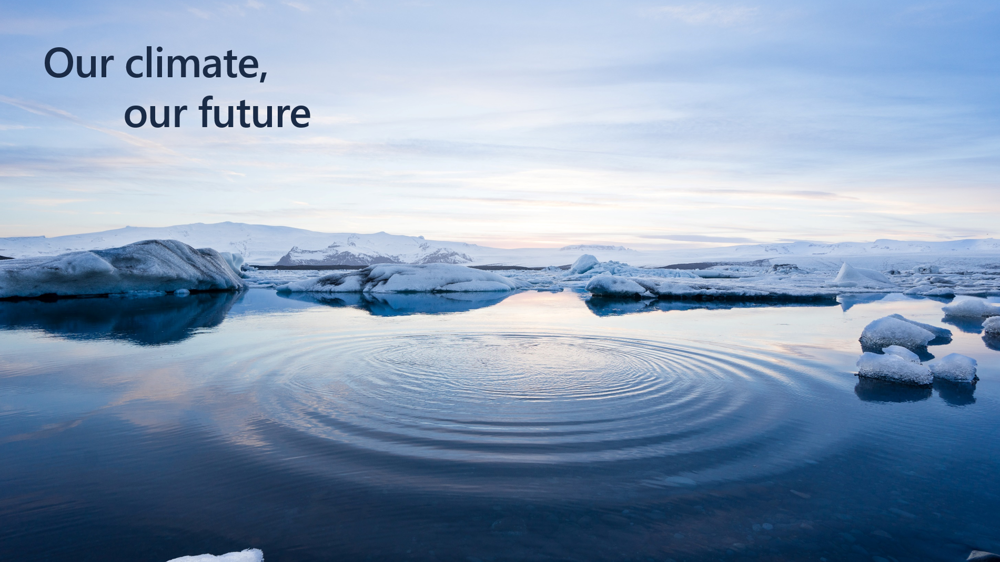

The world is facing an extraordinary challenge due to industrialization and overuse of limited resources. Climate change is already disrupting operations, supply chains, and economies.

Climate scientists agree that aggressive action is needed immediately to accelerate decarbonization. Stakeholders and regulators are applying pressure to organizations to:

- Report and reduce their carbon emissions,

- Replenish more water than they use,

- Reduce waste generation,

- And increase recycling and protect land.

However, an organization’s sustainability journey is replete with many challenges:

- **Lack of standards** - Many organizations are struggling to understand differing guidelines and reporting practices globally, regionally, and even within industries.

- **Slow manual processes** - Many organizations use spreadsheets to organize report emissions data. These processes aren't auditable and aren't sufficient to meet regulatory scrutiny over reporting accuracy.

- **Value chain transparency** - Organizations need better visibility into the environmental footprint of their entire operations, their products, and their value chain, but the data is difficult to collect because it comes from suppliers and other partners outside the organization.

- **Siloed data** - The data that's collected from organizational teams and across value chains is often returned in multiple formats, including paper-based invoices and receipts. These formats have varying levels of accuracy, making the process of collecting and calculating emissions even more complex.

- **Capital investment tradeoffs** - Organizations are also challenged to clearly understand how the efforts they make in reducing their environmental impact affects their bottom line, shareholder value, and opportunities for business growth.
