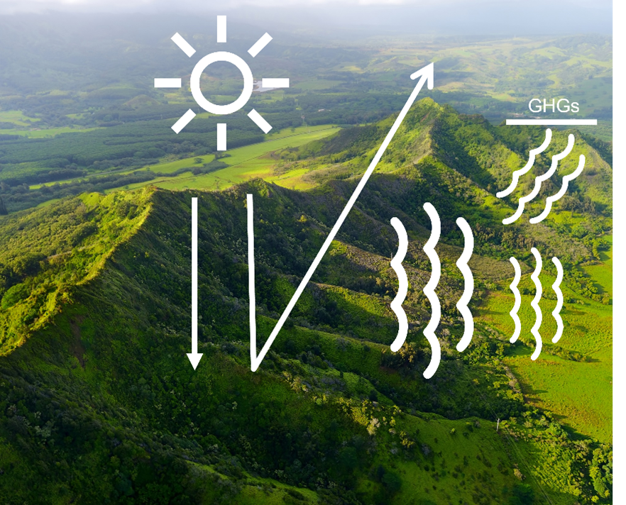
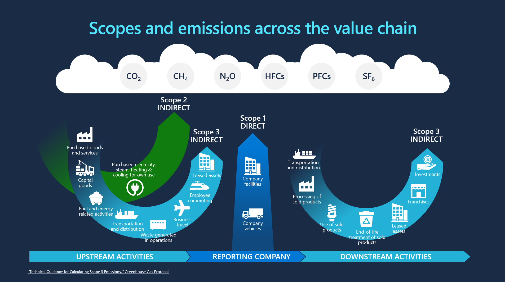

The following sections explain key concepts about sustainability.

## Greenhouse gas effect

The greenhouse gas effect is a condition that’s caused by the presence of greenhouse gases (GHGs) in the atmosphere that trap some of the heat that the sun emits. Until recently, the earth has had a balance whereby the oceans, forests, and soils recycled GHG emissions (principally carbon).

The extra GHGs that human activities release have become so excessive that it's not all recycled by ecosystems. As a result, climate change has occurred, including increasing temperature and extreme weather patterns that have already influenced many physical systems.

Human-created emissions come from a wide range of sources, including energy generation (electricity and heat), buildings, transportation, manufacturing, and agriculture.

## Global Warming Potential (GWP)

Human activities produce carbon dioxide (CO2), methane (CH4), nitrous oxide (N2O), refrigerants (HFCs, PFCs, and CFCs), and other greenhouse gases (Sulphur hexafluoride - SF6, Ozone - O3), each with its own Global Warming Potential (GWP).

GWP is the potency with which each gas traps heat from the sun. Different human-emitted gases cause global warming at varying intensities and timescales.

## Carbon dioxide equivalent

All greenhouse gas emissions are converted to a unified unit of measurement, carbon dioxide equivalent (or CO2e), by using their GWP.

## Emission scopes

The Greenhouse Gas Protocol uses emission scopes, a comprehensive global standardized framework to measure and manage greenhouse gas (GHG) emissions from private and public sector operations, value chains, and mitigation actions. For more information, see [Greenhouse Gas Protocol](https://ghgprotocol.org/?azure-portal=true).

Emission scopes are classified into three scopes:

- **Scope 1** - Direct emissions that are created through an organization’s use of a combustion of fossil fuels, such as exhaust from transport trucks or diesel generators.

- **Scope 2** - Indirect emissions that come from the purchase of electricity or heat that’s used in offices or manufacturing plants.

- **Scope 3**- Indirect value chain emissions that come from all other activities in which an organization is engaged, whether upstream (through the supply chain) or downstream (in the product use phase) of its own operations. Scope 3 emissions have 15 categories, including emissions that are associated with the materials in buildings and the business travel of employees, to the electricity that customers might consume when using products.

## Carbon accounting

Carbon accounting is the process by which organizations measure the number of greenhouse gases that they’re emitting. This process is necessary for organizations to understand their climate impact and meet emissions reporting requirements. Carbon accounting helps to count, inventory, track, and report an organization's GHG emissions. A common practice in carbon accounting is categorizing CO2 as Scope 1, Scope 2, or Scope 3 Greenhouse Gases (GHG).

## Carbon targets (Emission targets)

To lower emissions, organizations around the world are making commitments and defining targets according to the impacts that they’re responsible for. The targets should be quantifiable and include carbon reduction and removal goals. For more information, see [Greenhouse Gas Protocol](https://ghgprotocol.org/?azure-portal=true).

Carbon targets include:

- **Carbon neutral** - An organization becomes carbon neutral by reducing their emissions and/or paying others to not emit an equivalent of their remaining emissions.

- **Carbon net zero** - An organization is considered net zero carbon when they remove as much carbon as they emit.

- **Carbon negative** - An organization is carbon negative when they remove more carbon than they emit each year.

> [!VIDEO https://www.microsoft.com/videoplayer/embed/RE5eDzv]

## Emission factors

Emission factors are variables that convert emission-causing activities into its relevant carbon emissions. Factors differ for every emission source or category that’s applied to the activity data.

By using emission factors, you can estimate emissions that an activity creates.

**Activity x Emission factor = Emission**

An emission factor shows the quantity of GHGs that are emitted in relation to a particular activity, in carbon dioxide equivalent (CO2e), for each accounting unit of the activity (for example, Lbs CO2e/KWh).

## Water storage

For organizations that store large amounts of incoming or outgoing water, it's essential to report the total water retained and any variations in these volumes to meet external reporting standards. If there are instances of negative water consumption, this tracking helps determine if facilities and organizations genuinely contribute to water restoration in the environment.

## Water revenue intensity

Organizations must gauge their water usage efficiency in relation to their total revenue to fulfill external reporting requirements. This metric is depicted as the total water usage (in cubic meters) for every unit of net revenue within the company.

## Water sustainability goal

Organizations face intricate water consumption patterns that hinder their progress towards water sustainability objectives. It's crucial for these entities to monitor their water sustainability targets, ranging from individual sites to the organization as a unit.

## Waste quantity data

Organizations require up-to-date and comprehensive waste quantity information to generate precise insights and reports. A view into historical waste data in real-time and sift through, aggregate, or delve deeper into the data based on facility or organizational levels, time frames, types of waste, and material specifics.

## Waste sustainability disclosure

Organizations aiming to achieve corporate waste sustainability targets and fulfill external waste reporting requirements need to create standard waste sustainability reports to report on their organization’s waste quantity data.
