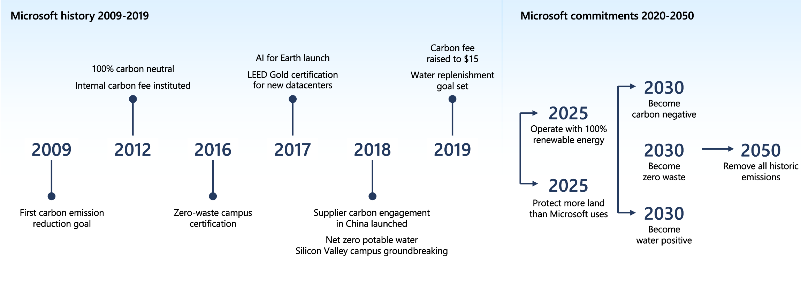
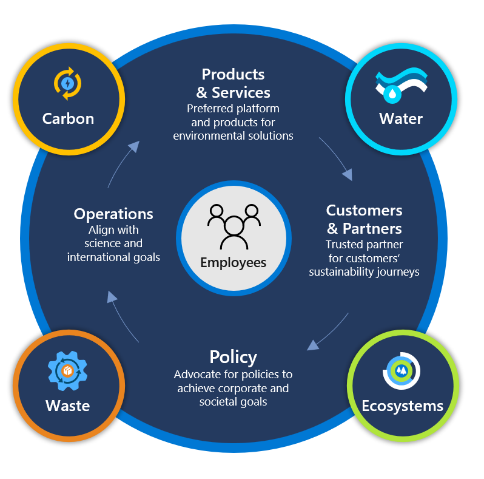

Microsoft isn't new to the topic of sustainability. For more than a decade, Microsoft has steadily built on a commitment toward innovation and investment in technologies to address sustainability.

Microsoft is working closely with customers and partners to advance a collective progress because, for organizations of all kinds, in every industry, the overarching sustainability journey is similar.

> [!VIDEO https://www.microsoft.com/videoplayer/embed/RE5eqx9]

Microsoft’s vision is to be the leading platform provider of technology solutions to environmental changes.

The key learnings from Microsoft’s sustainability journey are:

- Migrating to the cloud reduces carbon emissions.

- Smart building solutions help reduce embodied carbon, energy, and water use.

- Optimized datacenters reduce energy use, emissions, water use, and waste.

- Innovation drives more sustainable devices and packaging.

- Reducing the impact of the supply chain requires collaboration and transparency.

- Shifting the culture of the organization is vital to drive transformation.
