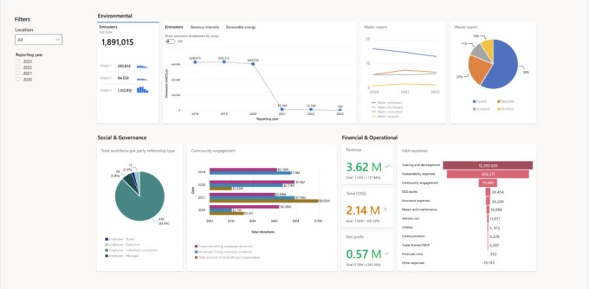

**Project ESG Lake** reduces time to insights by enabling organizations to better manage and prepare their data for holistic analysis. The solution offers an expansive ESG data model with more than 400 tables covering carbon, water, waste, social, governance, biodiversity, and general business areas. By using this solution, organizations can build a comprehensive data estate, centralizing and transforming data from across business units and supply chains into a standard schema that’s ready for advanced analytics and reporting.

## Capabilities of Project ESG Lake

Project ESG Lake empowers organizations to bring together ESG data from various source systems and standardize it to the ESG data model to build a centralized ESG data estate.

With Project ESG Lake you can:

- Integrate emissions data from sources like Microsoft Sustainability Manager or other third-party solutions into your ESG data estate.

- Incorporate your Microsoft-related emissions data from services like Azure and Microsoft 365. You can then use Project ESG Lake’s transformation framework to prepare for analytics and reporting.

- Further enrich your ESG data using external datasets across various sustainability categories like biodiversity, climate risk, energy, and ESG.

- Use the standardized data in [Microsoft Fabric](https://azure.microsoft.com/blog/introducing-microsoft-fabric-data-analytics-for-the-era-of-ai/?azure-portal=true), a unified analytics platform, for AI-powered insights.

- Connect your ESG data with Power BI reporting templates aligned to ESG data models and customize the Power BI reports to focus on specific metrics and targets.

- Connect your ESG data to reporting templates aligned to Corporate Sustainability Reporting Directive (CSRD) for faster insights and reporting on CSRD metrics.

The following image shows integrated ESG data from various source systems, standardized to build a centralized ESG data estate in Project ESG Lake.

> [!div class="mx-imgBorder"]
> 

## Data model

Bringing ESG data together from multiple systems and applications is complex. Microsoft has developed a system to simplify this process by providing shared data language for business and analytical applications to use. The data model constitutes over 400 tables covering various ESG areas including water, waste, and product carbon footprint. This model helps organizations in centralizing data that can help streamline data ingestion, sharing, calculations, and reporting. Organizations can select tables based on their specific needs.

## Data integration

Project ESG Lake allows you to import environmental data from our primary tools, such as Microsoft Sustainability Manager, and data about your use of Azure and Microsoft 365, into your own data lake in your own tenant subscription. Additionally, you can create your framework to integrate and transform data from other external sources.

## Emissions

Combine your emissions data from Azure and Microsoft 365 with your other ESG information. Use a standard format with the help of [Microsoft Cloud for Sustainability API](/industry/sustainability/api-overview/?azure-portal=true) and Microsoft’s transformation pipelines.

## Datasets

Access third-party ESG datasets for data enrichment and driving actionable insights. These datasets cover data for ESG indicators, emissions, biodiversity risks, and more. This data could help, for instance, in identifying endangered species by country/region.

## Reporting

Reporting templates provide insight into how your organization is performing on ESG factors and in streamlining regulatory report preparation. These reports cover all the key ESG areas like carbon, water, waste, governance and more. You can customize these templates to improve upon ESG metrics.

## Governance

Governance ensures data security and integrity. You can grant specific access permissions to data sources and manage data policies using tools like [Microsoft Purview](https://www.microsoft.com/security/business/microsoft-purview/?azure-portal=true).
