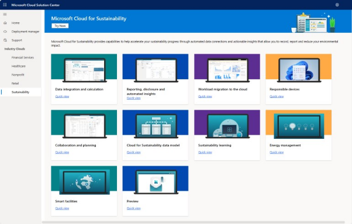

The [Microsoft Cloud Solution Center](https://solutions.microsoft.com/?azure-portal=true) serves as a centralized hub for deploying and setting up Microsoft's industry-specific cloud solutions. These solutions include the solutions that are part of Microsoft Cloud for Sustainability.

Solution Center integrates various Microsoft platforms, including Microsoft 365, Azure, Dynamics 365, and the Power Platform, offering users a cohesive experience.

> [!div class="mx-imgBorder"]
> 

To set up and configure Microsoft Cloud for Sustainability solutions, you must use Microsoft Cloud Solution Center. The Solution Center streamlines and assists you throughout the deployment journey, verifying licensing prerequisites and other dependencies to ensure you're fully equipped for the setup.

> [!div class="mx-imgBorder"]
> 
