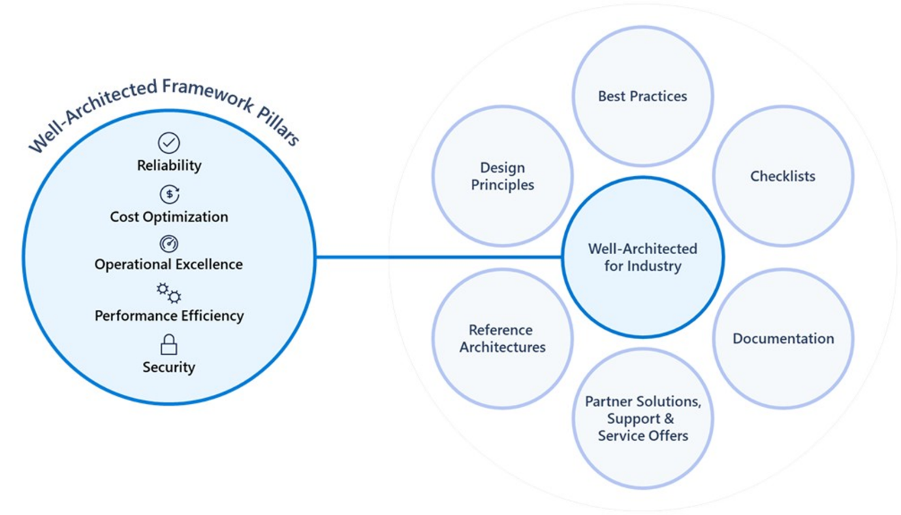
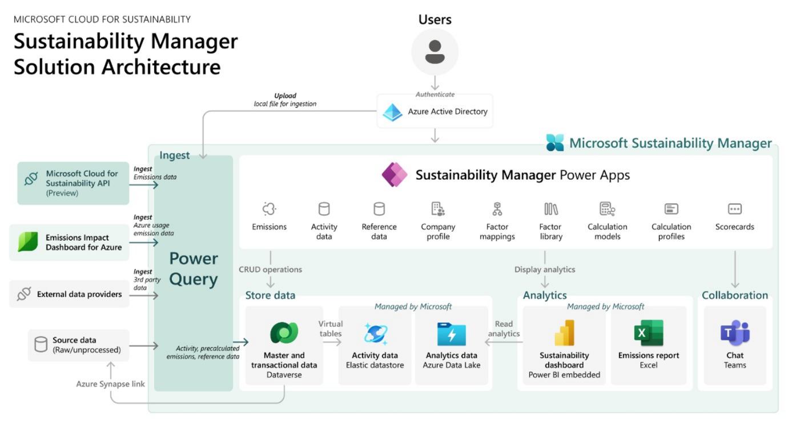
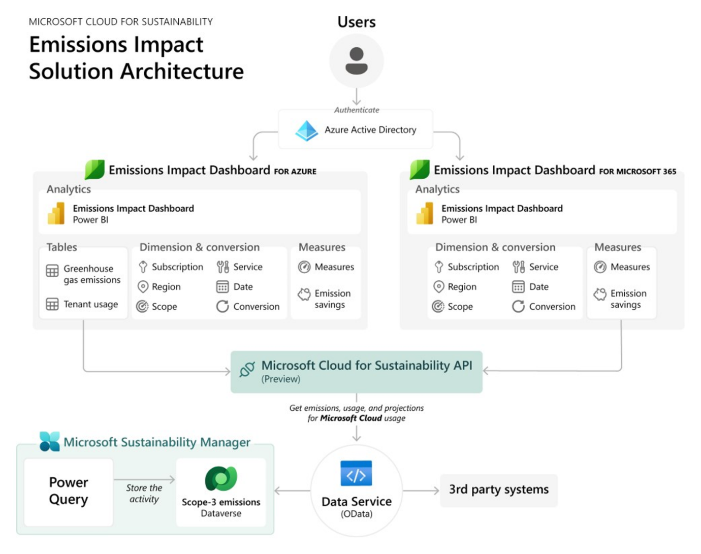

The "Well-Architected for Industry" framework, as described, is a set of guiding principles designed to enhance the quality of industry-specific cloud workloads. It applies the existing five pillars of Microsoft Azure Well-Architected Framework to Microsoft Cloud for industry solutions that helps produce high-quality, stable, and efficient industry cloud architecture:

- Reliability

- Security

- Cost optimization

- Operational excellence

- Performance efficiency

The following diagram gives a high-level overview of Well-Architected Framework pillars and investment areas:

> [!div class="mx-imgBorder"]
> 

## Well-Architected for Industry supporting elements

The six supporting elements of Well-Architected for Industry include:

- **Reference architecture**: A tailored blueprint for Microsoft Cloud industry-specific solutions.

- **Design principles**: Guidelines for constructing solutions using Microsoft Cloud for industry applications.

- **Best practices**: Recommendations for designing, launching, and managing operations.

- **Checklists**: Tools to evaluate the design, rollout, and functioning of industry cloud tasks.

- **Documentation**: References for technical manuals and details.

- **Partner solutions, support, and services offers**: Information on third-party integrations, technical advice, and associated support and service propositions.

## Well-Architected for Microsoft Cloud for Sustainability

Well-Architected for Industry guidance is available to help organizations build Microsoft Cloud for Sustainability workloads using proven best practices and scalable principles for cloud adoption and governance. In this way, they, too, are more reliable, secure, cost-optimized, operationally excellent, and performant.

Actionable and simple-to-use technical resources are available to help implementation teams know where to focus as they adopt Cloud for Sustainability solutions, including:

- [Reference architecture](/industry/well-architected/sustainability/sustainability-architecture-overview)

- [Design principles](/industry/well-architected/sustainability/cloud-sustainability-design-principles)

- [Implementation recommendations](/industry/well-architected/sustainability)
  
- [Assessment](/assessments/333d9326-e34c-40e1-88d9-8342afceec36/) 
  
- [Documentation](/industry/sustainability/overview)

Reference architectures are available for the following cloud-based solutions offered as part of Microsoft Cloud for Sustainability:

- Microsoft Sustainability Manager

- Emissions Impact Dashboard

The following diagram shows the solution architecture for Microsoft Sustainability Manager:

> [!div class="mx-imgBorder"]
> 

The following diagram shows the solution architecture for Emissions Impact Dashboard:

> [!div class="mx-imgBorder"]
> 

For more information, see [Well-architected for Microsoft Cloud for Sustainability](/industry/well-architected/sustainability/?azure-portal=true). Well-architected guidance is also accessible from Solution Center.
