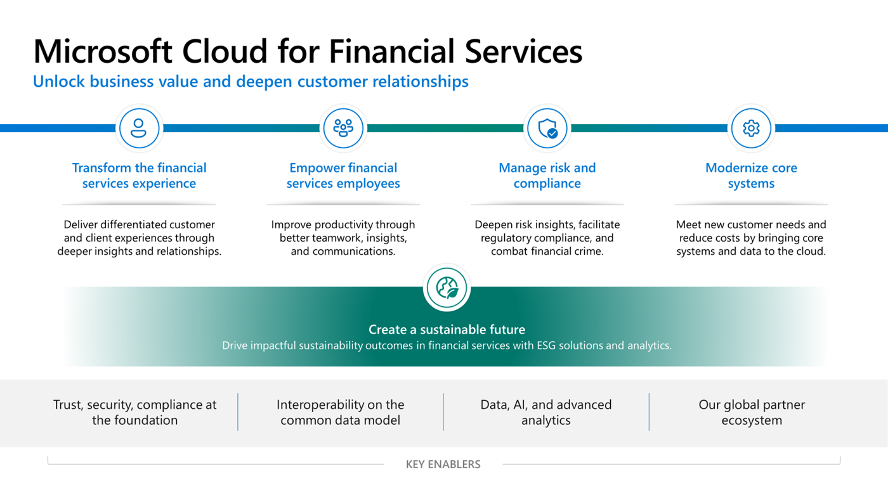

While the overall value proposition of Microsoft Cloud for Financial Services encompasses the full extent of the financial services industry, the solution templates discussed in this module focus on the retail banking and to some extent the wealth management subverticals of this broad industry.

Leaders in the banking industry are focused on helping their organizations weather storms and adapt to relentless change. Challenges range from developing customer expectations and workforce transformation to competitive threats and innovation imperatives counterbalanced by risk, security, and regulatory compliance considerations. Financial services institutions need to make financial, cultural, and technological investments to address these challenges, stay competitive, and prepare for an uncertain future.

> [!div class="mx-imgBorder"]
> 

The pressures and crises that recently beset the banking industry highlight the general volatility of financial markets against the backdrop of profound global economic, environmental, and geopolitical change. In addition, the imperative to cut costs and enable new efficiencies--while at the same time continuing to push programs of digital innovation that yield greater differentiation and potential for revenue growth in a cutthroat competitive environment--remains critical.

Here's a summary of the banking industry trends that fuel the above mentioned challenges and the need for banks to act:

- **Changing customer expectations** - Increasingly, customers expect a more personalized banking experience. The importance of the customer experience is magnified when you put it in the context of the customer journey, that is, all the points at which customers encounter the bank at different times, in different channels, and with different needs. To provide better service and more meaningful interactions, bank employees need a complete view of their customers.

- **Workforce Transformation** - The industry’s most important assets are its employees, who drive bank operations and manage customer engagement and service. Whether onsite or remote, employees with the right communications and collaboration tools are more effective in addressing business needs and servicing customers.

- **Competitive pressures** - Banks face threats from both traditional competitors in their own field, and also from nontraditional competitors, such as challenger banks, fintechs, and born-in-the-cloud “neo” banks. These competitors enter the financial business and disrupt the typical way in which banks engage with customers.

- **Innovation imperatives** - In addition to allowing banks to stay competitive, innovation is critical to meeting changing customer expectations, tapping into new markets, creating new efficiencies, and developing new business models. By introducing new products, services and processes, banks can differentiate themselves from their competitors, attract new customers, and better retain existing ones. Additionally, innovation focused on streamlining business processes through the application of automation and AI can also lead to cost savings across the organization.

- **Risk, security, and compliance** - Year after year, banks are asked to comply with more stringent regulatory requirements and cybersecurity controls worldwide. The complex regulatory environment puts burdensome demands on financial institutions to provide regular reporting to various regulatory bodies. Banks thus seek technology solutions that enable them to better comply with regulations, and better protect their organizations and their customers.

- **Advancing sustainable finance** - The extraordinary, time-sensitive challenge to stabilize society through achieving global net-zero emissions is top of mind in banking and financial services industry-wide. The challenge is to accelerate environmental, social, and governance (ESG) progress and make sustainability good for businesses.

As a result, banks are looking for a new approach to pave the way for the future. With these priorities in mind, banks are prioritizing cloud services to drive digital transformation because of the ability to speed up deployment, lower complexity, and manage upfront investment.

## Industry scenarios

To address the challenges mentioned previously, Microsoft is working with its global partner ecosystem to establish competencies in data, AI and advanced analytics. Microsoft continues to invest in vertical capabilities setting a stronger focus on Microsoft Fabric, Azure OpenAI Service, and Microsoft 365 Copilot as underlying technologies. At the same time, we’re open-sourcing selected applications from our Microsoft Cloud for Financial Services solutions portfolio. This open-sourcing removes friction from their adoption and allows greater flexibility for systems integrators (SI) and independent software vendor (ISV) partners, to customize and integrate them into their industry solutions.

Microsoft Cloud for Financial Services is built on a foundation of trust, with privacy, security, and regulatory compliance controls at its core.

> [!div class="mx-imgBorder"]
> 

The Microsoft Cloud for Financial Services applications that form the core of our solution templates are built on an industry data model that helps facilitate interoperability, unify data to accelerate insights and improve decision making, and improve business workflows.

Built on this essential foundation, Microsoft Cloud for Financial Services helps organizations transform the banking experience, empower banking employees, manage risk and compliance. and modernize core systems.

In this learning path, you focus on the following industry scenarios:

-   **Transform the banking experience** - Deliver differentiated customer experiences through deeper insights and relationships.

-   **Manage risk and compliance** - Deepen risk insights, facilitate regulatory compliance, and combat financial crime.

## Featured capabilities

Following are the capabilities around the value chain and how Microsoft and its global partner ecosystem can further transform the banking experience and empower employees.

> [!div class="mx-imgBorder"]
> 

### Transform the banking experience

- **Unified customer profile for retail banking** - This capability allows partners and customers to create solutions that allow employees to have a comprehensive view of the customer, which helps them tailor better customer experiences.

- **Unified client profile for wealth management** - Enables partners or customers to create solutions that would offer relationship managers, operating in the Wealth Management industry, a comprehensive view of their clients, bringing pertinent information such as financial holdings and goals into a single view.

- **Onboarding essentials** - Provides partners and customers with a comprehensive toolkit, which allows them to create streamlined and AI-infused experiences for customer and product onboarding flows, taking complexity out of the customer experience. The Loan onboarding sample app uses the toolkit, giving an example how a loan onboarding solution can be created based on onboarding essentials

### Manage risk and compliance

- **Compliance Program for Microsoft Cloud** - Offers white glove service to support risk, audit, and compliance teams in addressing financial services regulatory compliance, cybersecurity, and privacy.

- **Compliance Manager** - Helps financial organizations assess, monitor, and improve their compliance posture vis-à-vis global, regional, and industry regulations and standards.

These capabilities are built on a few foundational elements that are tailored to the financial services industry. The first element involves a data model and connectors on Dataverse, which enables the connection between Microsoft Cloud for Financial Services capabilities and the financial institution’s data using Microsoft’s established Power Platform capabilities. Also, it ensures interoperability of solutions with a financial institution’s solutions and partner solutions. Second is Microsoft’s extensive ecosystem of partners, which extend the cloud’s capabilities further, ensuring fit-for-need solutions. These elements are built on the trusted and compliant Microsoft Cloud.
