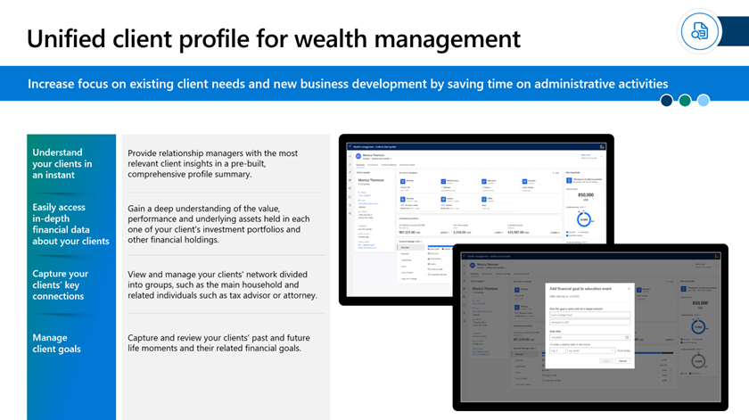

Microsoft enables partners and customers who work on the transformation of the banking experience for their customers and bankers, with three solution templates. Some of these solution templates are available as open source on [GitHub](https://github.com/microsoft/fsi-experiences): 

- Unified customer profile for retail banking.

- Unified customer profile for wealth management.

- Onboarding essentials and the associated loan onboarding sample application.

## Unified customer profile for retail banking

The unified customer profile solution template helps you tailor customer experiences with a comprehensive view of the customer’s financial situation and preferences.

> [!div class="mx-imgBorder"]
> 

With a unified customer profile, banks can take advantage of cross-sell or up-sell opportunities, helping to increase customer lifetime value and loyalty.

The core functional capabilities of unified customer profile include:

- **See customer details in an instant** - Provide bankers with the most relevant customer information in a prebuilt, comprehensive summary view.

- **Easily access the financial information of your customer** - Quickly see the financial holdings your customer has and if there are any red flags or opportunities for a sell-on.

- **Capture customers’ connections** - View and manage your customers’ family ties and co-ownership of holdings, such as the main household and related individuals as account co-owners or beneficiaries of a financial holding.

- **Keep track of life events** - Better serve your customers by keeping track of their key life events like birthdays, marital status, employment dates, and other events that might have an influence on their financial needs and asks.

## Unified client profile for wealth management

Unified client profile for wealth management is tuned to the specific needs of the wealth management sub vertical, specifically relationship managers in that business.

> [!div class="mx-imgBorder"]
> 

Like unified customer profile for retail banking, the essential value is found in the comprehensive dashboard views. These views permit a relationship manager to get a thorough sense of who their clients are as efficiently as possible. It helps deepen client relationships with meaningful advice, providing relationship managers with a good understanding of a client’s financial status, investment portfolios, financial goals, important life moments, and other personal attributes.

Following are the main features:

- **Understand clients in an instant** - Provide relationship managers with the most relevant client insights in a prebuilt, comprehensive profile summary.

- **Easily access in-depth financial data about clients** - Gain a deep understanding of the value, performance, and underlying assets held in each one of your client’s investment portfolios and other financial holdings.

- **Capture clients’ key connections** - View and manage your clients’ network divided into groups, such as the main household and related individuals such as tax advisor or attorney.

- **Manage client goals** - Capture and review your clients’ past and future life moments and their related financial goals.

## Onboarding essentials

Onboarding essentials provide partners and customers with a comprehensive toolkit, which allows them to create streamlined and AI-infused experiences for customers and product onboarding flows. It helps to take many complexities out of the associated customer experience. The loan onboarding sample application shows how this toolkit can be applied to provide customers with easy-access loan applications. These capabilities help streamline the loan process and enhance customer experience and loyalty while increasing organizational and employee productivity.

> [!div class="mx-imgBorder"]
> 

The customer onboarding capabilities include:

- **Better manage financial application onboarding tasks** - Define document journeys, improve process visibility, and execute consistently with ready-made, customizable components, and workflows.

- **Improve human workflows with AI** - Optimize approval cycles and minimize errors through automated document journeys augmented with AI based insights.

- **Extend and enhance business processes and experiences** - Take advantage of our library of non-Microsoft  extensions and enable other onboarding scenarios.

