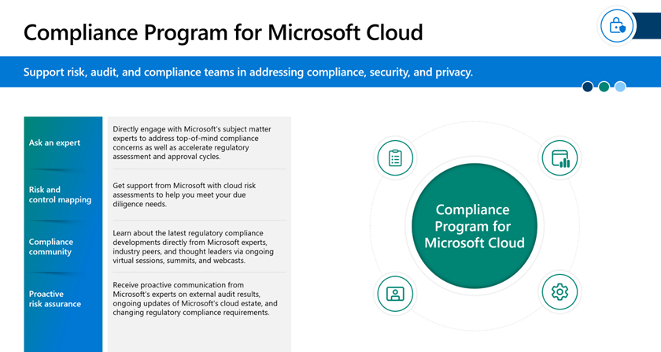
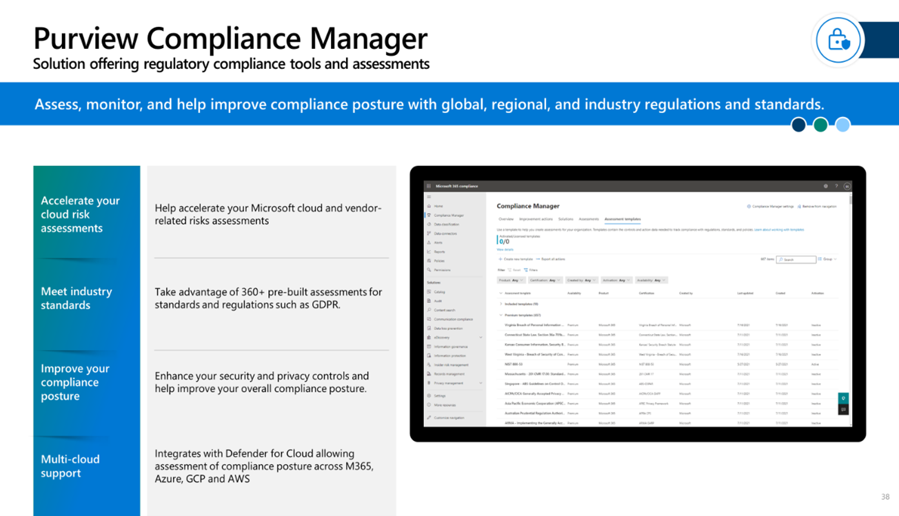

There are two core capabilities that are available to help with your security and compliance challenges:

- **Compliance Program for Microsoft Cloud** offers white glove service to support risk, audit, and compliance teams in addressing financial services regulatory compliance, cybersecurity, and privacy.

- **Compliance Manager** to assess, monitor, and improve a financial institution’s compliance posture.

## Compliance Program for Microsoft Cloud

The program’s white-glove service is delivered through a dedicated team of industry, engineering, and legal subject matter experts. This team broadly supports your risk stakeholders in addressing financial services regulatory questions across compliance, cybersecurity, and privacy topics. The program offers strategic support on how to best address regulatory challenges and helps to gain cloud assurance directly from Microsoft.

> [!div class="mx-imgBorder"]
> 

After customers join the program, customers can directly engage with Microsoft’s subject matter experts to address top of mind compliance concerns and accelerate risk assessments. The program features consist of reactive and proactive services:

- **Ask an expert** - Directly engage with Microsoft’s subject matter experts to address top-of-mind compliance concerns.

- **Risk and control mapping** - Get support from Microsoft with cloud risk assessments to help you meet your due diligence needs and accelerate regulatory assessment and approval cycles.

- **Compliance community** - Learn about the latest regulatory compliance developments directly from Microsoft experts, industry peers, and thought leaders via ongoing virtual sessions, summits, and webcasts.

- **Productive risk assurance** - Receive proactive communication from Microsoft’s experts on external audit results, ongoing updates of Microsoft’s cloud estate, and changing regulatory compliance requirements.

The program aims to provide hands on support to our customers in the financial services industry.

## Compliance Manager

Regulatory compliance assessments enable customers to assess, monitor, and help improve compliance posture with global, regional, and industry regulations and standards.

> [!div class="mx-imgBorder"]
> 

This capability provides the following features:

- **Accelerate your cloud risk assessments** - Help accelerate your Microsoft Cloud and vendor-related risks assessments.

- **Align with industry standards** - Use over 360 prebuilt assessments for standards and regulations.

- **Optimize for better compliance** - Help improve your overall compliance posture, enhancing security and privacy controls.

- **Multi-cloud support** – Integrates with Defender for Cloud allowing assessment of compliance posture across Microsoft 365, Azure, Google Cloud Platform (GCP), and Amazon Web Services (AWS).
