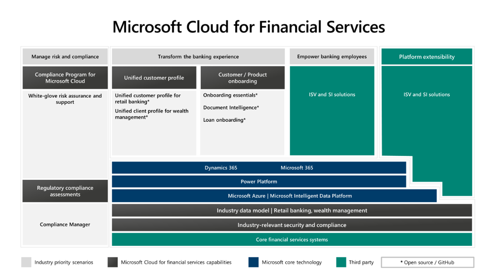

Microsoft Cloud for Financial Services uses a combination of well-established Microsoft products to address industry scenarios that are focused on retail banking, including some support for wealth management.

The following illustration shows how independent software vendors and system integrators drive the required and recommended capabilities along with the external extensions.

> [!div class="mx-imgBorder"]
> 

The preceding illustration is a logical, layered architecture that highlights the following elements:

-  **Core financial services systems** - Represented as a layer of retail banking core systems that process and store the fundamental data for the core capabilities. On top of these systems are the consistent and compliant Microsoft Cloud for Financial Services capabilities.

-  **Industry data model** - Comprehensive data tables and relationships that help make it easier for financial services organizations to quickly set up and deploy solutions by using a common collection of entities. The data model is divided into submodels built on each other to support banking wealth management, general onboarding, and small and medium business and property and casualty use cases.

 	The data model is divided into the following submodels:

    - Banking core data model

    - Common data model

    - Document common data model

    - Document intelligence data model

    - Financial services common data model

    - Loan onboarding data model

    - Onboarding application base

    - Property and casualty data model

    - Retail banking core data model

    - SMB data model

-   **Microsoft platform layer** - The core capabilities are built on top of Microsoft’s industry-leading cloud technologies from Microsoft Azure, Microsoft Power Platform, Dynamics 365, and Microsoft 365.

-   **Transform the banking experience** - You can build on the following solution templates to deliver on this core retail banking or wealth management capability:

    - **Unified customer profile for retail banking** - Built using Microsoft Power Platform, especially Power Apps for the functional and user interface layer, using data stored on Microsoft Dataverse.

    - **Unified client profile for wealth management** - Built using Microsoft Power Platform, especially Power Apps for the functional and user interface layer, using data stored on Microsoft Dataverse.

    - **Onboarding essentials** - This toolkit allows you to design and configure customer and product onboarding experiences. You can use the flows and AI capabilities of document intelligence to handle your documentation requirements. There’s also the loan application sample app, which demonstrates how this toolkit can be applied. You can also integrate with your AI and non-Microsoft banking services of choice.

- **Empower banking employees** - This capability is provided through our global network of ISV and SI Partners.

- **Manage risk across the organization** - This capability consists of two offerings:

    - **Compliance Program for Microsoft Cloud** - A white-glove risk assurance and support service that is delivered by Microsoft resources.

    - **Regulatory compliance assessments** - A set of prebuilt assessments that are delivered by using Compliance Manager.

-   **Platform extensibility** - This capability is delivered by independent software vendors and system integrators by extending the industry data model and integrating their bespoke solutions with the Microsoft Cloud for Financial Services solution templates. With our new approach, delivering these solution templates as open source through GitHub, we give even more flexibility to our partners to customize, enhance, and integrate our solution templates. This allows our partners and customers to literally make them their own. Today unified customer profile for retail banking and unified client profile for wealth management are available as [open source on GitHub](https://github.com/microsoft/fsi-experiences/?azure-portal=true). Onboarding essentials and associated solutions and sample applications are planned to follow soon.
