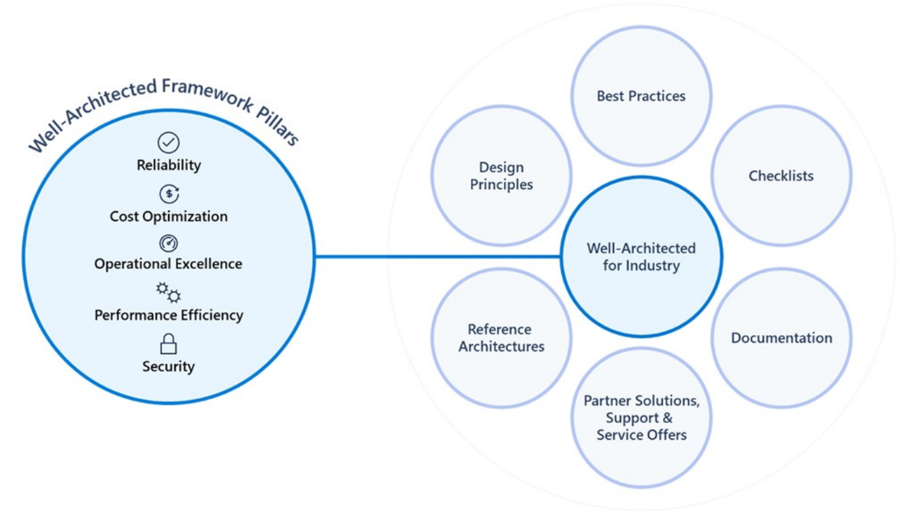
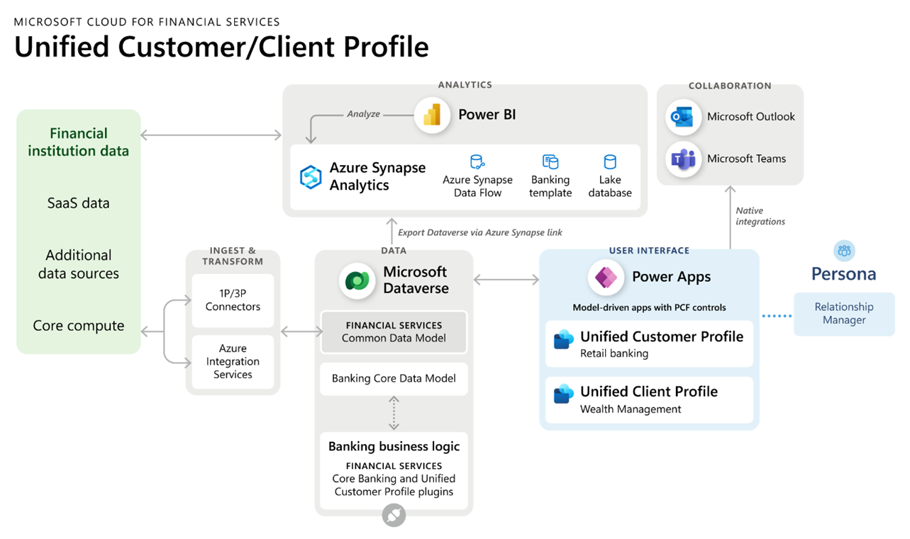
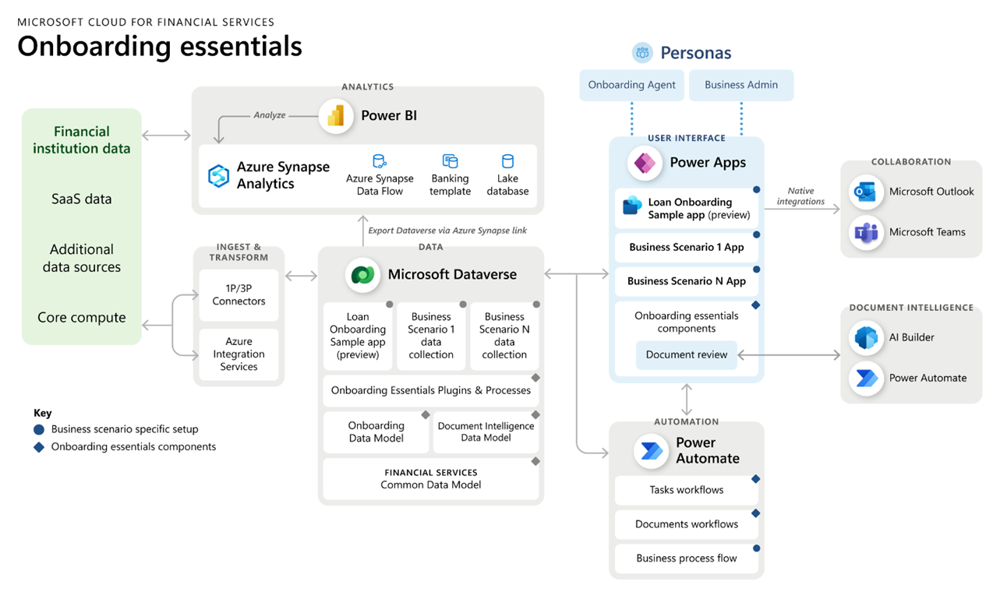
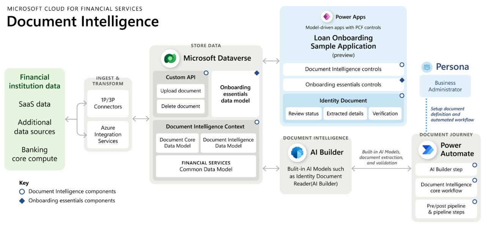

The **Well-Architected for Industry** framework, as described, is a set of guiding principles designed to enhance the quality of industry-specific cloud workloads. It applies the established five pillars of the Microsoft Azure Well-Architected Framework to Microsoft Cloud for industry solutions that helps to produce a high-quality, stable, and efficient industry cloud architecture:

-   Reliability

-   Security

-   Cost optimization

-   Operational excellence

-   Performance efficiency

The following diagram gives a high-level overview of Well-Architected Framework pillars and investment areas:

> [!div class="mx-imgBorder"]
> 

### Well-Architected for Industry supporting elements

The six supporting elements of Well-Architected for Industry include:

-   **Reference architecture** - A tailored blueprint for Microsoft Cloud industry-specific solutions.

-   **Design principles** - Guidelines for constructing solutions using Microsoft Cloud for industry applications.

-   **Best practices** - Recommendations for designing, launching, and managing operations.

-   **Checklists** - Tools to evaluate the design, rollout, and functioning of industry cloud tasks.

-   **Documentation** - References for technical manuals and details.

-   **Partner solutions, support, and services offers** - Information on non-Microsoft integrations, technical advice, and associated support and service propositions.

### Well-Architected for Financial Services

Well-Architected for Industry guidance is available to help organizations build banking workloads using the Microsoft Cloud for Financial Services data models and solution templates, using proven best practices and scalable principles for cloud adoption and governance. This guidance helps to ensure that they're more reliable, secure, cost-optimized, operationally excellent, and performant. 

Actionable and simple-to-use technical resources are available to guide implementation teams to know where to focus as they adopt Cloud for Financial Services solutions, including: 

-   [Reference architecture](/industry/well-architected/financial-services/architecture-overview/?azure-portal=true)

-   [Design principles](/industry/well-architected/financial-services/design-principles/?azure-portal=true)

-   [Implementation recommendations](/industry/well-architected/financial-services/?azure-portal=true) (design, deploy, monitor)

-   [Documentation](/industry/financial-services/overview/?azure-portal=true)

-   [Assessment tool](https://aka.ms/wai-mcfsi-assessment/?azure-portal=true)

Reference architectures are available for the following cloud-based solutions offered as part of Microsoft Cloud for Financial Services:

-   [Unified customer or client profile](/industry/well-architected/financial-services/unified-customer-profile-architecture/?azure-portal=true)

-   [Onboarding essentials](/industry/well-architected/financial-services/onboarding-essentials-architecture/?azure-portal=true)

-   [Document intelligence](/industry/well-architected/financial-services/document-intelligence-architecture/?azure-portal=true)

The following diagram shows the solution architecture for **Unified customer/client profile**:

> [!div class="mx-imgBorder"]
> 

The following diagram shows the solution architecture for **Onboarding essentials**:

> [!div class="mx-imgBorder"]
> 

The following diagram shows the solution architecture for **Document intelligence**:

> [!div class="mx-imgBorder"]
> 

For more information, see [Well-architected for Microsoft Cloud for Financial Services](/industry/well-architected/financial-services/?azure-portal=true). Well-architected guidance is also accessible from Solution Center.
