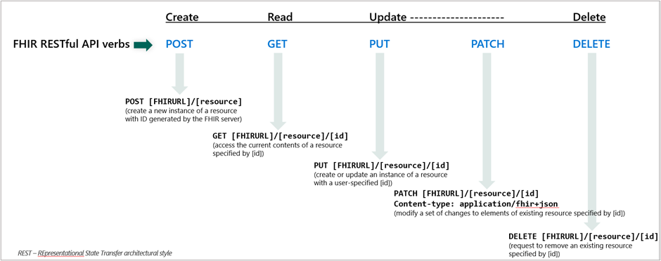
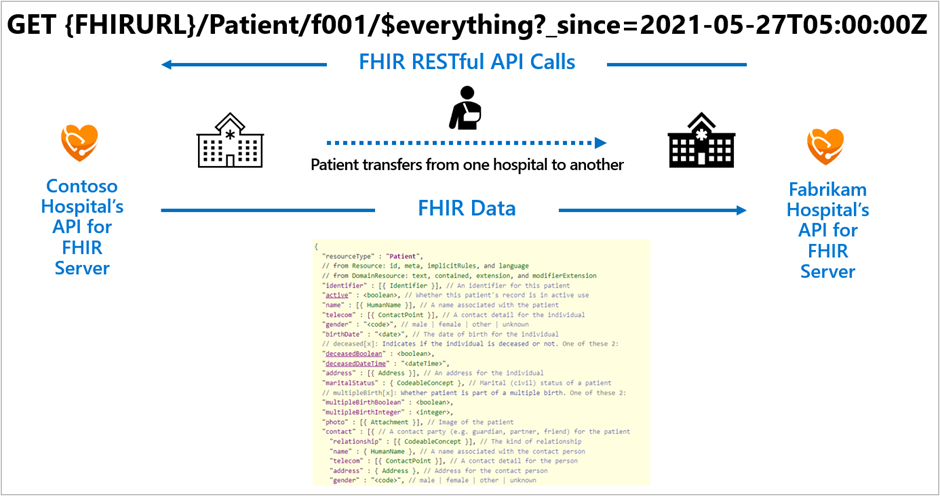

FHIR® R4 specifies a RESTful (Representational State and Transfer) API to allow remote client access to a FHIR server. When a remote client connects with a FHIR server through the FHIR API, if the remote client has the needed permissions, the remote client can retrieve and/or modify FHIR® data.

The following image illustrates how you can use each RESTful HTTP verb with FHIR resources.

> [!div class="mx-imgBorder"]
> 

One common application of FHIR API is the exchange of a patient's health data from one electronic health record (EHR) to another when the patient transfers between medical facilities.

> [!div class="mx-imgBorder"]
> 

Previously, you learned how the US Core Implementation Guide specifies mandatory capabilities for RESTful FHIR® interactions. The following examples are of a RESTful API request pattern and the name search parameter that's supported in the FHIR API.

**Patient request by using the resource ID in the RESTful path**

`GET [base]/Patient/[id]`

`GET [base]/Patient/1032702`

**Patient query by name**

`GET [base]/Patient?name=[string]`

`GET [base]/Patient?name=Shaw`

A good way to get familiar with the FHIR® RESTful API is to actually use it. By deploying and setting up a client application, you can prepare to complete some exercises by using it. Consider the following details on deploying and setting up a client application:

- FHIR® service should be deployed in Azure. For information about how to deploy the FHIR service, see [Deploy a FHIR service](/azure/healthcare-apis/fhir/fhir-portal-quickstart/?azure-portal=true).

- You'll need a registered client application to access the FHIR service. For information about how to register a client application, see [Register a service client application in Microsoft Entra ID](/azure/healthcare-apis/register-application/?azure-portal=true).

- Permissions should have been granted to the client application and your user account, such as **FHIR® Data Contributor**, to access the FHIR service.

After you've completed those prerequisites, you can follow these how-to guides:

- [Access using Postman](/azure/healthcare-apis/fhir/use-postman/?azure-portal=true)

- [Access with cURL](/azure/healthcare-apis/fhir/using-curl?azure-portal=true&tabs=PowerShell)

- [Accessing using the REST Client](/azure/healthcare-apis/fhir/using-rest-client/?azure-portal=true)

## SMART on FHIR

Substitutable Medical Applications and Reusable Technologies ([SMART on FHIR](https://docs.smarthealthit.org/)) is a healthcare standard through which applications can access clinical information through a data store. It adds a security layer based on open standards including OAuth2 and OpenID Connect, to FHIR® interfaces to enable integration with EHR systems. Using Smart on FHIR provides benefits such as

- Applications have a known method for obtaining authentication/authorization to a FHIR® repository.

- Users accessing a FHIR® repository with Smart on FHIR are restricted to resources specific to the user, rather than having access to all data in the repository.

- Applications can be granted access to a limited set of data persisted in FHIR service by using SMART clinical scopes.

For more information to enable Smart on FHIR capabilities on FHIR service, see [Smart on FHIR - Azure Health Data Services](/azure/healthcare-apis/fhir/smart-on-fhir)

## Open-source repositories

Following the GitHub repositories for the open-source versions of Microsoft health data tools can be beneficial if you're developing applications that connect with FHIR service or the other managed services in Azure Health Data Services. Often, the repositories will provide access to new functionality before it's added to the official products. You might also have access to the product teams if you submit GitHub issues or pull requests. 

The open-source repositories that are related to Azure Health Data Services are:

- [FHIR Server for Azure](https://github.com/microsoft/fhir-server/?azure-portal=true)

- [FHIR Converter](https://github.com/microsoft/FHIR-Converter/?azure-portal=true)

- [FHIR Loader](https://github.com/microsoft/fhir-loader/?azure-portal=true)

- [Azure Health Data and AI samples](https://github.com/Azure-Samples/azure-health-data-and-ai-samples/tree/main/samples/?azure-portal=true)

- [Azure Health Data Services Toolkit](https://github.com/microsoft/azure-health-data-services-toolkit)

- [Azure API for FHIR Migration Tool](https://github.com/Azure/apiforfhir-migration-tool)

- [Medical Imaging Server for DICOM](https://github.com/microsoft/dicom-server/?azure-portal=true)

- [FHIR Analytics Pipelines (Synapse Sync)](https://github.com/microsoft/FHIR-Analytics-Pipelines/?azure-portal=true)

- [FHIR Anonymization](https://github.com/microsoft/Tools-for-Health-Data-Anonymization/?azure-portal=true)

- [IoMT FHIR Connector for Azure](https://github.com/microsoft/iomt-fhir/?azure-portal=true)

For example, the FHIR server for Azure is the code that backs the managed FHIR service (which is part of Azure Health Data Services).

You can deploy and manage the FHIR server for Azure and then have full control over all components that are needed for a FHIR server. Keep in mind that when you're using the open-source version, you'll need to manage all of it. The codebase is only presented on an as-is basis, which means that you'll need to:

- Maintain the service.

- Ensure compliance.

- Manage the database, disaster recovery, and so on.

When using the managed Azure offering, you'll use a provisioned deployment of the open-source project, which is offered as a platform-as-a-service (PaaS) in Azure. That service is built, managed, and maintained by the Microsoft Health and Life Sciences engineering team. You'll have extra features that aren't available in the open-source version, and the service will enable you to meet regulatory compliance requirements for protected healthcare information (PHI).

If you're interested in learning how to deploy, set up, and use Azure Health Data Services for FHIR workloads and other health data interoperability solutions, see the [Azure Health Data Services Workshop](https://github.com/microsoft/azure-health-data-services-workshop/?azure-portal=true).
