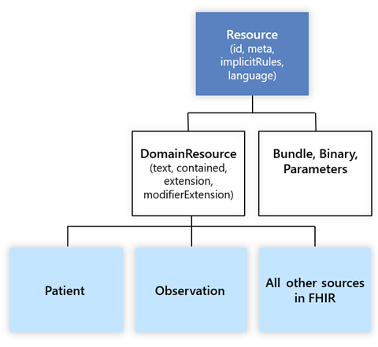
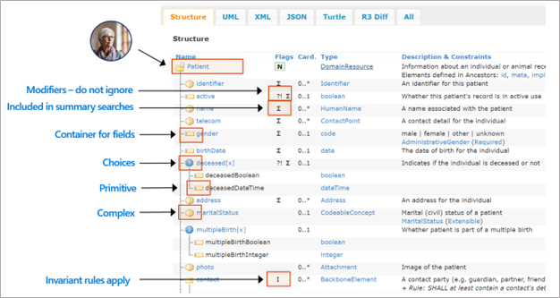

Resources in FHIR® are the entities that form the main components of the FHIR® data model. Previously, you learned about the way that resources are structured and how real-world healthcare interactions are modeled by resources that reference each other to form a web of health information. Now, you'll learn about what constitutes a resource in FHIR® and what sets resources apart from each other.

## Hierarchy

At the foundation of the FHIR data model is an abstract *base resource* class that all resource types inherit from, whether directly or indirectly. Only three resource types will inherit directly from the base resource class: Bundle, Binary, and Parameters. Additionally, a resource class will also inherit directly from the base resource class: DomainResource, which is the parent class to all familiar, real-world resource types in FHIR, such as Patient, Practitioner, Observation, Device, CarePlan, and so on. All resource types, aside from Bundle, Binary, and Parameters, will inherit from the DomainResource class.

As stated in the HL7 FHIR® documentation, "Only three resources - Bundle (collection of resources), Binary (the data of a single raw artifact in its native form), and Parameters (operation requests or responses) inherit *directly* from base Resource. DomainResource (what most other resources are derived from) allows other resources to contain text, contained resources, extensions and data elements specific to the particular domain of each resource."

> [!div class="mx-imgBorder"]
> 

## Resource elements and structure

Each resource type in the FHIR specification is defined with a set of attributes to capture information as it's generated in real-world healthcare scenarios. These attributes, or *elements* as they're referred to in FHIR, are what sets FHIR resource instances apart from each other on a FHIR server.

For example, each FHIR resource instance has an ID element to store that instance's unique ID on the FHIR server where the resource lives. An ID is assigned to each resource instance so that you can tell different resource instances apart. For example, on a FHIR server, one Patient resource with an ID of 123 and another Patient resource with an ID of 124 could exist (and so on).

The four elements that *all* resource types carry in FHIR® are ID, metadata, impicitRules, and language. That is, the Bundle, Binary, and Parameters resource types plus all common resource types that inherit from the DomainResource class.

> [!div class="mx-imgBorder"]
> 

In addition to these four elements are many other elements that are specific to the common resource types that inherit from the DomainResource class. For example, the Patient resource type has gender, birthDate, and address elements. Each patient resource instance on a FHIR server will have its own unique set of elements as such that distinguish patients from one another. Beyond the Patient resource type, the Observation resource type will have another set of elements, as will the Encounter, Medication, and DiagnosticReport resource types.

Each resource type is defined with a structure for the different elements that the resource type supports. The following image shows the structure for the Patient resource type with some of its standard elements.

> [!div class="mx-imgBorder"]
> 

## Identity

Two standard ways of identifying a resource instance on a FHIR server are: the resource ID element (as mentioned above) and another variety of element known as a *business identifier*.

- **Resource ID** - Included at the trailing end of a FHIR resource's location URL (for example, `{{fhirurl}}/Patient/123`), the resource ID (such as *123*) is unique to each resource instance on a FHIR server. If the resource instance is moved or copied to another FHIR server, then a new resource ID will be assigned to the copied or moved resource (with some exceptions in practice).

- **Business identifier** - Generally, in addition to a server-wide resource ID, resources will have identifier elements to represent the entity uniquely in the real world. This identifier remains fixed if a resource instance is copied/moved to another FHIR server. For example, for a patient, a social security number is an ID that (typically) doesn't change. If the SSN for a patient is used as a business identifier for that patient's FHIR resource instance, then that business identifier will remain the same wherever the resource instance is hosted.

> [!NOTE]
> In FHIR® literature, the term *resource* is used to mean a resource type or resource instance, depending on the context.

## Other resource details

**Resource extensions** allow you to associate more data to a core resource definition. For example, a Patient resource has required elements such as patient identifier, patient name, and gender. This resource must also support the following components: contact detail (for example, a telephone number or an email address), a birth date, an address, a communication language, a race, an ethnicity, and a birth sex (as part of the HL7 international standard). When a patient resource is extended for other purposes, such as participation in a global clinical study, you might need to capture more details, such as nationality. Be mindful that this approach might disrupt standardization across platforms when an extension isn't included elsewhere.
