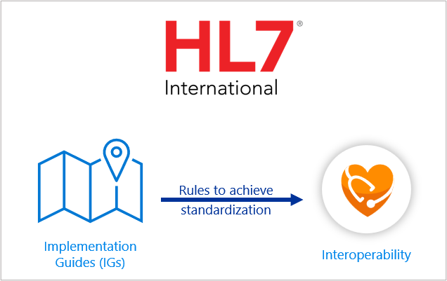
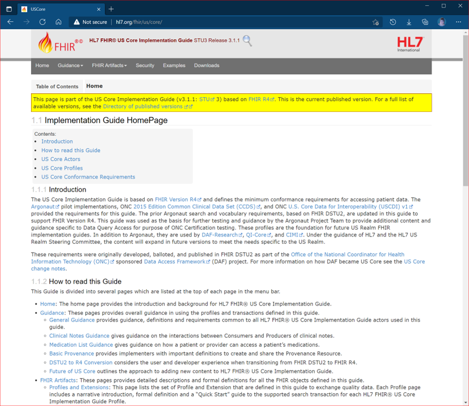
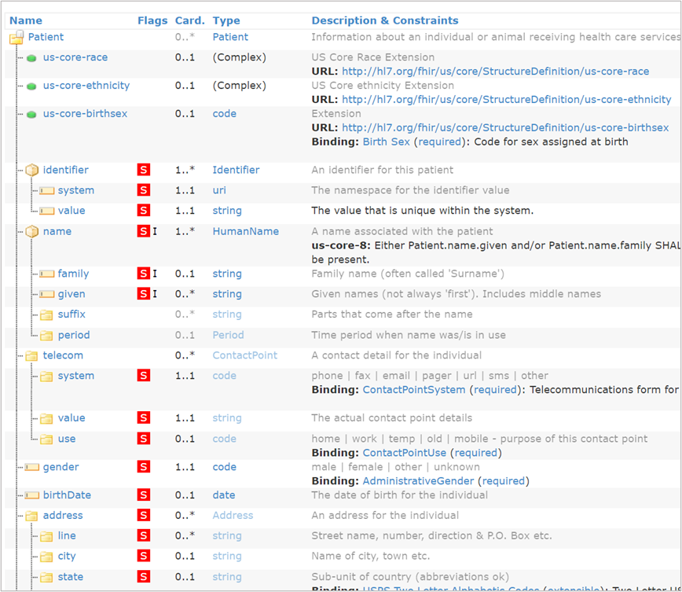
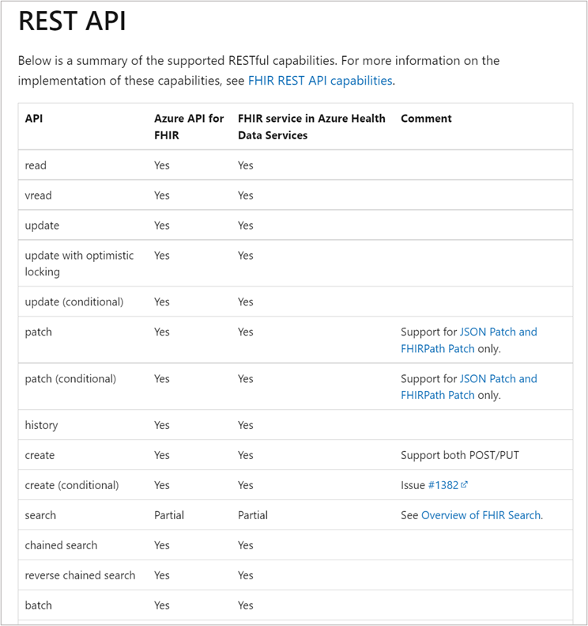

The HL7 organization defines an implementation guide (IG) as a set of rules about how FHIR resources are used (or should be used) to solve a particular problem. HL7 is a global consortium of healthcare and IT experts, and the US government and other governments have adopted its standards. Implementation guides offer rules that translate to standards for problem solving and interoperability.

> [!div class="mx-imgBorder"]
> 

Implementation guides contain the rules that allow organizations to standardize a data model. As a result, interoperability is enabled for the exchange of data between individuals and organizations that have been using disparate application interfaces and data storage systems. Applications often state what implementation guides that they support.

Implementation guides contain two types of resource references:

- **Contents** - A set of logical statements that implementations must conform to.

- **Examples** - Illustrate the intent of the profiles as defined in the implementation guide. Profiles are a set of constraints on a resource or the minimal expectations to record, search, and fetch data that's specific to that resource.

Implementation guides also include associated documentation to clarify usage. Multiple implementation guides are available in FHIR® to handle different tasks, such as constraints, customized operations, and management of bulk transfer of data.

For more information, see the [Implementation Guide Registry](http://fhir.org/guides/registry/?azure-portal=true).

## HL7 FHIR® US Core

One implementation guide that you should become familiar with is the HL7 FHIR® US Core Implementation Guide. Consider US Core as an *institutional* implementation guide as opposed to the more technical FHIR® IG. As implied by the name, this IG covers standards that are relevant to the United States. This guide is based on FHIR® R4 and defines the minimum constraints on the FHIR resources.

US Core provides the framework for the implementation of regulations that are driven by the [Centers for Medicare & Medicaid Services (CMS)](https://www.cms.gov/?azure-portal=true) and the [ONC Final Rule](https://www.healthit.gov/topic/oncs-cures-act-final-rule). Payors and providers across the United States who accept Medicare/Medicaid patients implement FHIR® by following the profiles that are defined in US Core.

For example, in a scenario about pharmaceutical data, you can find information in the US Core about how the different roles within a care interaction are arranged within the FHIR® framework. By implementing these important implementation guides, you can communicate and collaborate effectively with others outside your organization to deliver what's needed for the patient.

The following image shows the US Core Implementation Guide. Access the [full guide](http://hl7.org/fhir/us/core/?azure-portal=true) for a better understanding of what it contains.

> [!div class="mx-imgBorder"]
> 

## US Core profiles

The US Core Implementation Guide (based on FHIR® R4) defines the minimum set of constraints on the FHIR resources that are required to create US Core Profiles. The US Core Profiles are the minimum mandatory elements, extensions, and terminology that must be present.

Interoperability, which allows for different information systems, devices, and applications to access, exchange, integrate, and cooperatively use data in a coordinated manner, is enabled by the profile elements that are described in detail within the US Core Implementation Guide. Numerous profiles exist, including profiles for BMI, body temperature, heart rate, and vital signs. Currently, 23 profiles are included in US Core Profiles. Each profile has requirements and guidance is provided. For more information, see the [list and full details](http://hl7.org/fhir/us/core?azure-portal=true#us-core-profiles).

The following example shows one of the profiles (Patient). This profile sets minimum expectations for the Patient resource to record and be searchable for basic demographics and other administrative information about an individual patient. It identifies which core elements, extensions, vocabularies, and value sets should be present in the resource when you're using this profile.

The profile identifies mandatory elements and must support data elements. The mandatory elements must always be present or must be supported if the data is present in the sending system. In other words, you can't create a patient profile without the patient's name, but you can create it without the email address. While it's not required in the profile, the elements (including US Core extensions such as race and ethnicity) in the right column must be supported if they're present.

| Mandatory | Must support |
|-----------|--------------|
| Patient identifier (that is, MRN) | A birth date |
| Patient name | An address |
| Gender | Contact details (for example, telephone and email) |
| | A race |
| | An ethnicity |
| | A birth sex |
| | Previous name |
| | Suffix |
| | A communication language |

The following example is a snapshot view of patient profile content. You can also explore the [full profile](http://hl7.org/fhir/us/core/StructureDefinition-us-core-patient.html?azure-portal=true) that includes JSON and XML examples.

> [!div class="mx-imgBorder"]
> 

From the preceding image, the **Flags** column that contains a red **S** indicates that the element must be supported. For each element, you can explore details by selecting the name. The following example shows the [language element](http://hl7.org/fhir/us/core/StructureDefinition-us-core-patient-definitions.html?azure-portal=true#Patient.language).

> [!div class="mx-imgBorder"]
> 

## Interoperability and patient access

The [US Core Server Capability Statement](http://hl7.org/fhir/us/core/CapabilityStatement-us-core-server.html?azure-portal=true) describes the expected capabilities of the US Core Responder actor (that is, the FHIR server) which is responsible for serving responses to queries that are submitted by applications that comply with the US Core Requestor specification (that is, the client). Azure Health Data Services supports capabilities that enable compliance with the US Core Implementation Guide. These capabilities include RESTful API interactions, data conversion, defining and indexing custom search parameters, and Touchstone open access for Testing as a Service (TaaS).

The following image highlights a summary of the supported RESTful capabilities of the FHIR service in Azure Health Data Services.

> [!div class="mx-imgBorder"]
> 

The US Core Server Capability Statement in the FHIR® documentation includes details for each profile. For example, you can review the [patient profile](http://hl7.org/fhir/us/core/CapabilityStatement-us-core-server.html?azure-portal=true#patient) to understand what is expected of a compliant client and server to ensure interoperability.

Understanding how the implementation guides bring the FHIR® specification to life can help you work with Azure Health Data Services. Take some time to explore the parts of US Core that are most relevant to your work.
