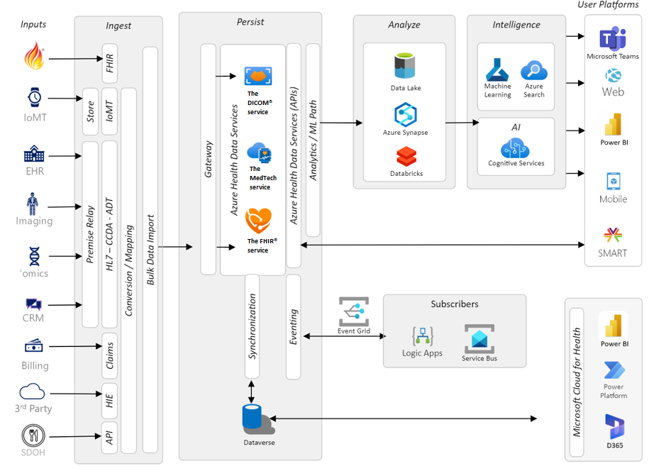
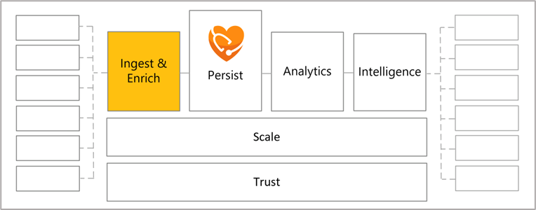
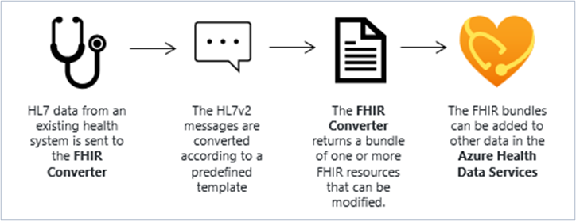
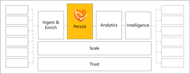
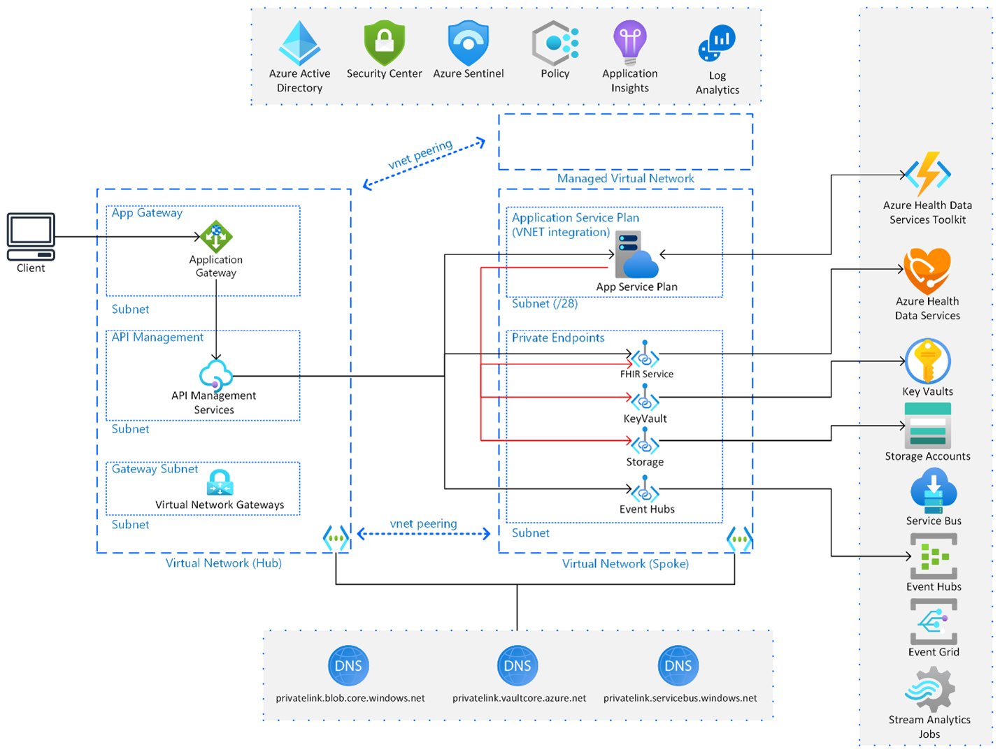
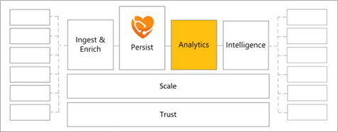
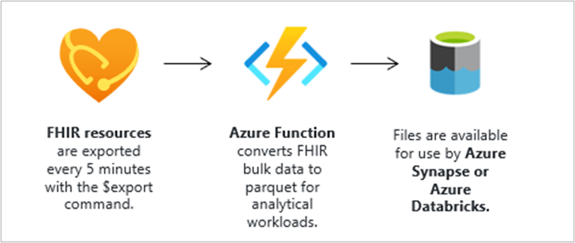
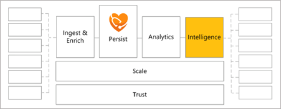
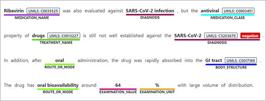

Next, you explore the architecture of Azure Health Data Services and learn about some primary functions in more detail. Start by reviewing the following sample reference architecture. This view is of a common, real-world architecture of a healthcare solution that includes the functional building blocks of Ingest, Persist, Analyze, and Intelligence. Keep in mind that not all solutions require every piece in this diagram. Take a minute to review the components of each section and the flow of data.

> [!div class="mx-imgBorder"]
> 

This reference architecture demonstrates how you can connect the various components to address an organization's unique health data challenges. For more information, see [Solutions for Healthcare](/azure/architecture/industries/healthcare/?azure-portal=true).

## Ingest

The Ingest function allows you to take data from different sources and load the data into Azure Health Data Services. As you build your solution architecture, the ingestion requirement is a good place to start evaluating your needs.

> [!div class="mx-imgBorder"]
> 

The `$convert-data` operation built in to the FHIR® service is useful for converting health data from legacy formats into FHIR, and the open-source [FHIR® Loader](https://github.com/microsoft/fhir-loader/?azure-portal=true) (not shown in the preceding image) is the recommended method of bulk-ingesting FHIR® data into FHIR service.

The `$convert-data` operation enables conversion of legacy-formatted healthcare data such as HL7v2, C-CDA, STU3 and JSON  into FHIR® bundles. Mapping templates define conversion between these data formats to FHIR® bundles. There are 57 predefined default mapping templates available that you can use to define the conversion from source data formats such as HL7v2, CCDA, STU3, JSON to FHIR® R4 format. Additionally, you can customize these templates. For more information, see [Transform HL7v2 data to FHIR® R4 with $convert-data and Azure Data Factory](/azure/healthcare-apis/fhir/convert-data-with-azure-data-factory).

The FHIR® bundle is returned for further validation, if necessary, prior to persisting in the FHIR service. Keep in mind that the `$convert-data` operation doesn't persist the data in FHIR service. That step needs to happen after conversion.

The following diagram illustrates the convert data process.

> [!div class="mx-imgBorder"]
> 

## Import operation

Import operation enables loading Fast Healthcare Interoperability Resources (FHIR®) data to the FHIR server at high throughput. FHIR service Import operation ingests data into the FHIR service from a storage account.
 
FHIR service supports two modes of $import - Initial mode is intended to load FHIR resources into an empty FHIR server. Initial mode only supports CREATE operations and, when enabled, blocks API writes to the FHIR server.

Incremental mode is optimized to load data into FHIR server periodically and doesn't block writes via API. Incremental mode ingests multiple versions of FHIR resources in single batch while maintaining resource history. This mode retains the lastUpdated field value in FHIR resources during the ingestion process while also maintaining chronological order of resources.

To configure import on FHIR service, see [Executing the import by invoking $import operation on FHIR service in Azure Health Data Services](/azure/healthcare-apis/fhir/import-data).

Health care organizations utilizing Azure Health Data Services, FHIR service, often need to run synchronous and asynchronous data flows simultaneously. The asynchronous data flow includes receiving batches of large data sets containing patient records from various sources such as Electronic Medical Record (EMR) systems. These data sets need to be imported into a FHIR server to ensure comprehensive patient information is available. This import needs to be done simultaneously with the synchronous data flow to concurrently execute API CRUD (Create, Read, Update, Delete) operations on Azure Health Data Services FHIR service. Concurrently performing data import and API CRUD operations on the FHIR server is crucial to ensure uninterrupted healthcare service delivery and efficient data management.

## Persist

To persist data means to store the data on a server for later access. For example, the FHIR® import operation helps to ingest FHIR® data so that the data can be persisted in FHIR service. In addition to FHIR data ingestion and persistence, Azure Health Data Services enables the persistence of DICOM data through the DICOM service and medical IoT data through the MedTech service (both of which you can connect to the FHIR service for data merging in FHIR).

> [!div class="mx-imgBorder"]
> 

The open source [Azure Health Data Services Toolkit](https://github.com/microsoft/azure-health-data-services-toolkit)  helps you extend the functionality of Azure Health Data services by providing a consistent toolset to build custom operations to modify the core service behavior. This toolkit abstracts common patterns so you can focus on delivering your use cases.

Custom operations are purpose-built solutions that act as a proxy for a single or small set of HTTP endpoints. This toolkit simplifies developing these solutions. The toolkit is the new approach for the deprecated FHIR Proxy.

The following architecture is a sample of how you could deploy and integrate custom operations built with the Azure Health Data Services toolkit in a production environment with Azure Health Data Services.

> [!div class="mx-imgBorder"]
> 

## Analytics

In the context of Azure Health Data Services, analytics are managed through de-identifying and exporting FHIR® data for use in the broader Azure data processing ecosystem (such as Microsoft Azure Synapse or Microsoft Azure Machine Learning). Secondary use of health data is defined as a "non-direct care use of PHI for things like analytics, research, public health provider certification, etc." Analytics uses the data persisted in the FHIR®, DICOM®, or MedTech service to solve organizational problems and enable better health outcomes.

> [!div class="mx-imgBorder"]
> 

For example, FHIR service supports the `$export` operation that allows you to export de-identified FHIR® data to an Azure storage account. The `$export` operation supports inline, configurable anonymization. The following examples show the use of the `$export` operation for different scopes of resources on the FHIR service:

- **System** - `GET https://<<FHIR service base URL>>/$export>>`

- **Patient** - `GET https://<<FHIR service base URL>>/Patient/$export>>`

- **Group of patients** - `GET https://<<FHIR service base URL>>/Group/[ID]/$export>>`

> [!div class="mx-imgBorder"]
> 

## Intelligence

The Intelligence stage in a health data architecture is the part of the process where AI is used to extract health insights from the data. This AI could include Azure Machine Learning, Microsoft Azure Cognitive Search, Microsoft Azure Cognitive Services, AI Builder, or similar AI components.

> [!div class="mx-imgBorder"]
> 

An example would be Text Analytics for Health, which is built on Azure Cognitive Services. By using Microsoft Azure Text Analytics for Health, you can extract and label relevant medical information from unstructured text. Example uses are doctor notes, discharge summaries, clinical documents, and so on.

> [!div class="mx-imgBorder"]
> 

You can use these health data architecture components together to meet your organization's specific needs.
