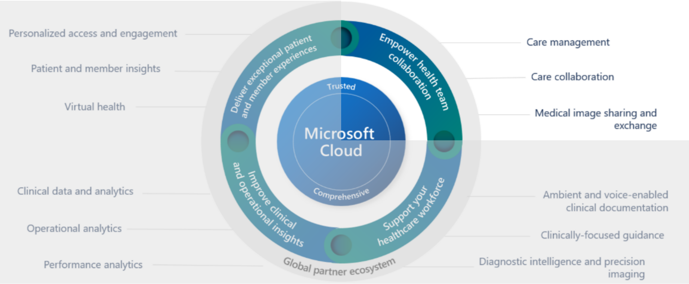
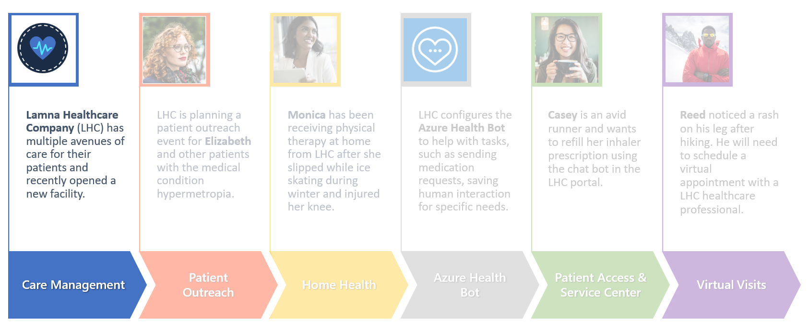

With the **Care Management** application, healthcare systems can provide coordinated care to each patient by quickly communicating the right information, at the right time, to the right people. Users can create, personalize, and enable new care plans for patients, manage care teams, and view patients' clinical timelines and care insights, all within the application.

Key capabilities of Care Management include:

-   **Care team** - View and collaborate with care teams to provide the best care for the patient.

-   **Care plan** - Create and assign care plans and automate adherence to improve care coordination for your patients.

-   **Clinical timeline** - Concise, sequential, and interactive view of a patient's clinical occurrences.

-   **Virtual clinic** - Provide your care team members with the ability to perform virtual appointments with patients.

## Industry prioritized scenarios

Care Management focuses on the **Enhance patient engagement** and **Empower health team collaboration** priority scenarios. It creates a system that allows for a 360-degree view of patient healthcare data with patient insights, enhanced care team collaboration, and virtual care options.

> [!div class="mx-imgBorder"]
> 

## Healthcare story

This lab focuses on the story of Lamna Healthcare Company, which is opening a new location in Redmond, WA.

> [!div class="mx-imgBorder"]
> 

Now that Lamna Healthcare Company's new location is ready to open, it needs to be entered into the system. Additionally, employees must understand the healthcare data model and how the data is displayed in the Care Management application.

The following exercises in this module help you learn more about the Care Management application:

- Explore the healthcare data model and how patient details, clinical data, and care plan data are related.

- Navigate the unified patient view of a patient record in the Care Management application.

- Create a location record for Lamna Healthcare Company.

- Add a new patient information in the Care Management App.
