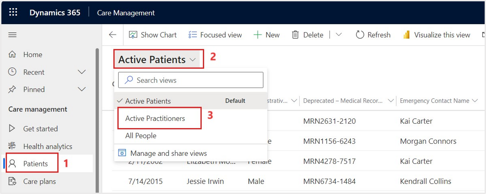

In this exercise, you'll navigate the patient record and explore information that's captured in the Care Management application. In this scenario, you'll examine the unified patient view to observe how a care team member would obtain a full view of clinical and non-clinical data for a specific patient.

1.  Go to [Microsoft Power Apps](https://make.powerapps.com/?azure-portal=true) in an InPrivate or Incognito window and then sign in with your username and password.

1.  Select the proper **Environment** in the upper right corner of the home page.

1.  In Power Apps, select **Apps** on the left navigation pane. Select and open **Care Management** by selecting the app from the list.

	> [!div class="mx-imgBorder"]
	> 

1.  You'll be directed to the **Get Started** under **Care management**. Select the **Health Analytics** section, showing the **Care Plan Activities Dashboard**. This dashboard shows actionable charts on care plan activities for care managers and coordinators.

	> [!div class="mx-imgBorder"]
	> 

    You can find other dashboards, such as the **Care Coordinator Dashboard**, in the dropdown menu.

	> [!div class="mx-imgBorder"]
	> 

1. Select **Patients** on the left navigation pane. The default view is **Active Patients**. In your own time, you can switch the view to **Active Practitioners** and explore the practitioners form to observe how it differs from the patient form.

	> [!div class="mx-imgBorder"]
	> 

1. Find and select **Amber Rodriguez** from the **Active Patients** view. Open the record by double-clicking or selecting **Edit** in the command bar.

	> [!div class="mx-imgBorder"]
	> 

1. The unified patient view has two available forms: **Patient-Clinical** and **Patient-Administrative**. You can change the form from the dropdown menu under the patient name. You can set form access through security roles. The **Administration** form shows non-clinical data only.

	> [!div class="mx-imgBorder"]
	> 

1.  In the **Patient-Clinical** form, examine the **Summary** tab on Amber's patient record. The purpose of the patient record is to give a comprehensive view of Amber's latest information.

	> [!div class="mx-imgBorder"]
	> 

	1. The **Patient snapshot** section displays a customizable view of the patient information. Select an item to display the details of the record on the right panel of the form.

	1. In the **Active conditions** section, review Amber's pre-existing conditions. You can drill down for more information or create a new condition for the patient.

	1. In the **Clinical details** section, cycle through the various icons to review different medical details, including **Medications and prescriptions**, **Encounters**, **Results and diagnostics**, and **Procedures**. This method is simple and efficient for observing patient healthcare details.
	
		> [!div class="mx-imgBorder"]
		> 

		**Assistant** section provides an overview of notifications so that the admin can check back later to stay updated.
	
	1. Review the **Patient Interactions** section, which shows any activity, note, or post. You can filter and sort this section if necessary.

1. Select the **Profile** tab.

	> [!div class="mx-imgBorder"]
	> 

1. The **Profile** tab includes extra and non-clinical information, including the **Patient information**, **Patient relationships**, **Patient contact methods**, **Insurance coverage**, **Claims**, and **Medical identifiers** sections.

	> [!div class="mx-imgBorder"]
	> 

1. Select the **Clinical timeline** tab. On this tab, a care team member can view a weekly calendar of the patient's clinical information and a list of upcoming or previous events.

	> [!div class="mx-imgBorder"]
	> 

1. Select the **Upcoming events** dropdown menu on the right pane to view **Previous events**.

	> [!div class="mx-imgBorder"]
	> 

1. Review the list of events that Amber had previously, including appointments, care plans, encounters, and medication requests.

	> [!div class="mx-imgBorder"]
	> 

1. Select the **Care Plan** tab. On this tab, the care team member has a full view of all care plans that are associated with the patient. This tab also includes a list of the patient's care plan activities and statistics for completed activities and goals. You can create a new care plan or filter by care plan type in this view.

	> [!div class="mx-imgBorder"]
	> 

1. Select the **Care team** tab. On this tab, the care team member can find other members who might be providing care to the patient for current conditions and care plans.

	> [!div class="mx-imgBorder"]
	> 

1. Select the **Related** tab to view other details that are related to the patient record.

	> [!div class="mx-imgBorder"]
	> 

You've now explored the starting dashboards and the unified patient view features in the Care Management application.
