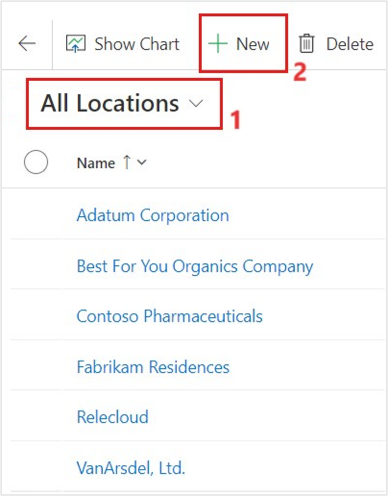
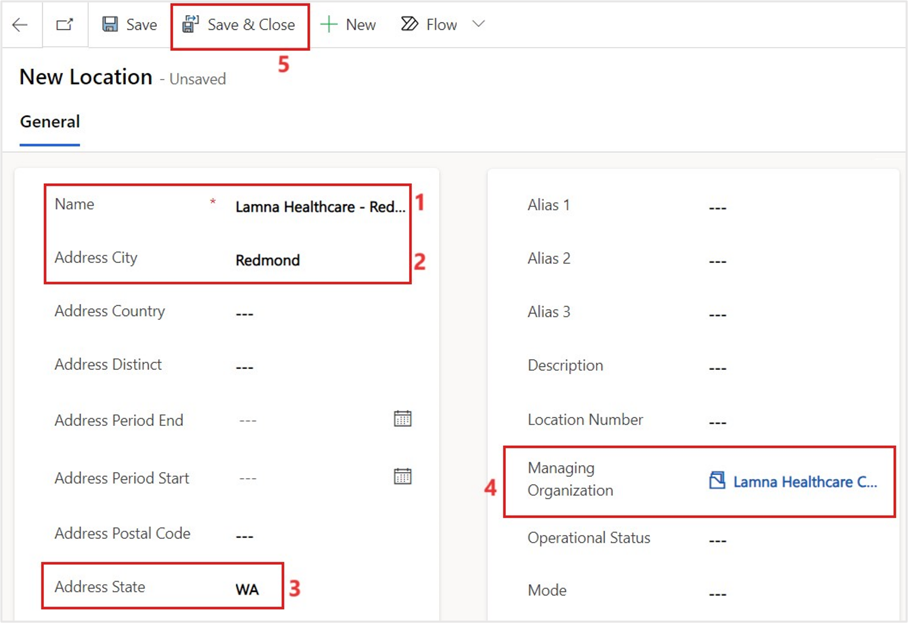
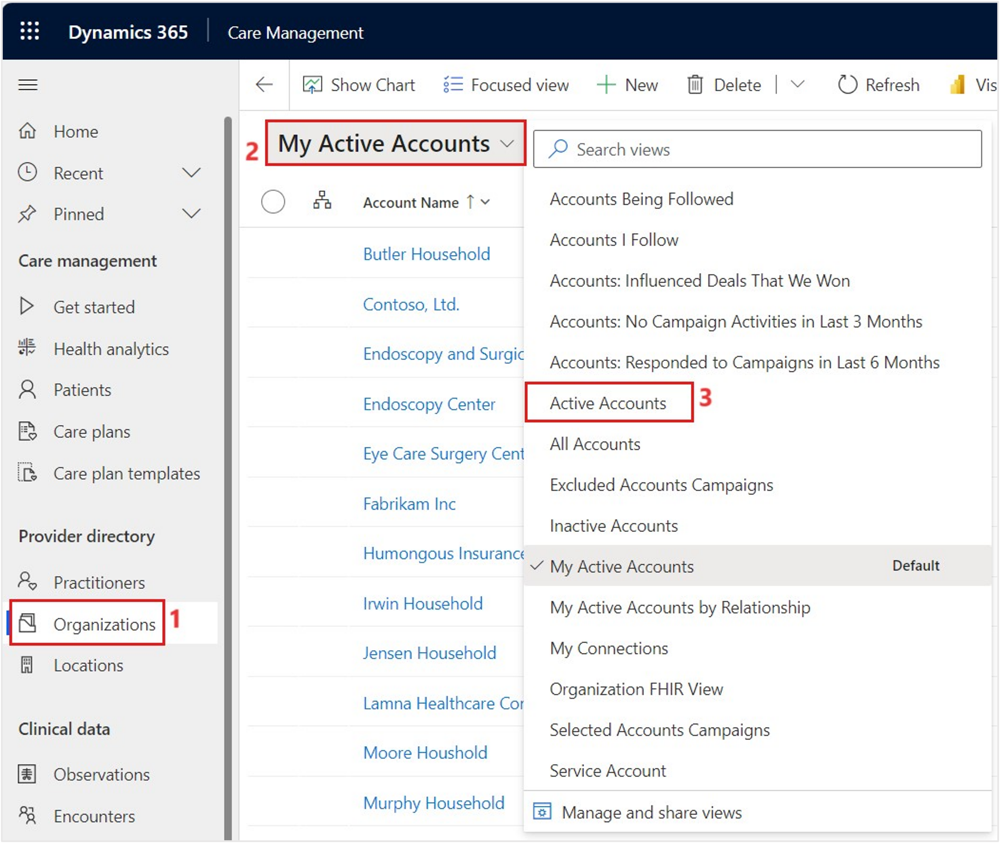
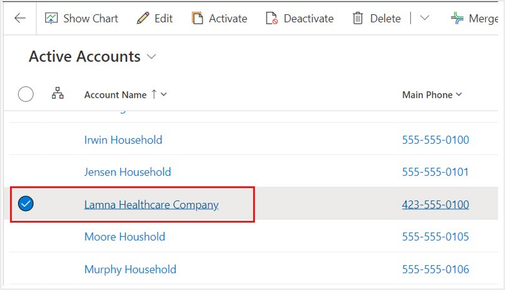
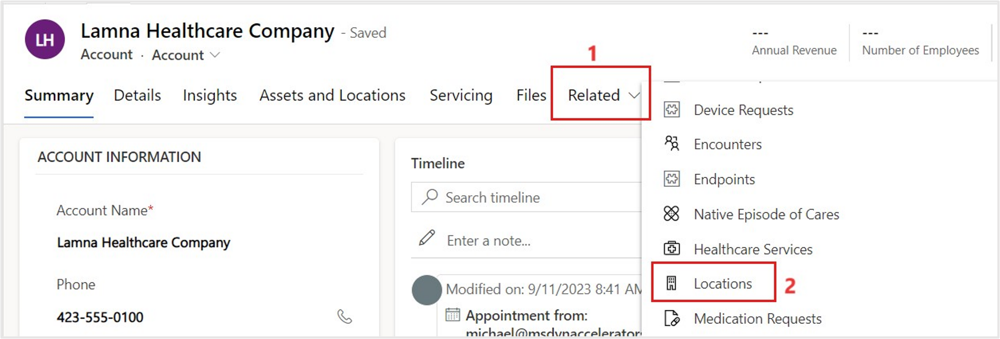
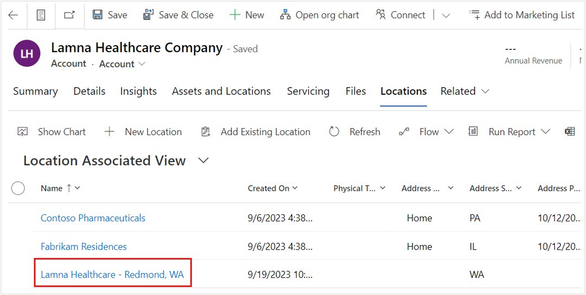

In this exercise, you'll create a new location record for the **Healthcare Patient Portal** organization. They've opened a new branch in Redmond, Washington, and you'll need to ensure that this location is in the system.

1.  In the Care Management application, select **Locations** in the left navigation under **Provider directory**.

1.  In the **All Locations** view, select **+ New**.

	> [!div class="mx-imgBorder"]
	> 

1.  Fill in the following information for the new location:

	- **Name** - Lamna Healthcare - Redmond, WA

	- **Address City** - Redmond

	- **Address State** - WA

	- **Managing Organization** - Lamna Healthcare Company

1.  Select **Save & Close**.

	> [!div class="mx-imgBorder"]
	> 

1.  In the left navigation, select **Organizations** to review the new location in its managing organization record. Change the grid view in the dropdown menu from **My Active Accounts** to **Active Accounts**.

	> [!div class="mx-imgBorder"]
	> 

1.  While in the **Active Accounts** view, select the **Lamna Healthcare Company** organization.

	> [!div class="mx-imgBorder"]
	> 

1.  On the Lamna Healthcare Company record, select the **Related** tab and then scroll down to select **Locations**.

	> [!div class="mx-imgBorder"]
	> 

The newly created **Lamna Healthcare - Redmond, WA** location will show as associated with the record.

  > [!div class="mx-imgBorder"]
  > 

You've now created a new location in Redmond, WA for Lamna Healthcare Company and have viewed it in the associated organization in the Care Management application.

In this module, you explored the Administration section of the Care Management application. In your own time, you can continue through the other sections of the application, including Care Management, Clinical Data, and Templates.
