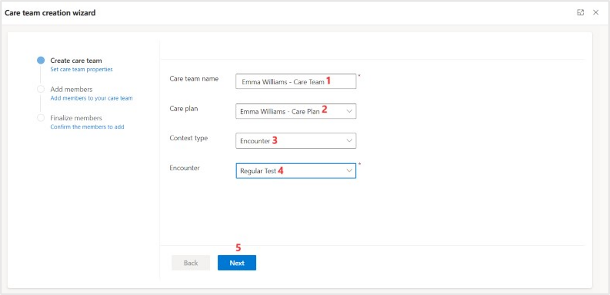

In this task, you'll create a new **Patient** and **Patient Encounter** record in the **Care Management** app. Then, you'll assign it a **Care Plan** and a **Care Team** based on the patient's details.

1.  Create a new **Patient** record in the **Care Management** app by following these steps:

    1.  In the upper-right corner of the **Care Management** home page, select the plus (**+**) icon.

    1.  Select **Contact** from the list.

1.  Create a new patient record with the following information.

	- **Contact Type** - Patient

	- **First Name** - Emma

	- **Last Name** - Williams

	- **Email** - <emmawilliams@contosopersonal.com>

	- **Mobile Phone** - (561) 555-3010

	- **Business Phone** - (431) 555-3010

1.  Select **Save and Close**.

	> [!div class="mx-imgBorder"]
	> 

1.  Select the record that you created.

1.  Enter the **Household** as **Lamna Healthcare Company**.

1.  Select the edit icon next to **Home address** and then enter the following details:

	- **Address** - 4 Illinois Drive
	
	- **City** - Bronx
	
	- **State/Province** - New York
	
	- **Zip code** - 55102
	
	- **Country** - United States of America

    > [!div class="mx-imgBorder"]
	> 

1.  Select **Save**.

1.  On the contact page, select **Encounters** from the **Related** dropdown menu.

1.  Select **New Encounter**.

1.  Enter the following details for the new encounter.

	- **Encounter Name** - Regular Test

	- **Status** - Planned 

	- **Patient** - Emma Williams

	- **Start Date/Time** - Tomorrow's date and 8:00 AM

	- **End Date/Time** - Tomorrow's date and 11:00 AM

	- **Priority** - routine

	- **Destination** - Lamna Healthcare Company

1.  Select **Save and Close**.

	> [!div class="mx-imgBorder"]
	> 

1.  You'll create a new **Care Plan** and **Care Plan Team** for the patient you created in the previous step. You'll create a **Care Plan** with one or more **Care Team member(s)** for the care team to collaborate and provide better healthcare for the patient. 
    
    1. Select the **Care Plan** tab.
    
    1. Select the **New care plan** dropdown list and select **Blank**.

1.	Enter the following details in the **New Care Plan** screen.

	- **Plan Name** - Emma Williams – Care Plan

	- **Status** - Active

	- **Start Date** - Tomorrow’s date and 8:00 AM

	- **End Date** - Tomorrow’s date and 11:00 AM

	- **Encounter** - Regular Test

1.  Select **Save and Close**.

	> [!div class=”mx-imgBorder”]
	> 

1. Create a Care team. Select the **Care team** tab and then select **Add a new care team.**

1. Enter the following details on the create new team wizard.

    - Under **Create care team**:

        - **Care team name** - Emma Williams - Care Team

        - **Care plan** - Emma Williams - Care Plan

        - **Context type** - Encounter

        - **Encounter** - Regular Test

    > [!div class="mx-imgBorder"]
	> 

    - Under **Add members**:

        - **Member type** - Practitioners
	
        - **Search members** - Adrian King

1.  Select member type - **Related persons** and add **Cameron Baker.** Select **Next**.

1. Select **Submit**.
