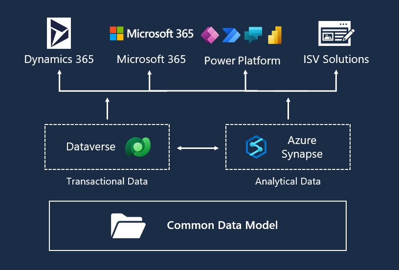
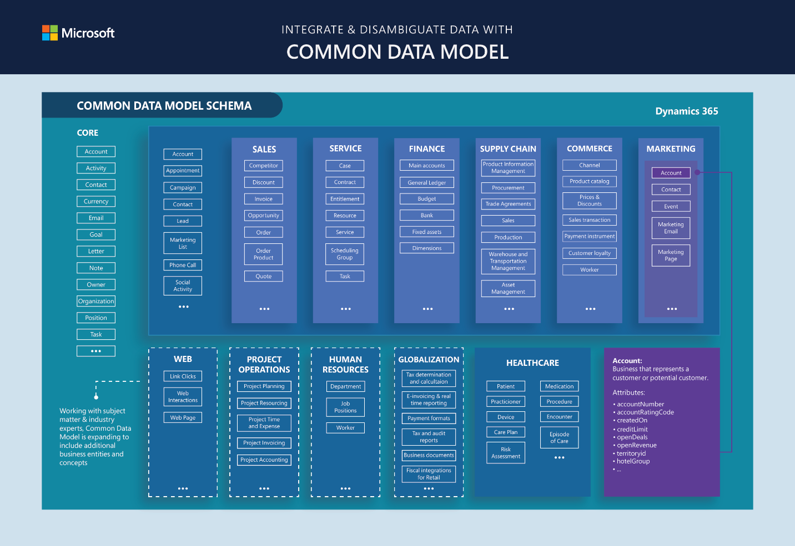

If you've brought together data from multiple systems and applications, then you know that it can be an expensive and time-consuming task. Without the ability to share and understand the same data easily, each application, or data integration project, would require a custom implementation.

Common Data Model simplifies this process by providing a shared data language for business and analytical applications to use. It's a common machine-understandable way to describe data with semantic consistency across business, transactional, analytical, and industry domains. This feature helps
drive interoperability across apps and services from the Microsoft ecosystem and allows customers to create insights from their data.

> [!div class="mx-imgBorder"]
> 

Common Data Model isn't a service; rather, it's a semantically rich set of table and column definitions that you can instantiate as a service.

- For business or transactional data, you can instantiate Common Data Model through Microsoft Dataverse (formerly known as Common Data Service). Customers, independent software vendors (ISVs), and partners can use and extend the entity and attribute definitions as needed to access and write business data that's present in Dataverse, including:

  - Microsoft Dynamics 365 Finance

  - Finance and operations apps

  - Microsoft Dynamics 365 Customer Service

  - Other data that Dynamics 365 creates

- For analytical data, you can instantiate Common Data Model through Microsoft Azure Synapse Analytics. Customers, ISVs, and partners can use Azure Synapse to manage and extend Common Data Model definitions and to create new entity definitions as needed.

## Common Data Model schema

Common Data Model includes a set of standardized, extensible data schemas that Microsoft and its partners have published. This collection of predefined schemas includes entities, attributes, semantic metadata, and relationships. The schemas represent commonly used concepts and activities, such as Patient and Care Plan, to simplify the creation, aggregation, and analysis of data. The following screenshot shows some elements of the standard tables with the Healthcare data model highlighted in the overall Common Data Model schema.

For more information, see [Common Data Model](/common-data-model/?azure-portal=true).
