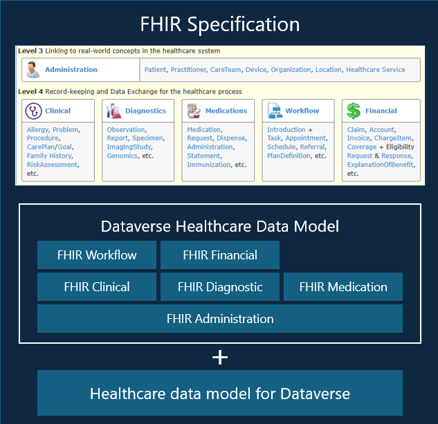
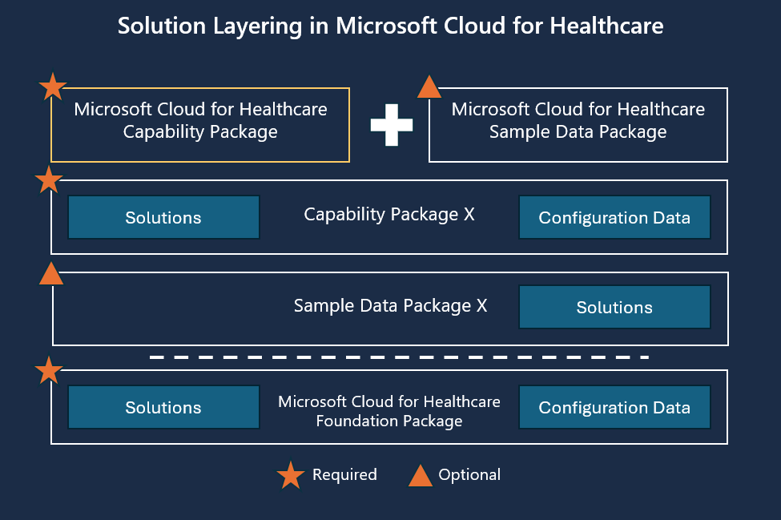
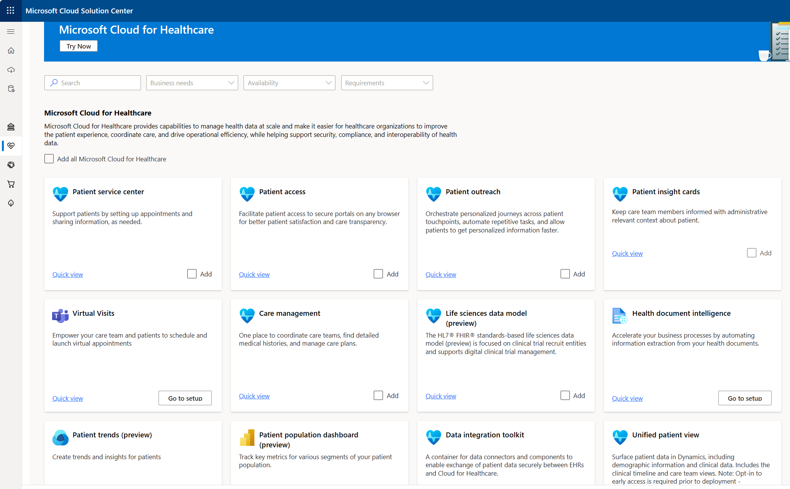
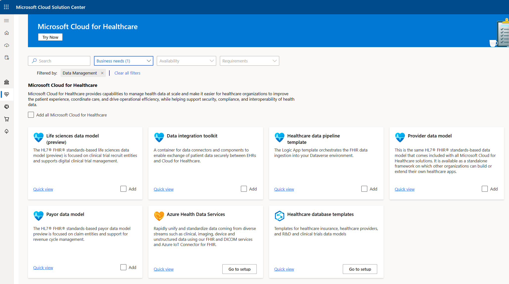

The healthcare data model for Dataverse defines a common schema for healthcare business entities, and it's extendable. It's based on the Fast Healthcare Interoperability Resources (FHIR) standards framework. The data model consists of 20+ FHIR/HL7 resources that form the core data constructs that drive Microsoft Cloud for Healthcare.

The healthcare data model for Dataverse includes several prebuilt, model-driven applications that showcase how to build healthcare applications in Microsoft Power Platform by using the data model. Some of these applications can use out-of-the-box tables from the following applications:

- Dynamics 365 Customer Service

- Dynamics 365 Field Service

- Dynamics 365 Customer Insights - Journeys

The entity reference for Dynamics 365 solutions in Microsoft Cloud for Healthcare is available in the [Overview of Microsoft Cloud for Healthcare entities](/common-data-model/schema/core/industrycommon/healthcare/healthcare-overview/?azure-portal=true) Common Data Model documentation.

The core schema that comprises the Microsoft Cloud for Healthcare data model for Dataverse is implemented as a series of related Dataverse tables. Essentially, the HL7 FHIR, JSON-based, document-centric schema has been translated to a relational data model, taking advantage of the Dataverse platform capabilities, namely:

- Relational tables

- Search indexing

- Business application design

- Workflows

- An extensibility platform

After it's installed, the Healthcare data model for Dataverse is available in managed solutions and is segmented according to the FHIR specifications. Basically, the solutions group the tables according to their corresponding FHIR resources as defined by the [HL7 FHIR specification](https://www.hl7.org/fhir/index.html/?azure-portal=true).

> [!div class="mx-imgBorder"]
> 

System owners can own, manage, and extend the data model. For example, the data model represents only a subset of FHIR resources, so customers can add their own tables that represent other FHIR resources. Alternatively, customers can add fields to the existing tables to meet their system requirements.

You can instantiate Common Data Model through Dataverse, making this data available to Microsoft Power Platform. Then, all healthcare experiences for better care and insights display through applications and services above this layer. For example, Microsoft Power Apps portals and Microsoft Azure Health Bot enable care coordination and Microsoft Dynamics 365 Customer Insights - Data.

## Healthcare capabilities and the healthcare data model

Each Microsoft Cloud for Healthcare capability that's available in Microsoft Cloud Solution Center is associated with a subset of the healthcare data model, depending on the accompanying scenarios. The following diagram shows the general approach to layering with the deployment packages for the healthcare data model components on the target tenant.

> [!div class="mx-imgBorder"]
> 

Each Microsoft Cloud for Healthcare capability follows a structure and layering convention, and it includes packaging that enables deployment in a controlled manner. At the base is Microsoft Cloud for Healthcare Foundation Package, which has a set of solutions and configuration data. The subsequent package layers build on the foundation and include Microsoft Cloud for Healthcare capability packages, adding the relevant data model tables for the corresponding package.

Examples of available capability packages are **Patient service center**, **Patient Access**, **Care Management**, or **Data integration toolkit**.  Each capability includes a set of required solutions, possible optional sample data packages, and optional configuration data. Packages allow Microsoft Cloud for Healthcare customers to select only the solutions and packages that they need for their requirements.

For example, if you choose to install Care Management, the Microsoft Cloud for Healthcare capability package would be for care management. Then, this capability package would only include the Healthcare data model for care management.

## Healthcare data model for Dataverse deployment

These capability packages and the Microsoft healthcare data model are available for deployment through the Microsoft Cloud Solution Center at [https://solutions.microsoft.com](https://solutions.microsoft.com/?azure-portal=true). Solution Center is the Microsoft Industry Cloud deployment center for all Industry Cloud solutions, including Microsoft Cloud for Healthcare. Solution Center provides access to all previously discussed capability packages and more. Customers can deploy one or more capabilities and then Solution Center completes the following actions:

- Validates the underlying dependencies.

- Provides options for installing the related sample packages.

- Deploys each package in the correct order.

> [!div class="mx-imgBorder"]
> 

In the Solution Center, you can filter the capability package list against the **Business needs**, **Availability**, and **Requirements**.  Filtering against **Data Management** as the **Business needs** returns a subset of the capability packages, as shown in the following screenshot.

> [!div class="mx-imgBorder"]
> 

Microsoft Cloud for Healthcare includes several data management-specific capability packages and related services. The solutions in the packages are segmented according to the HL7 specifications, and the capability packages are further grouped according to focused usage areas. For example, Solution Center includes tiles for the following data models:

- Payor data model

- Provider data model 

- Life sciences data model (preview)

This segmentation helps customers select only the data model components that are required for their solution.
