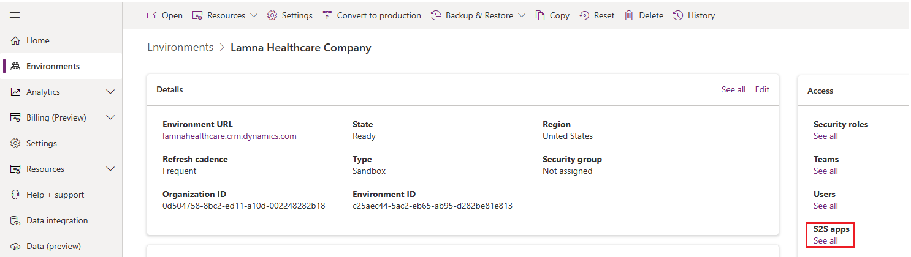

The Healthcare data pipeline template is a data management capability in Microsoft Cloud for Healthcare. You can deploy this template from [Microsoft Cloud Solution Center](https://solutions.microsoft.com/Microsoft%20Cloud%20for%20Healthcare/?azure-portal=true). This template deploys an app from Azure Logic Apps with a blob trigger to asynchronously process bundles in the blob storage.

You can deploy the resources that are outlined in the following table by using the Healthcare data pipeline template.

| Resource | Description |
|----------|-------------|
| Managed identity | The name of the managed identity follows a specific format: **miUniqueValue**. The prefix **mi** stands for managed identity, and the suffix **UniqueValue** is a random string ensuring that the name isn't duplicated. The deployed logic app is assigned this managed identity. The managed identity is also granted access to the storage account, FHIR server, and the Dataverse environment. |
| Azure storage account | The name of the storage account follows a specific format: **saUniqueValue**. The prefix **sa** stands for storage account, and the suffix **UniqueValue** is a random string ensuring that the name isn't duplicated. Along with the storage account, the template also deploys the three containers, namely **bundles**, **bundlesarchive**, and **bundleserror**. |
| Role assignment | Assigns the [Storage Blob Data Contributor](/azure/role-based-access-control/built-in-roles#storage-blob-data-contributor/?azure-portal=true) role on the storage account to the managed identity. |
| Microsoft Azure Event Grid | The name of the Event Grid follows a specific format: **egUniqueValue**. The prefix **eg** stands for Event Grid, and the suffix **UniqueValue** is a random string ensuring that the name isn't duplicated. All blob events are posted to this Event Grid. |
| Microsoft Azure Service Bus | The name of the Service Bus follows a specific format: **sbUniqueValue**. The Event Grid posts events to the Service Bus queue named **bundleCreated**. |
| Authorization rule | Creates a listen authorization rule on the Service Bus with the name **bundleauthlisten**. |
| Azure Logic Apps | Uses the **Consumption** hosting plan type to create a logic app workflow that triggers off the Service Bus events. This logic app posts the bundles to the created endpoints. |

The following diagram shows the design of the pipeline that deploys through the template.

> [!div class="mx-imgBorder"]
> 

When a bundle is placed in the bundles container of the deployed Azure storage account, a **BlobCreated** event is created and posted to the Azure Service Bus through Azure Event Grid topics, triggering a logic app run. The logic app fetches the bundle and posts it to the configured endpoints. If the run is successful, the bundle is moved to the **bundlesarchive** folder and a blob with the name **originalblobname_result.json** is created in the same folder. If the run results in an error, the bundle is moved to the **bundleserror** folder and a blob with the name **originalblobname_result.json** is created in that folder.

## Deploy Healthcare data pipeline template

In this task, you use [Microsoft Cloud Solution Center](https://solutions.microsoft.com/Microsoft%20Cloud%20for%20Healthcare/?azure-portal=true) to deploy Healthcare data pipeline template.

1. While signed in to your Microsoft 365 tenant as global administrator, open a new browser tab and then go to [Microsoft Cloud Solution Center](https://solutions.microsoft.com/Microsoft%20Cloud%20for%20Healthcare/?azure-portal=true).

1. On the **Microsoft Cloud for Healthcare** page, select any solution card, such as **Personalized care**.

1. Select **Data Management** from the **Filter by capability** dropdown menu.

1. Select the **Healthcare data pipeline template** card.

   > [!div class="mx-imgBorder"]
   > 

1. Select **Deploy**.

1. On the **Select an Azure environment for Healthcare data pipeline template** page, provide the following details:

   - **Subscription** - Select the Azure subscription in which you provisioned the Azure Health Data Services workspace.

   - **Resource Group** - Select the resource group name in which you provisioned the Azure Health Data Services workspace.

   - **Resource Location** - Leave the default value.

   - **Dataverse Url** - Specify the URL of the Dataverse environment in which you deployed Microsoft Cloud for Healthcare solutions. It should look like `https://lamnahealthcare.crm.dynamics.com`.

   - **Post to Fhir Server** - Select **true** from the dropdown menu.

   - **Fhir Server Url** - Specify the FHIR server URL that you copied in the previous unit. It should look like `https://lamnahealthahdsworkspace-lamnahealthfhir.fhir.azurehealthcareapis.com/`.

   - **Unique Value** - Leave the default value.

   > [!div class="mx-imgBorder"]
   > 

1. Select **Next**.

1. On the **Deployment summary and nickname** page, enter a name in the **Name this new deployment for easy management** text box.

1. Select the **Terms of Service** box.

1. Select **Next**.

1. On the **Configure pre-deployment dependencies** page, select **Deploy** if all solution dependencies have a green check mark.

1. On successful deployment of the **Healthcare data pipeline template**, go to [Azure portal](https://portal.azure.com/?azure-portal=true) and then select the resource group in which Azure Health Data Service was deployed.

1. Verify if the following resources are deployed in the resource group:

   - Managed Identity

   - Storage account

   - Service Bus Namespace

   - Event Grid System Topic

   - Logic App

   - API Connection

   > [!div class="mx-imgBorder"]
   > 

## Grant the FHIR Data Contributor role to the managed identity

In this task, you'll grant the **FHIR Data Contributor** role to the managed identity that was created through the deployment of Healthcare data pipeline template. This task allows the managed identity to post new data to the FHIR service that you created in the Azure Health Data Services workspace.

1. While signed in to your Microsoft 365 tenant as global administrator, open a new browser tab and then go to the [Azure portal](https://portal.azure.com/?azure-portal=true).

1. Select the resource group in which Azure Health Data Service and FHIR service were deployed.

1. Select the **FHIR service**.

1. On the **FHIR service** page, select **Access Control (IAM)** on the left navigation pane.

1. On the right pane, select **+ Add > Add role assignment**.

   > [!div class="mx-imgBorder"]
   > 

1. On the **Add role assignment** page, select the **FHIR Data Contributor** role and then select **Next**.

   > [!div class="mx-imgBorder"]
   > 

1. In the **Assign access to** object, select **Managed identity**.

1. Select **+ Select members**.

   > [!div class="mx-imgBorder"]
   > 

1. On the **Select managed identities** panel, select **User-assigned managed identity** from the **Managed identity** dropdown menu.

1. Select the managed identity that was created through Healthcare data pipeline template deployment.

   > [!div class="mx-imgBorder"]
   > 

1. Select **Review + assign**.

## Grant the Sync Admin for FHIR App Reg User role to the managed identity

In this task, you register the managed identity as an application user in the Dataverse environment and then grant the **Sync Admin for FHIR App Reg User** Dataverse role to it so that it can access Dataverse Healthcare APIs.

1. While signed in to your Microsoft 365 tenant as global administrator, open a new browser tab and then go to the [Azure portal](https://portal.azure.com/?azure-portal=true).

1. Select the resource group in which **Managed Identity** service is deployed.

1. Select the **Managed Identity**.

1. Copy the **Client ID** of the **Managed Identity** from its **Overview** page and then save it in a notepad.

1. Open a new browser tab and then go to the [Microsoft Power Platform admin center](https://admin.powerplatform.microsoft.com/home/?azure-portal=true).

1. Select the Dataverse environment in which you deployed the Microsoft Cloud for Healthcare solutions.

1. In the **Access** section, select **S2S apps** and then select **+ New app user**.

   > [!div class="mx-imgBorder"]
   > 

1. On the **Create a new app user** pane, select the **Business unit** that's associated with your Dataverse environment and then select **+ Add an app**.

1. On the **Add an app from Azure Active Directory** pane, paste the client ID of the managed identity, which you copied in the previous step, in the search box.

1. Select the name of the managed identity from the search results.

1. Select **Add**.

1. Select the edit icon next to **Security roles**.

1. On the **Edit security roles** pane, select the **Sync admin for FHIR App Reg User** role and then select **Save**.

1. Select **Create**.

Now, you've successfully set up and deployed the Healthcare data pipeline template. Additionally, you granted the **FHIR Data Contributor** Azure role and the **Sync admin FHIR App Reg User** Dataverse role to the managed identity.
