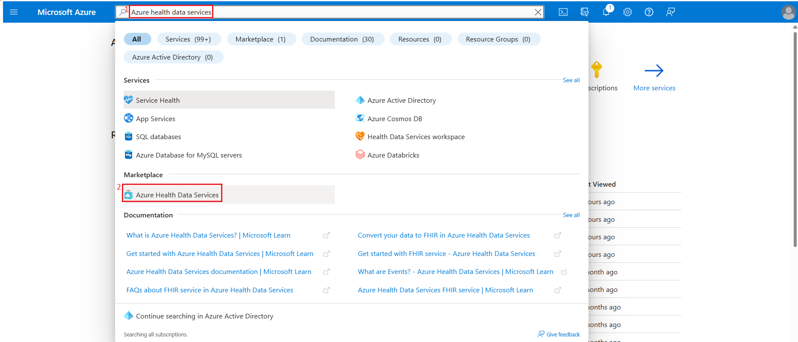
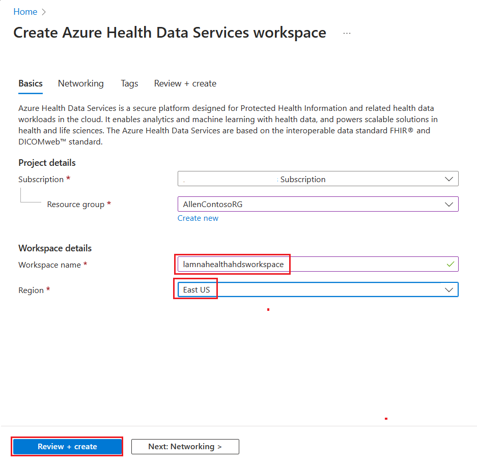
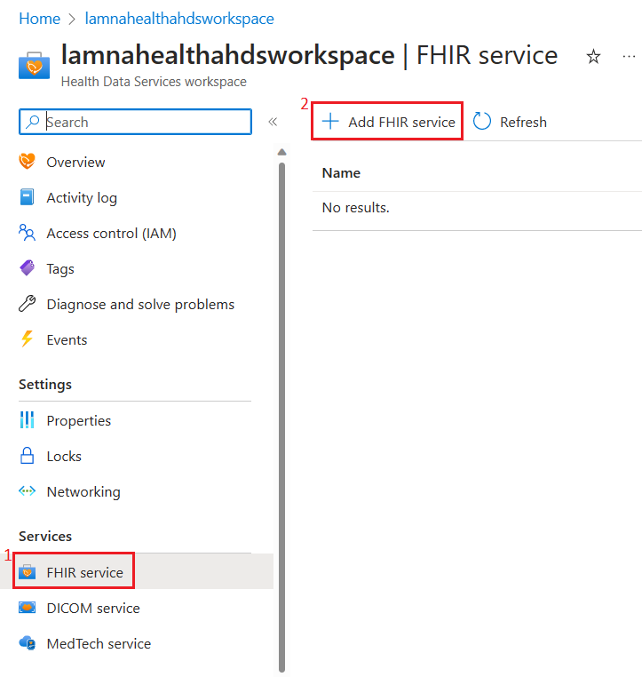
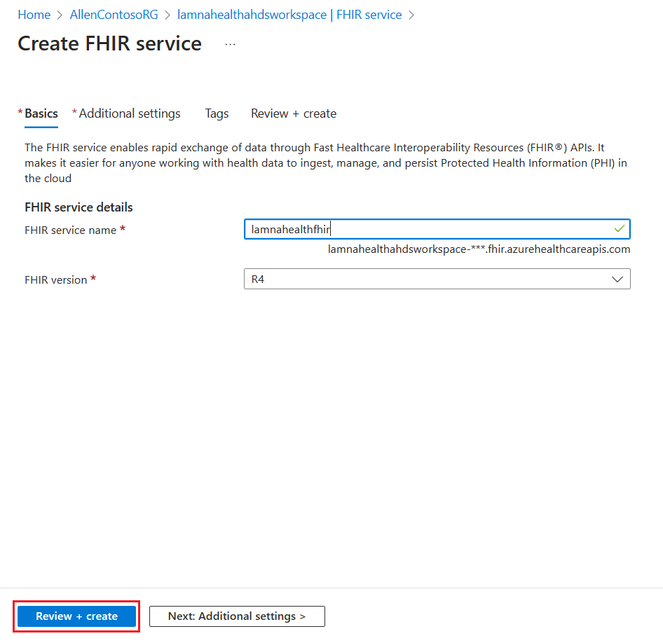
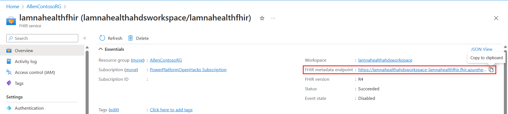

Azure Health Data Services is a suite of purpose-built technologies for protected health information (PHI) in the cloud. It's built on the global open standards that are established by Fast Healthcare Interoperability Resources® (FHIR®) and Digital Imaging Communications in Medicine (DICOM). It helps you unify and manage health data from various sources and formats, such as clinical, imaging, device, and unstructured data, and standardize it in the cloud. It also provides tools for you to de-identify data for secondary use and connect it to analytics and AI services for generating insights.

Important features of Azure Health Data Services include:

- Quick deployment of managed, enterprise-grade FHIR, DICOM, and medtech services.

- Tools to transform and ingest data from legacy or device proprietary formats to FHIR.

- Connectors to Microsoft Azure Synapse Analytics, Microsoft Azure Machine Learning, and Microsoft Power BI for visualizations and analytics.

- Support for Substitutable Medical Applications and Reusable Technologies (SMART on FHIR) apps to build new applications.

- Compliance with regional regulations, such as Health Insurance Portability and Accountability Act (HIPAA), General Data Protection Regulation (GDPR), and California Consumer Privacy Act (CCPA).

- Application monitoring and role-based access controls within a compliance boundary.

Azure Health Data Services is beneficial for healthcare data management because it:

- Improves patient and research outcomes with analytics and insights.

- Streamlines health workloads by making PHI easier to exchange across the care continuum.

- Decentralizes clinical trials with remote monitoring of biometric data from devices.

- Processes imaging data quickly and at scale with DICOM cast technology.

- Builds on a trusted cloud for healthcare that is Health Information Trust Common Security Framework (HITRUST CSF) certified.

Azure Health Data Services is the evolved version of Azure API for FHIR and offers more technology and services.

## Set up an Azure Health Data Services workspace and the FHIR Service

In this task, you'll use the Microsoft Azure portal to set up an Azure Health Data Services workspace and the FHIR service.

1. While signed in to your Microsoft 365 tenant as global administrator, open a new browser tab and then go to the [Azure portal](https://portal.azure.com/?azure-portal=true).

1. Search for **Azure health data services** in the upper search box.

1. Select **Azure Health Data Services** under the **Marketplace** section.

   > [!div class="mx-imgBorder"]
   > 

1. On the **Create Azure Health Data Services workspace** page, select the appropriate **Subscription** and **Resource group** name and then enter the following workspace details. When you're finished, select **Review + create**.

    - **Workspace name** - lamnahealthahdsworkspace

    - **Region** - East US

    > [!div class="mx-imgBorder"]
    > 

1. Select **Create**.

1. After successful deployment, go to the resource group and select **lamnahealthahdsworkspace**.

1. On the **lamnahealthahdsworkspace** page, on the left navigation pane, select **FHIR service**.

1. Select **+ Add FHIR service** on the right pane.

   > [!div class="mx-imgBorder"]
   > 

1. On the **Create FHIR service** page, enter the following details and then select **Review + create**.

   - **FHIR service name** - lamnahealthfhir

   - **FHIR version** - R4

   > [!div class="mx-imgBorder"]
   > 

1. After successful validation, select **Create**.

1. After successful deployment, go to the resource group and select **lamnahealthfhir**.

1. Select **Overview** on the left navigation pane and then copy the **FHIR metadata endpoint** value from the right pane. Save this information on a notepad to use later in this module.

   > [!div class="mx-imgBorder"]
   > 
