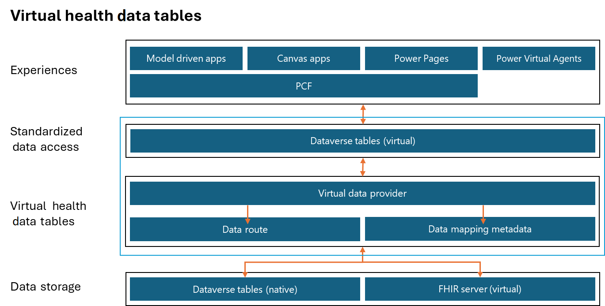

Virtual health data tables in Microsoft Cloud for Healthcare help you virtualize your clinical reference data and other healthcare data when you're using model-driven apps and other engagement solutions. With these tables, you can virtualize your data, removing the need for you to build expensive integrations that visualize the same data-intensive tables multiple times across Microsoft and other applications, such as electronic health record (EHR) systems. Virtual health data tables take the best of the [Microsoft Dataverse virtual tables (entities)](/power-apps/developer/data-platform/virtual-entities/get-started-ve/?azure-portal=true) solution and layer it on top of a data routing concept so that you can establish data routes for your tables or entities.

Dataverse virtual tables have limitations. One limitation is that you can't convert an existing physical table to a virtual one or vice versa. This scenario results in the creation of new tables and requires you to reconstruct Dataverse applications so that they use the new table structure when you're switching between virtual and physical tables. Another challenge is that, after you visualize a table, users have two tables to choose from when they're creating the saved views and advanced queries.

To solve this challenge, you can use virtual health data tables to establish data routes for your tables or entities.

> [!div class="mx-imgBorder"]
> 

The architecture that's shown in the preceding diagram illustrates the working of virtual health data tables. The lower part of the stack contains the data storage system, such as the Dataverse entities, which are native to Microsoft Cloud for Healthcare solutions. It also includes the FHIR server, which is virtual. Virtual health data tables use the Data route and Data mapping metadata components of the virtual data provider to switch between Dataverse and the FHIR server as data storage. The virtual entities in Dataverse use the Virtual data provider infrastructure to show information on the apps.

You can use the following security roles to work with virtual health data tables.

| Security role | Description | Audience |
|---------------|-------------|----------|
| Healthcare Virtual Tables Admin | With this role, users can set up virtual health data tables. | Administrator |
| Sync admin for FHIR Config Administrator | With this role, users can create and manage entity and attribute data maps, and they can set values for integration settings in Data integration toolkit. | Administrator |
| Healthcare Virtual Tables User | This role provides access to the virtual table entities. You can assign this role to everyone who accesses the virtual health data entities. | User |

Key highlights of virtual health data tables include:

- Virtual health data tables are built on Dataverse's existing virtual table solution; therefore, they share the [same limitations](/power-apps/developer/data-platform/virtual-entities/get-started-ve?azure-portal=true#limitations-of-virtual-tables) as virtual tables.

- By default, virtual health data tables are set to route data requests to Dataverse.

- You can set up virtual health data tables so that they route data requests to the FHIR server.

- Currently, virtual health data tables only support connection to Azure FHIR servers.

- Only **Observation** and **Encounter**-related tables are in scope for virtual health data tables.

- Records in the **Observation** and **Encounter**-related virtual tables have read-only access.

- If the core **Observation** or **Encounter** table is changed to virtual or Dataverse, then you should change all related supporting tables at the same time.

- The expand operation is supported by virtual **Observation** and **Encounter** expand tables.

- When you set up expand tables to route data from a virtual data provider (FHIR server), the retrieve multiple query is only supported if the query includes filters on the parent link attribute. For instance, **Observation Component**, which is an expand entity of the **Observation** entity, must contain a filter on specific IDs of msemr_observation (parent link attribute).

- Retrieving expand entries by using an ID isn't supported because expand entries don't have a unique ID in FHIR. The ID that appears when you select a record from retrieve multiple results is temporary.

- Virtual health data tables support column filtering as defined by the Health Level Seven (HL7) specification. You can filter on linked entities for one level only.

- Virtual health data tables support limited composite filters for single table composite filters.

- Virtual health data tables support the composite filter definitions that are described in the following table.

| Composite filter | Description |
|------------------|-------------|
| code-value-concept | Code and coded value parameter pair |
| code-value-date | Code and date/time value parameter pair |
| code-value-quantity | Code and quantity value parameter pair |
| code-value-string | Code and string value parameter pair |
| combo-code-value-concept | Code and coded value parameter pair, including in components |
| combo-code-value-quantity | Code and quantity value parameter pair, including in components |

For more information, see [Composite Search Parameters](https://build.fhir.org/search.html?azure-portal=true#combining) in the HL7 FHIR documentation.

- Linked entity filters are supported by using chained filtering according to the HL7 FHIR specification. The level of support is dependent on the Azure API for FHIR version. Unsupported filter conditions return exceptions and no results.

- Sorting is implemented according to the HL7 FHIR specification. The level of support is dependent on the Azure API for FHIR version. Data is still returned, even if sorting conditions are unsupported.

The following table provides some key implementation considerations when you're planning to use virtual health data tables.

| Risk | User experience | Potential mitigation risk |
|------|-----------------|---------------------------|
| Existing saved views and dashboards | All charts and dashboards that were created by using physical entities that have since been virtualized no longer function. | Refactor saved views and dashboards to use the new virtualized entity. Note the new Native text added to the front of legacy Dataverse versions of the virtual health data tables. The virtual version of these tables is, for example, named Encounters or Observations. Communicate changes to users. In addition to system views, users need to refactor personal views. |
| Charts | All charts no longer function or are available for creation. | Power BI or an alternative solution for visualizing this data is required. Model-driven charts don't render for virtualized data. Communicate changes to users. They no longer have charts in personal views and dashboards if they were created prior to using physical entities. |
| Relevance search not supported | Relevance search doesn't function for virtual health data tables. | Communicate changes to end users. Assess if you can use virtual entities in your deployment. The new default search experience in model-driven Power Apps is built on relevance search. |
| AI Builder not supported | AI Builder insights that once used physical Dataverse tables are no longer available when those tables are virtualized. | Consider other AI options from Microsoft. The datasets that you consider virtualizing in Dataverse should likely be analyzed with Azure services, such as Azure Synapse Analytics, to uncover opportunities in your clinic or business. |
| Virtual tables is a simplified security model because they change to organization-level security | Security should be examined for compliance requirements. | If organization-wide security isn't a fit for your deployment, reconsider using virtual health data tables. |

The following FHIR resources are set up as virtual tables and are deployed with virtual health data tables. 

- Allergy Intolerance

- Appointment EMR

- Condition

- Encounter

- Episode of Care

- Location

- Medication Request

- Observation

- Procedure

For the complete list of other supporting tables that are set up as part of virtual health data tables, see [Virtualized tables](/dynamics365/industry/healthcare/virtual-health-data-tables-overview?branch=main&branchFallbackFrom=pr-en-us-7704#virtualized-tables). 
