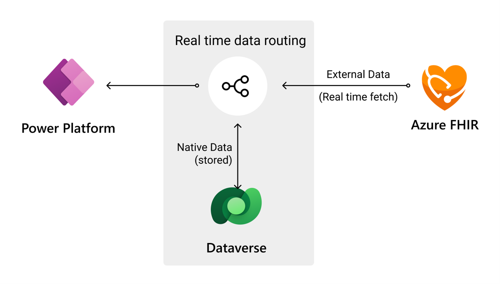
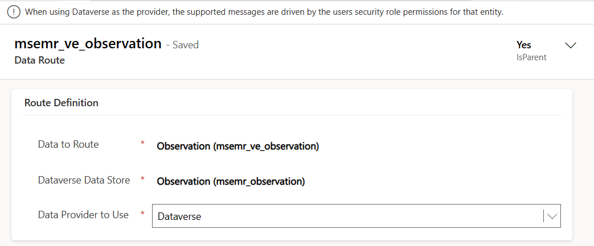
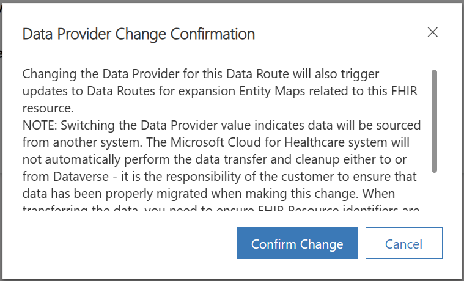
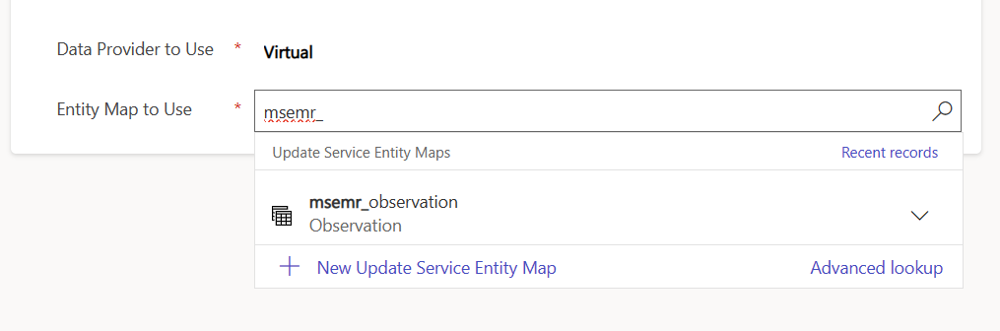

You've set up the prerequisites for virtual health data tables by setting up Azure Health Data Services, FHIR service, Dataverse Healthcare APIs, and the Integration Settings feature.

Virtual health data tables includes another key element as part of its setup: the Data Routes feature.

## Data routes

Virtual health data tables use the existing [Microsoft Dataverse virtual tables (entities)](/powerapps/developer/data-platform/virtual-entities/get-started-ve/?azure-portal=true) platform capability and they layer on top of the data routing concept.

> [!div class="mx-imgBorder"]
> 

A key limitation with Dataverse virtual tables is the lack of tools to convert an existing physical table to a virtual one and vice versa, leading to the creation of net new tables. If you need to switch to virtual or physical, you need to change your Dataverse applications so that they use the new table structure. Furthermore, you need to preserve virtual and physical tables to accommodate the complex interoperability requirements. If your design approach includes virtual and physical tables, you'll have two possible tables to use when creating the saved views and advanced searches.

Virtual health data tables solve these challenges by helping you establish data routes for your tables or entities.

Standard Dataverse virtual tables require static mapping to the remote schema and a single data source at runtime. Data routes in virtual health data tables provide a configurable option to route requests on virtual tables to the physical Dataverse store or to the remote FHIR endpoint. This option provides the flexibility to start with your data in Dataverse and implement connectivity to a FHIR endpoint later.

Each virtualized FHIR resource has its own data route configuration entry, so you can route requests independently. For example, you can have the **Encounters** table set up as virtual while setting up **Allergy Sensitivity** as a physical table in Dataverse. You can change this configuration anytime, and the custom provider immediately redirects from where the data is accessed.

> [!NOTE]
> While the configuration changes are immediate, you're responsible for data cleanup or data movement. For example, if **Encounter** is changed from Dataverse to virtual, the encounter records aren't automatically deleted from Dataverse.

As you virtualize more FHIR resources and their virtual Dataverse tables, each new entry would also inherit this data route capability.

By setting up the Data Routes feature, you can dynamically change the data provider for virtual tables. You can update the data routes for each FHIR resource, and the related expansion data routes are automatically updated to the same route. While you can do this switch at runtime, you would typically change these values at the time of deployment.

To switch the data route for tables from virtual to Dataverse or vice versa, follow these steps:

1.  In the Data integration toolkit, go to **Data Routes** under **Map Setup**.

1.  Select an available data route record, such as **Observation** or **Encounter**, and then select **Edit**.

	> [!div class="mx-imgBorder"]
	> 

1.  Change the value for the **Data Provider to Use** field. A message prompt with confirmation will display.

	> [!div class="mx-imgBorder"]
	> 

1.  After you select **Confirm Change** on the message, select the entity map for this route.

	> [!div class="mx-imgBorder"]
	> 

    This step updates each data route for the corresponding expansion tables. Now, the **Data Provider to Use** values are updated and the correct entity map is assigned.

1.  To validate your changes, change the navigation area to **Healthcare Data** and then select the corresponding navigation item under **Clinical Data** for your selected virtual table. Based on your selection, the data that's presented in this view is sourced from Dataverse or virtual.
