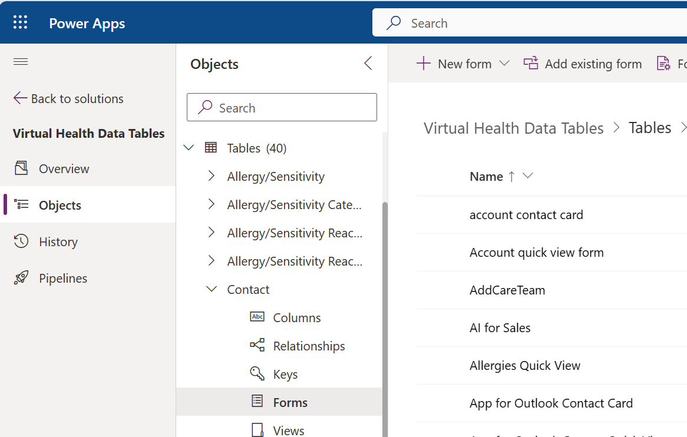
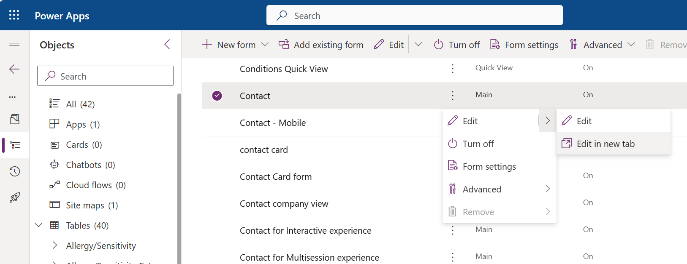
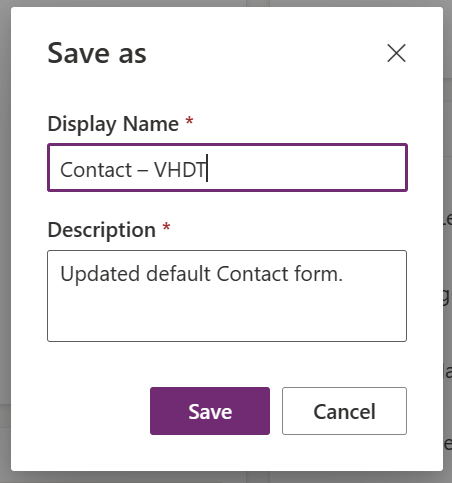
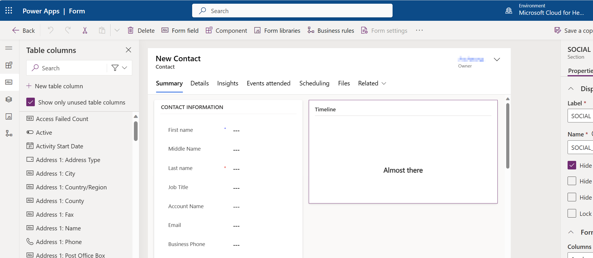
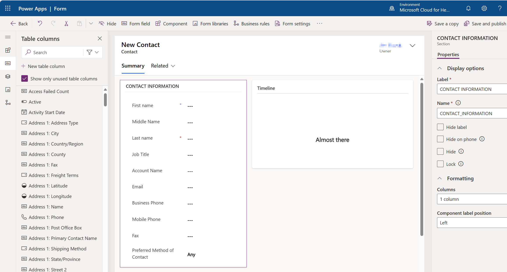

When the new model-driven app includes the required tables, and when the navigation elements are in place, you'll learn how to display data that's related to the patient by using the virtual tables in the solutions. Creating a new Main form versus modifying an existing form ensures that you don't interfere with how other applications operate. Then, you can add this new form to a solution for deployment to other environments.

## Prerequisites
To complete the steps in this exercise, you need to meet the following prerequisites:

-   [Microsoft Cloud for Healthcare training environment preparation](/training/modules/training-environment-preparation-healthcare/?azure-portal=true)

-   System Administrator rights are granted for the user on a Microsoft Power Platform environment

## Create the new form
Your first task in this exercise is to create the new form by following these steps:

1.  Open the **Virtual Health Data Tables (VirtualHealthDataTables)** solution.

1.  On the left navigation pane, go to the **Tables** section and select the Contact table.

1.  Expand the Contact options and then select **Forms** to view the available forms.

	> [!div class="mx-imgBorder"]
	> 

1.  Create a new form that's a copy of the Main form for the Contact table that's already in the system. This form might include tabs, sections, subgrids, and custom controls.

1.  In the list of current forms, select the **Contact** form. Select the ellipsis (**...**) menu next to the name and then select **Edit in new tab**.

	> [!div class="mx-imgBorder"]
	> 

1.  In the upper-right toolbar, select **Save a copy**. Enter a new name for the copy, such as **Contact - VHDT**.

	> [!div class="mx-imgBorder"]
	> 

Now, you have a new form that you can customize for virtual health data tables.

> [!div class="mx-imgBorder"]
> 

## Clean up the new form

In this exercise, you remove the tabs except for the **Summary** tab.

1.  If a tab contains a field that's set to **Business Required**, you can't delete the tab. One option is to move these items to the tab that you want to preserve so that you can delete the tab.

1.  In the **Event Information** section, move the **Last Name** field to the **Summary** tab. Move the field to the **Summary** tab, and when you see the tab details, move the field to the **Contact Information** section.

1.  You can hide the field because it's a duplicate field on the form. Select the **Last Name** field and then select **Hide** from the Forms designer tools.

1.  After you move the field, select the **Details** tab and then select **Delete** from the form designer tools.

1.  Repeat the previous step for the **Insights**, **Events attended**, **Scheduling**, and **Files** tabs.

1.  In the **Summary** tab, delete the sections named **Map View**, **Assistant**, and **Customer Details**.

	> [!div class="mx-imgBorder"]
	> 

1.  Select **Save and publish** in the upper-right corner of the Forms designer tools.

Now, you have a simplified new Main form that you can update to include the related virtual tables.

