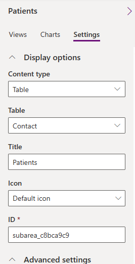

After you have a new solution with the required elements, you'll create a new model-driven app to collect the functionality for your users. This app provides your users with an access point to your work with virtual health data tables.

## Prerequisites
To complete the steps in this exercise, you need to meet the following prerequisites:

-   Microsoft Cloud for Healthcare Trial with the Data integration toolkit installed

    For more information, see [Microsoft Cloud for Healthcare training environment preparation](/training/modules/training-environment-preparation-healthcare/?azure-portal=true).

-   System Administrator rights are granted for the user on a Microsoft Power Platform environment

## Create the application
In this task, you create the application by following these steps:

1.  Go to [Power Apps](https://make.powerapps.com/?azure-portal=true), select **Solutions**, and then open the solution named **Virtual Health Data Tables** (VirtualHealthDataTables).

	> [!div class="mx-imgBorder"]
	> 

1.  Select **New > App > Model-driven app**.

1.  In the **New model-driven app** panel, select **Use components from a custom solution**.

    This step adds the existing solution components to your application. 

1. Select the solution that you created in the previous exercise. Enter the other required details as follows:
	
	-  **Name** - Virtual Health Data Tables App
	
	-  **Description** - New sample application using Virtual Health Data Tables
	
		> [!div class="mx-imgBorder"]
		> 

1.  Select **Create**.

When the process is complete, the model-driven app designer displays your new application as follows.

> [!div class="mx-imgBorder"]
> 

## Create the navigation for the new application and focus on the patient
Follow these steps to create the navigation for the new app and focus on the patient:

1.  On the designer, in the list of **Pages**, search for **Contact**. Select the ellipsis (**...**) menu on **Contact views** and then select **Add to navigation**.

	> [!div class="mx-imgBorder"]
	> 

1.  After the contact is added, view the updated main designer page with the newly added navigation item for **Contacts**.

	> [!div class="mx-imgBorder"]
	> 

1.  Select **Save**.

1.  In the main designer, on the navigation pane, select **Contacts**. On the right pane, select the **Settings** tab.

1.  Change the **Title** to **Patients**.

	> [!div class="mx-imgBorder"]
	> 

1. Select the **Views** tab, and in the lower corner of the panel, turn off the **Include all views in the app** toggle.

	> [!div class="mx-imgBorder"]
	> 

1. On the prompt, select **Turn off**.

   > [!NOTE]
   > By turning off this setting, you can create a model-driven app with only the required elements.

	> [!div class="mx-imgBorder"]
	> 

1. Select **Save**.

1. In the **Views** list, under the **Not in this app** section, select the ellipsis (**...**) menu on the **Active Patients** option and then select **Add**.

	> [!div class="mx-imgBorder"]
	> 

1. Repeat the previous steps for **Patients FHIR View**.

1. In the list of views, select the ellipsis (**...**) menu on the **Active Contacts** option and then select **Remove**.

1. Select **Save**.

1. Repeat previous steps 1 to 5 to add the **Encounter views** and **Allergy/Sensitivity views** to the navigation. You can retain the **Settings** and **Views** details with the default values.

1. Select **Save**.

1. Repeat the previous steps for **Views** in the application, and then update the application to only include selective **Forms** for **Contact**.

1. Under the main navigation, select **Patients view** and then select **Patients form**.

1. In the lower part of the **Patients form** panel, on the right side of the page, turn off the **Include all forms in the app** toggle.

	> [!div class="mx-imgBorder"]
	> 

1. Update the list to include only the following forms:

    -  Contact

    -  Contact - VHDT

    -  Patient FHIR View

    -  Practitioner

   Now, you have only the required views for your users.

1. Select **Save > Publish**.

## Publish and test
Your final task in this exercise is to publish and test the application by following these steps:

1.  On the toolbar in the upper-right corner, select **Publish**.

	> [!div class="mx-imgBorder"]
	> 

1.  After the process is complete, select **Play**.

    The new application launches in a new window or tab. You can view the updated **Patients** title on the left pane and a list of the sample records on the right pane.

	> [!div class="mx-imgBorder"]
	> 

1.  Select the **Active Patients** dropdown menu and verify that only the views that you selected in the previous task display.

	> [!div class="mx-imgBorder"]
	> 

1.  Select **Encounters** on the left navigation pane. You can view the list of **Encounters** that are stored in Dataverse.

	> [!div class="mx-imgBorder"]
	> 

1.  Similarly, you can view the Allergy/Sensitivity records. 

Now, you have a published model-driven application that displays a list of Patients, Encounters, and Allergy/Sensitivity records by using virtual health data tables. Though you're using the virtual tables, the displayed data resides in Dataverse. This data is the sample data that's deployed with the trial solution. The data provider for virtual health data tables is set up by default to display data that resides in Dataverse.

By updating the data routes, you can display data that only resides in the Azure Health Data Services FHIR server.
