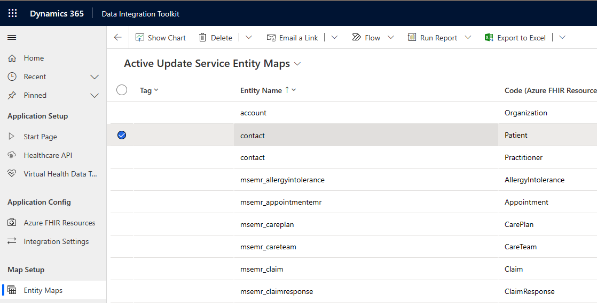
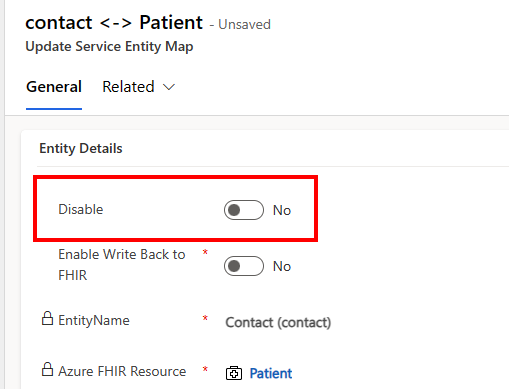
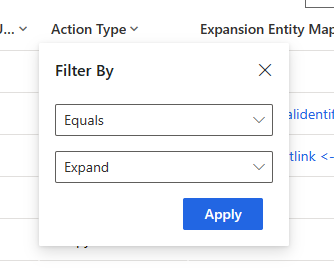
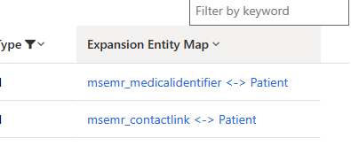
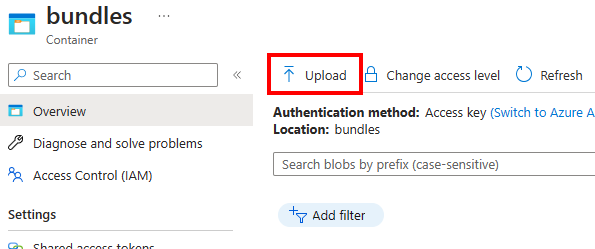
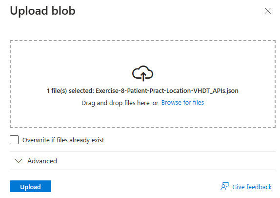
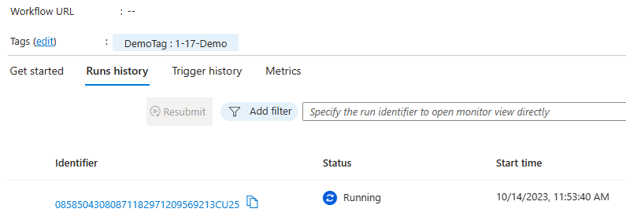
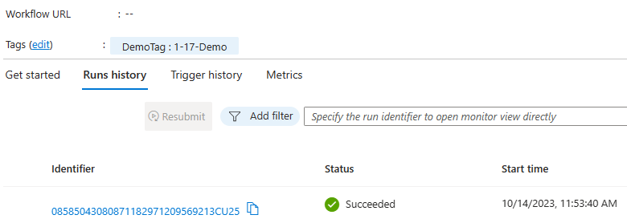
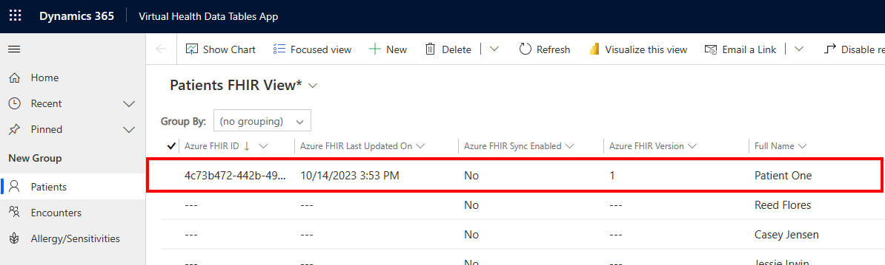
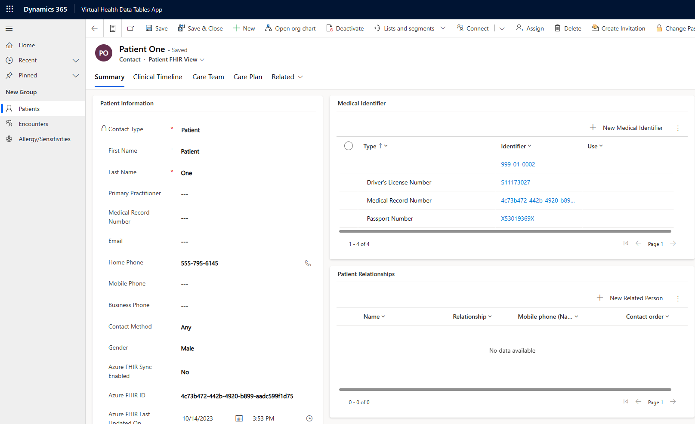

After you create the model-driven app, set up related services, and set up virtual health data tables, you can test the application. Testing the application demonstrates how you can use your new application to manage persisted data in Dataverse and remote FHIR services.

In this exercise, you post FHIR data to both services and observe how virtual health data tables provides access to the remote FHIR service that's relative to the Dataverse patient record. This exercise provides the initial setup of your Dataverse data with a patient who's connected to an **Azure Health Data Services FHIR service** entry.

## Prerequisites
To complete the steps in this exercise, you need to meet the following prerequisites:

- Microsoft Cloud for Healthcare Trial with Data integration toolkit installed

   For more information, see [Microsoft Cloud for Healthcare training environment preparation](/training/modules/training-environment-preparation-healthcare/?azure-portal=true).

-  System Administrator rights are granted for the user on a Microsoft Power Platform environment

-  Azure Health Data Services FHIR service is set up and accessible

-  Azure Logic Apps is set up with the corresponding Microsoft Azure Blob Storage account container

-  The following FHIR bundle samples are downloaded:

    -   [Exercise-Patient-Pract-Location-VHDT_APIs.json](https://github.com/MicrosoftDocs/mslearn-developer-tools-power-platform/tree/master/healthcare-cloud)

    -   [Exercise-Enc-Obs-FHIRServerOnly.json](https://github.com/MicrosoftDocs/mslearn-developer-tools-power-platform/tree/master/healthcare-cloud)

## Set up the entity maps for Dataverse Healthcare APIs

To ensure processing of the uploaded FHIR bundle, you need to turn on the relevant entity maps and their child expansion maps.

1.  On the **Data Integration Toolkit** screen, on the left navigation pane, select **Entity Maps**.

2.  Open the entity map that shows **contact** in the **Entity Name** column and **Patient** in the **Code (Azure FHIR Resource)** column.

	> [!div class="mx-imgBorder"]
	> 

3.  In the **Entity Details** section, set the **Disable** toggle to **No**.

	> [!div class="mx-imgBorder"]
	> 

4.  Select **Save**.

5.  In the subgrid under the **Related Attribute Maps** section, filter the grid by the **Action Type** column on the **Expand** value.

	> [!div class="mx-imgBorder"]
	> 

6.  For each attribute map in the filtered list, open the related **Expansion Entity Map**. For **Patient**, the first **Expansion Entity Map** is named *msemr_medicalidentifer <-\> Patient*. Select the link in the column to open the entity map record.

	> [!div class="mx-imgBorder"]
	> 

7. Set the **Disable** toggle to **No**.

8. Select **Save & Close** to return to the **Patient Entity Map**.

9. Repeat the previous steps for each expansion entity map on the *contact <-\> Patient* entity map.

10. Repeat the previous steps for the following FHIR resource and Dataverse table pairs.

	|     Entity name                 |     Azure FHIR resource    |
	|---------------------------------|----------------------------|
	|     contact                     |     Practitioner           |
	|     account                     |     Organization           |
	|     msemr_location              |     Location               |
	|     msemr_allergyintolerance    |     Allergy/Sensitivity    |

The **Dataverse Healthcare APIs** are able to process FHIR bundles with these FHIR resources.

## Post the patient and related records to Dataverse

A patient record in Dataverse that's synced with a FHIR resource is required for virtual health data tables to display its data. You can post a new patient to FHIR services and Dataverse by using the deployed logic app.

1.  Open the Azure portal and go to the storage account that you created by using the Azure Resource Manager template deployment from **Microsoft Cloud Solution Center**.

2.  Under the **Data Storage** section, select **Containers** and then open the container named **bundles**.

3.  Select **Upload** from the available tools in the **bundles** container view.

	> [!div class="mx-imgBorder"]
	> 

4. In the right **Upload blob** panel, upload the sample bundle JSON named **Exercise-8-Patient-Pract-Location-VHDT_APIs.json**.
   This bundle contains resource entries for **Patient**, **Practitioner**, **Location**, and **Organization**.

> [!div class="mx-imgBorder"]
> 

5.  Select **Upload**.

6.  Go to the logic app that you created by using the Azure Resource Manager template deployment from **Microsoft Cloud Solution Center**.

7.  Select **Refresh** from the list of tools in the logic app. A new entry now displays on the **Runs history** tab in the lower part of the page.

	> [!div class="mx-imgBorder"]
	> 

    The run might take a few moments, so you might need to refresh again until the logic app run succeeds.

	> [!div class="mx-imgBorder"]
	> 

8. Return to your new model-driven application and view the list of patients. Change the view to the **Patient FHIR** view to view the new patient in the list with a value for **Azure FHIR ID**.

	> [!div class="mx-imgBorder"]
	> 

9. From the **Patients** option on the left pane, open the new patient record for **Patient One** and then change the form to **Patient FHIR View** by using the selector beneath the name in the header. The data that's provided in the bundle is now posted to Dataverse as a new contact and related records in **New Medical Identifier**.

	> [!div class="mx-imgBorder"]
	> 

You've taken the first step in using your new model-driven application by using Dataverse Healthcare APIs to connect a patient record between Dataverse and Azure Health Data Services FHIR services.

